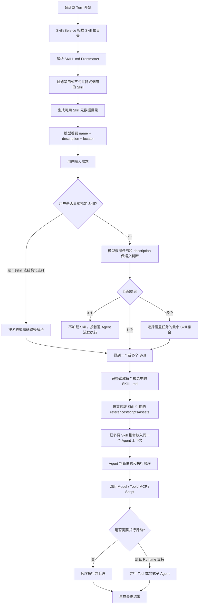
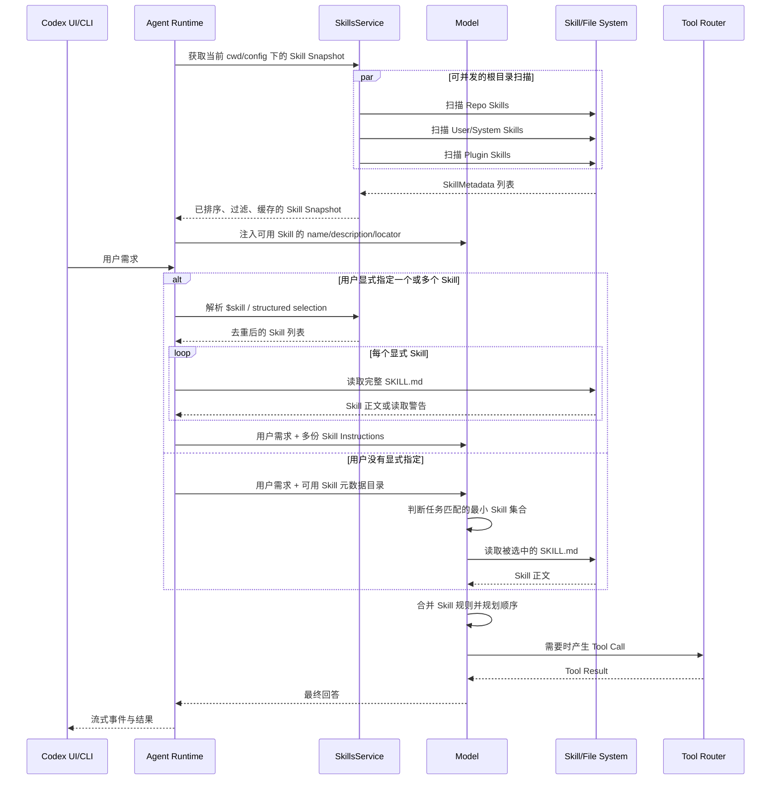
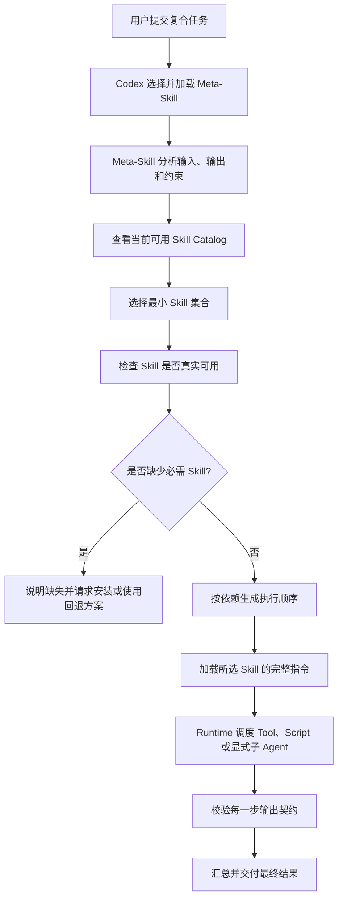

# Codex Skill 选择、加载与多 Skill 执行机制

> 更新时间：2026-07-31<br>
> 源码基线：OpenAI `openai/codex` commit `f0c30e528a54bdf0fa9a4d52ff74b34383434811`<br>
> 研究范围：用户在 Codex 中输入需求后，Skill 如何被发现、选择、加载；命中多个 Skill 时如何处理；哪些环节可能并发。<br>
> 说明：本文区分公开源码事实和架构解释。Codex 产品内部未公开部分不作确定性推断。

## 1. 一句话结论

> Codex 不会把每个 Skill 启动成一个并发进程或独立 Agent；Skill 是加载到同一个 Agent 上下文中的专业指令，多个 Skill 会被组合使用，真正是否并发取决于后续 Tool 调用或子 Agent 编排，而不是 Skill 数量。

---

## 2. 先纠正“用户输入后再搜索所有 Skill”这个理解

更准确的过程不是：

```text
用户输入需求
    ↓
临时遍历所有 SKILL.md 全文
    ↓
搜索最像的一份
```

而是：

```text
会话/Turn 准备阶段
    ↓
扫描 Skill 根目录
    ↓
读取 Skill 元数据：name、description、path、policy
    ↓
生成可用 Skill 目录并放入模型上下文
    ↓
用户输入需求
    ↓
显式指定，或者模型根据 description 判断是否匹配
    ↓
只加载被选中的 SKILL.md 正文
```

因此可以分成两个阶段：

```text
Discovery：发现有哪些 Skill
Invocation：当前任务使用哪些 Skill
```

发现不等于使用。

---

## 3. Skill 到底是什么

Skill 不是：

- 一个正在运行的线程。
- 一个独立进程。
- 一个 Tool Executor。
- 一个自动创建的子 Agent。
- 一个必须并发执行的任务。

Skill 更接近：

```text
Skill
├─ 名称和描述
├─ 触发边界
├─ 专业工作方法
├─ 执行顺序和检查标准
├─ 可选 scripts
├─ 可选 references
├─ 可选 assets/templates
└─ Tool 或 MCP 使用说明
```

Skill 被选择后，核心动作是：

> 将 `SKILL.md` 的专业指令加入当前 Agent 的可见上下文，使同一个 Agent 按这套方法完成任务。

---

## 4. 总流程图



这张图最重要的分界：

```text
Skill 选择与加载
≠
Tool 或子 Agent 的并发执行
```

---

## 5. 时序图



说明：

- `par` 表示 Skill 根目录扫描在实现上可以有受限并发。
- `loop` 表示当前公开源码对多个显式 Skill 正文逐个读取并注入。
- 模型隐式选择 Skill 时，`SKILL.md` 的读取表现为 Agent 的读取动作，不代表启动新进程。
- 图中的 `M->>FS` 是逻辑表达；实际会通过 Codex 提供的文件或 Skill Resource 读取能力完成。

---

## 6. 第一步：Codex 怎样发现 Skill

Codex 的 `SkillsService` 会根据当前配置和工作目录构建 Skill Snapshot。

公开源码显示，可能的 Skill 来源包括：

```text
Repo Scope
├─ 项目配置目录下的 skills
└─ 项目层级中的 .agents/skills

User Scope
├─ 用户安装的 skills
├─ 兼容的旧 skills 目录
└─ Plugin 提供的 Skill Root

System Scope
└─ Codex 内置系统 Skills

Admin Scope
└─ 管理员配置的 Skills
```

不同产品版本、插件和环境还可能通过受控资源方式提供 Skill，不一定全部是普通本机文件。

### 6.1 扫描结果不是 Skill 正文集合

Discovery 阶段主要得到 `SkillMetadata`：

```text
name
description
short_description
policy
dependencies
path_to_skills_md
scope
plugin 信息
```

模型通常先看到的是目录，而不是所有 `SKILL.md` 的全文。

这样做是为了：

- 避免把几十或几百份 Skill 正文全部塞进 Context。
- 控制 Token 成本。
- 只有真正需要的 Skill 才进行完整加载。
- 允许 Skill 数量增长。

### 6.2 Skill Snapshot 会缓存

`SkillsService` 按当前工作目录或有效配置构建并缓存 Snapshot。

因此每次用户发送消息时，并不等价于重新从磁盘全文解析所有 Skill。配置、工作目录、插件根或缓存失效时，Snapshot 才需要更新。

### 6.3 根目录扫描可以并发

公开源码的 Root Loader 使用受 Semaphore 限制的并发扫描：

```text
多个 Skill Root
    ↓ buffer_unordered(MAX_CONCURRENT_ROOT_SCANS)
并发扫描
    ↓
恢复原始 Root 顺序
    ↓
确定性合并
```

这是一种 I/O 加速，不代表多个 Skill 同时执行。

### 6.4 合并后保持确定顺序

源码会在并发扫描完成后恢复 Root 顺序，并按照 Scope、Skill 名称和路径进行确定性排序。

当前源码的 Scope 排序顺序是：

```text
Repo → User → System → Admin
```

这里描述的是公开源码当前的合并/展示顺序，不应该被理解成所有指令冲突时的完整安全优先级。

---

## 7. 第二步：模型看到什么

Codex 会生成一个类似下面的可用 Skill 目录：

```text
Available skills
- pdf: Read, create and inspect PDF files. (file: .../SKILL.md)
- spreadsheets: Create and analyze spreadsheets. (file: .../SKILL.md)
- presentations: Create and edit presentations. (file: .../SKILL.md)
```

模型根据以下信息判断是否使用：

```text
用户需求
+ Skill name
+ Skill description
+ Skill trigger rules
+ 当前系统/开发者规则
```

### 7.1 默认不是向量数据库搜索

从当前公开的 Host Skills 主链路看，默认做法不是：

```text
用户问题 → Embedding → Vector DB → Top-K Skill
```

而是：

```text
Skill 元数据目录进入模型上下文
        ↓
模型根据自然语言描述做语义判断
```

插件、企业扩展或未来版本可以增加独立路由层，但不能把这种扩展可能性说成当前开源主链路的既定事实。

### 7.2 Skill 元数据有 Context Budget

当前源码会为 Skill 元数据设置上下文预算：

- 有模型上下文窗口时，默认以窗口的一小部分计算预算。
- 没有窗口信息时使用字符预算回退。
- Skill 太多时，描述可能缩短。
- 超出预算时，部分 Skill 元数据可能不进入模型可见目录，并产生警告。

这说明 Skill 越多不一定越好。大量相似 Skill 会造成：

- 描述竞争 Context。
- 路由歧义。
- 命名冲突。
- 模型难以选出最小集合。

### 7.3 New Chat 时到底“加载”了什么

这里需要区分两种完全不同的加载：

```text
发现加载：读取/解析 Skill 元数据，生成 Catalog
正文加载：读取被选中 Skill 的完整 SKILL.md
```

会话初始化时，Codex 会预热 Plugin 和 Skills，并为当前工作目录、配置和执行环境建立 Skill Snapshot。每个 Turn 也会拿到对应的 Snapshot。

这不等于：

```text
New Chat → 把所有 SKILL.md 正文都塞进 Context
```

更接近：

```text
New Chat / Turn Context
        ↓
发现当前可用 Skill
        ↓
向模型展示 name + description + locator
        ↓
任务选中 Skill
        ↓
才读取完整 SKILL.md
```

### 7.4 没有下载的 Skill 会不会加入

结论：真正不存在于当前 Skill 来源中的 Skill，不会凭空加入当前 Skill Catalog。

但“我没有手动下载”不等于“系统里没有”。Skill 可能来自：

| 来源 | 是否需要用户手动下载单独文件 | 是否可进入 Catalog |
|---|---|---|
| Codex 内置 System Skill | 不一定，可能随程序提供并缓存 | 可以 |
| 用户安装的 Skill | 通常需要安装 | 可以 |
| 当前仓库 `.agents/skills` | 由仓库提供 | 可以 |
| Plugin 中的 Skill | 安装 Plugin 时一起提供 | 可以 |
| Admin/企业配置 Skill | 由管理员提供 | 可以 |
| 执行环境或 Orchestrator Resource | 不一定落在本机普通目录 | 可以 |
| 互联网上存在但当前未安装的 Skill | 没有进入任何当前来源 | 不可以 |

判断标准不是“是否手动下载”，而是：

```text
当前 SkillsService / Skills Extension
是否能够发现并读取这个 Skill Resource
```

### 7.5 用户点名一个不存在的 Skill 会怎样

例如用户写：

```text
$unknown-skill 帮我完成任务
```

如果它不在当前 Catalog：

1. Codex 不应该假装已经加载它。
2. 应该说明该 Skill 当前不可用或无法读取。
3. 可以使用普通模型能力和现有 Tool 提供替代方案。
4. 除非用户明确要求安装，否则不应擅自从网络下载 Skill。

模型也许本来就会做类似事情，例如没有 `pdf` Skill 也能解释 PDF 概念，但这只能叫通用模型能力：

```text
会做类似任务
≠
已使用特定 Skill
```

### 7.6 Skill 是否会自动下载安装

默认不能理解为“缺什么就自动上网下载安装什么”。安装 Skill 会改变本机或当前项目状态，需要明确的安装工作流和权限。

可能出现的情况：

- 用户明确要求使用 Skill Installer 安装指定 Skill。
- 用户安装一个 Plugin，该 Plugin 携带 Skills。
- 管理员或系统版本提供新的 System Skills。
- 已安装 Skill 声明 MCP 依赖，Codex 在明确流程中提示或处理依赖。

最后一种是“处理已选 Skill 的依赖”，不是“自动搜索并安装一个不存在的 Skill”。

安装或新增 Skill 后，客户端通常通过：

```text
skills/changed
        ↓
重新调用 skills/list
        ↓
必要时 forceReload
        ↓
后续 Turn 使用新的 Skill Snapshot
```

让新 Skill 进入可用目录。具体刷新时机取决于客户端和当前会话状态。

---

## 8. 第三步：显式选择与隐式选择

Codex 有两条主要 Skill 调用路径。

## 8.1 显式选择

用户可以明确写：

```text
使用 $spreadsheets 和 $presentations 分析表格并生成汇报 PPT。
```

或者客户端使用结构化 Skill Input，携带名称和精确路径。

### 显式选择流程

```text
用户输入
    ↓
解析结构化 Skill Input
    ↓
解析文本中的 $skill-name 或 Skill Resource Link
    ↓
过滤 Disabled Skill
    ↓
按名称/路径去重
    ↓
读取所有显式 Skill 的 SKILL.md
    ↓
每份正文包装成 Skill Instructions
    ↓
一起加入当前 Turn 的模型上下文
```

### 同名 Skill 怎么办

如果 Plain Name 在当前目录中不唯一，源码不会随便挑一个。

例如存在：

```text
repo/report
user/report
plugin/report
```

用户只写：

```text
$report
```

可能因为歧义而无法通过 Plain Name 唯一选择。此时应该使用客户端提供的结构化选择或精确 Resource Path。

### 多个显式 Skill 怎么办

显式写了多个 Skill，规则是全部使用，而不是只取置信度最高的一个：

```text
$spreadsheets + $presentations
        ↓
读取两份 SKILL.md
        ↓
放入同一个 Agent Context
        ↓
同一个 Agent 安排先后顺序
```

当前源码会对选中的名称和路径去重，避免同一 Skill 被重复注入。

---

## 8.2 隐式选择

用户不写 Skill 名称：

```text
读取这个 Excel，分析销售趋势，再做成管理层汇报 PPT。
```

模型看到 Skill 目录后可以判断：

```text
需要 spreadsheets
需要 presentations
不需要 pdf
```

规则要求选择覆盖任务的最小 Skill 集合，而不是“可能相关的全部加载”。

### 隐式选择不是固定字符串匹配

用户不必写出：

```text
spreadsheet
presentation
```

只要语义和描述清楚匹配，模型可以选择对应 Skill。

### 禁止隐式调用的 Skill

Skill Policy 可以设置：

```text
allow_implicit_invocation = false
```

这种 Skill 不应该因为模型觉得相关而自动进入隐式可用集合，但仍可能通过显式选择使用，具体还要满足当前产品和配置策略。

适合关闭隐式调用的典型 Skill：

- 生产部署。
- 高风险数据修改。
- 昂贵外部操作。
- 容易误触发的专业流程。

---

## 9. 命中多个 Skill 时到底怎么处理

## 9.1 不会自动“一 Skill 一 Agent”

假设任务匹配三个 Skill：

```text
spreadsheet
presentation
pdf
```

默认不是：

```text
Agent A 执行 spreadsheet
Agent B 执行 presentation
Agent C 执行 pdf
```

而是：

```text
同一个 Agent
├─ 读取 spreadsheet 指令
├─ 读取 presentation 指令
└─ 读取 pdf 指令
```

然后同一个 Agent 根据任务依赖决定执行路线。

## 9.2 先选择最小覆盖集合

用户要求：

```text
读取 Excel 并生成 PPT
```

合理集合：

```text
spreadsheets + presentations
```

不应该因为系统还有 PDF Skill 就一起加载。

如果用户增加：

```text
最后同时导出 PDF
```

才可能加入 PDF Skill。

## 9.3 根据数据依赖排序

```text
spreadsheets
    ↓ 输出分析结果和图表数据
presentations
    ↓ 输出 PPT
pdf
    ↓ 输出 PDF 或检查 PDF
```

Skill 之间存在前后依赖时，应该顺序使用。

这不是因为 Skill 系统内部有一个固定 DAG，而是 Agent 根据各 Skill 指令和当前目标进行规划。

## 9.4 无依赖动作才可能并行

例如：

```text
读取 Excel
搜索行业资料
```

如果二者互不依赖，Agent Runtime 可能并行调用不同 Tool。

但准确说法是：

```text
由多个 Skill 推导出的 Tool Call 可以并行
```

而不是：

```text
多个 Skill 在并发运行
```

## 9.5 Skill 规则冲突怎么办

多个 Skill 可能给出冲突要求：

```text
Skill A：必须修改源文件
Skill B：只能只读分析
```

处理原则：

1. 系统、安全、权限和用户明确要求优先。
2. 只采用当前任务真正需要的最小 Skill 集合。
3. 区分不同阶段：可以先只读分析，确认后再修改。
4. 如果冲突会改变结果或安全边界，向用户确认。
5. 不能为了满足 Skill 而违反用户限制。

Skill 是辅助完成用户目标的方法，不是高于用户目标的最终权威。

---

## 10. 哪些地方并发，哪些地方不并发

| 环节 | 是否可能并发 | 准确解释 |
|---|---|---|
| 多个 Skill Root 扫描 | 是 | 当前源码使用受限并发扫描，最后恢复确定顺序 |
| 读取多个显式 Skill 正文 | 当前源码主链路是逐个读取 | `build_skill_injections` 使用顺序循环读取 |
| 多份 Skill 指令进入上下文 | 不是执行并发 | 只是同一 Turn 中存在多份指令 |
| 一个 Agent 应用多个 Skill | 默认不是并发 | 同一个模型根据依赖进行规划 |
| 多个独立 Tool Call | 可能 | 取决于模型输出、Tool 特性和 Runtime 支持 |
| 多个 Skill 中的脚本 | 不会自动并发 | 只有 Agent 实际调用脚本时才执行 |
| 多个子 Agent | 可能 | 必须由编排层显式创建或授权，不由 Skill 数量自动触发 |
| 多模型请求 | 可能 | 属于 Runtime/多 Agent 编排能力，不属于 Skill 加载 |

最简判断：

```text
Skill 是指令
Tool 是动作
Agent 是执行主体
Runtime 是调度系统
并发发生在 Runtime 调度动作时
```

---

## 11. 多个显式 Skill 的源码行为

公开源码中的核心逻辑可以简化成：

```rust
for skill in mentioned_skills {
    let contents = read_skill_file(skill.path).await;
    injections.push(SkillInjection {
        name: skill.name,
        path: skill.path,
        contents,
    });
}
```

随后每个 Skill 被包装成类似：

```xml
<skill>
  <name>spreadsheets</name>
  <path>...</path>
  ...完整 SKILL.md 内容...
</skill>
```

多个 `<skill>` 片段会进入同一个 Turn 的模型输入。

这说明：

- 多个显式 Skill 全部加载。
- 当前加载循环不是“每个 Skill 启一个并发任务”。
- 某个 Skill 读取失败会产生 Warning，循环继续处理其他 Skill。
- Skill 被注入后，仍由同一个 Model/Agent 决定下一步。

---

## 12. Skill 正文加载后的渐进式读取

选中 Skill 后，需要完整读取它的主 `SKILL.md`。

但是 Skill 目录里可能还有：

```text
my-skill/
├─ SKILL.md
├─ references/
│  ├─ electron.md
│  └─ tauri.md
├─ scripts/
│  └─ verify.sh
└─ assets/
   └─ template.md
```

正确做法不是一口气读取整个目录，而是：

```text
完整读取 SKILL.md
        ↓
根据 SKILL.md 的路由说明判断当前变体
        ↓
只读取当前任务需要的 reference
        ↓
需要时运行 script 或复用 asset
```

这叫 Progressive Disclosure：

- 主 Skill 指令必须完整读。
- 附加资料按任务需要读。
- 不加载无关框架、供应商或领域资料。

多个 Skill 同时命中时，也应该分别遵守各自的渐进式读取规则。

---

## 13. 一个完整例子

用户输入：

```text
读取 sales.xlsx，分析季度销售变化，生成管理层 PPT，并导出 PDF。
```

### 13.1 Skill 选择

```text
spreadsheets：需要读取和分析 XLSX
presentations：需要生成 PPT
pdf：需要导出或检查 PDF
```

### 13.2 Skill 加载

```text
同一个 Agent Context
├─ spreadsheets/SKILL.md
├─ presentations/SKILL.md
└─ pdf/SKILL.md
```

### 13.3 执行规划

```text
读取 sales.xlsx
        ↓
计算季度指标
        ↓
生成图表和汇报结构
        ↓
生成 PPT
        ↓
渲染并检查页面
        ↓
导出 PDF
        ↓
检查 PDF 页面
```

### 13.4 哪些可以并行

可能并行：

```text
读取多个互不依赖的数据 Sheet
生成几张互不依赖的图表
检查不同页面的渲染结果
```

不能直接并行：

```text
数据分析结果还没出来
        ↓
就开始生成依赖这些结果的最终 PPT
```

这里是任务依赖决定并发，不是三个 Skill 名称决定并发。

---

## 14. 显式多 Skill 与隐式多 Skill 对比

| 维度 | 显式指定多个 Skill | 模型隐式匹配多个 Skill |
|---|---|---|
| 触发者 | 用户或客户端 | 模型 |
| 示例 | `$spreadsheets $presentations` | “分析 Excel 并做 PPT” |
| 选择逻辑 | 精确名称/路径解析 | 根据 description 和任务语义 |
| 多个 Skill | 明确提到的全部使用 | 选择覆盖任务的最小集合 |
| 歧义处理 | 同名时要求精确路径 | 模型可能避免或请求澄清 |
| 正文加载 | Runtime 直接读取并注入 | Agent 选择后读取 |
| 是否创建多个 Agent | 否 | 否 |
| 是否自动并发 | 否 | 否 |

---

## 15. Skill 选择失败或异常时怎么办

### 找不到用户点名的 Skill

```text
说明 Skill 不可用
        ↓
使用最接近的普通能力继续
        ↓
不能假装已加载该 Skill
```

### `SKILL.md` 读取失败

当前显式注入实现会记录 Warning，并继续处理其他 Skill。

### Skill 描述太相似

应该：

- 改写名称和 description，使边界清楚。
- 增加正向触发和负面边界。
- 避免多个 Skill 都写成“处理文档”。
- 高风险 Skill 禁止隐式调用。

### Skill 太多

应该：

- 禁用当前项目不需要的 Skill。
- 合并高度重复的 Skill。
- 使用 Plugin/目录控制暴露范围。
- 保持 description 简短且有区分度。

---

## 16. 对我们手写 Agent 的启发

学习版不需要一开始复制 Codex 全部机制，可以拆成四个组件：

```text
Skill Registry
发现并保存 name/description/path
        ↓
Skill Selector
显式名称解析 + 模型语义选择
        ↓
Skill Loader
读取选中 Skill 的完整正文
        ↓
Instruction Composer
将多个 Skill 与用户需求组合成模型上下文
```

### 16.1 第一版最小接口

```ts
interface SkillMetadata {
  name: string
  description: string
  path: string
  allowImplicit: boolean
}

interface SelectedSkill {
  metadata: SkillMetadata
  instructions: string
}
```

### 16.2 第一版选择算法

```text
用户显式写 $skill
├─ 是 → 精确解析并全部加载
└─ 否 → 将 Skill Metadata 提供给模型
         ↓
       模型返回 selected_skill_names
         ↓
       校验名称、去重并限制数量
         ↓
       加载完整正文
```

### 16.3 第一版不要做

- 不做向量数据库检索 Skill。
- 不做自动一 Skill 一 Agent。
- 不做几十个重叠 Skill。
- 不让 Skill 绕过 Tool Policy。
- 不把全部 Skill 正文永久塞进 Context。

先用三个 Skill 验证机制即可：

```text
summarize-file
analyze-data
write-report
```

---

## 17. 验收问题与答案

### Q1：用户输入以后，Codex 是否搜索所有 Skill 全文？

不是。它先维护可用 Skill 元数据目录，再通过显式选择或模型语义判断选中 Skill，最后加载正文。

### Q2：如果同时匹配多个 Skill，会只选一个吗？

不一定。覆盖任务确实需要多个 Skill 时，会选择最小集合并组合使用。

### Q3：多个 Skill 是否并发执行？

不是。Skill 本身是指令，不是执行单元。后续独立 Tool Call 或显式子 Agent 才可能并发。

### Q4：每个 Skill 会创建一个 Agent 吗？

不会。默认是同一个 Agent 加载多份 Skill 指令。

### Q5：显式写多个 `$skill` 怎么处理？

全部解析、去重、加载并注入同一个 Turn；同名歧义时应使用精确路径。

### Q6：隐式匹配多个 Skill 怎么处理？

模型根据任务选择能覆盖目标的最小集合，并按照依赖规划执行顺序。

### Q7：多个 Skill 可以导致并行吗？

可以间接导致，但并行对象是 Tool 或子 Agent，不是 Skill。

### Q8：Skill 可以绕过审批和 Sandbox 吗？

不可以。Skill 只描述方法，Tool Policy、Approval 和 Sandbox 仍然约束真实动作。

---

## 18. 最简记忆图

```text
用户需求
   ↓
Skill Catalog：有哪些能力
   ↓
Skill Selection：当前需要哪些
   ↓
Skill Loading：读取选中的 SKILL.md
   ↓
Instruction Composition：合并到同一个 Agent
   ↓
Agent Planning：安排先后与依赖
   ↓
Tool/Sub-agent Execution：这里才可能并发
   ↓
最终结果
```

一句话记忆：

> 多 Skill 是“同一个 Agent 同时掌握多套方法”，多 Agent 才是“多个执行主体协作”；两者不能混为一谈。

---

## 19. Meta-Skill 详细介绍

### 19.1 Meta-Skill 是什么

Meta-Skill 可以翻译为：

```text
元技能 / 技能编排技能 / 关于如何使用技能的技能
```

普通 Skill 解决：

```text
某一种专业任务应该怎样做？
```

例如：

- 怎样分析 Excel。
- 怎样创建 PPT。
- 怎样检查 PDF。
- 怎样进行代码审查。

Meta-Skill 解决：

```text
面对一个复合任务，应该选择哪些 Skill、按什么顺序组合、如何检查交接结果？
```

例如：

```text
输入是 Excel，输出要求 PPT 和 PDF
        ↓
先使用 spreadsheet-analysis
        ↓
再使用 presentation-builder
        ↓
最后使用 pdf-verification
```

### 重要事实边界

`Meta-Skill` 是一个有用的 Agent 架构术语，但当前 Codex 公开 Skill Metadata 中没有一个独立的 `type: meta-skill` 核心类别。

在实现层面，它通常仍然是一份普通 `SKILL.md`：

```text
普通 Skill 文件格式
+ 更高层的选择、路由和编排说明
= Meta-Skill
```

因此不要误解为 Codex Runtime 里一定有一个名为 `MetaSkillEngine` 的特殊执行器。

---

### 19.2 Meta-Skill 和普通 Skill 的区别

| 维度 | 普通 Skill | Meta-Skill |
|---|---|---|
| 工作对象 | 具体业务任务 | Skill 选择和组合过程 |
| 典型问题 | “怎样做 PPT” | “这个任务需要哪些 Skills” |
| 输出 | 文件、分析、代码、报告 | 路由计划、中间交接、最终组合结果 |
| 是否仍是 SKILL.md | 是 | 通常也是 |
| 是否自动创建子 Agent | 否 | 否 |
| 是否绕过 Runtime | 否 | 否 |
| 是否能使用 Tool | 可以指导 Agent 使用 | 可以指导 Agent/Workflow 使用 |
| 是否能调用其他 Skill | 通过 Agent 读取和采用其他 Skill | 不等于函数级自动调用 |

一句话区别：

```text
普通 Skill：告诉 Agent 怎样完成一个专业动作
Meta-Skill：告诉 Agent 怎样组织多种专业方法完成复合目标
```

---

### 19.3 Meta-Skill 的三种常见类型

### 类型一：Router Meta-Skill

负责判断应该使用哪个 Skill。

```text
用户输入
├─ Excel → spreadsheet Skill
├─ PDF → pdf Skill
├─ PPT → presentation Skill
└─ 普通文本 → writing Skill
```

它的重点是：

- 输入分类。
- 正向触发条件。
- 负面边界。
- 同名或相似 Skill 的选择规则。
- 找不到 Skill 时的回退方案。

### 类型二：Orchestration Meta-Skill

负责多个 Skill 的依赖和交接。

```text
数据读取 Skill
      ↓ 结构化分析结果
图表 Skill
      ↓ 图表文件和说明
PPT Skill
      ↓ 演示文稿
PDF Skill
      ↓ PDF 验收结果
```

它的重点是：

- 哪些步骤串行。
- 哪些步骤可以并行。
- 每一步输入输出格式。
- 失败后如何重试或回退。
- 最终由谁进行质量检查。

### 类型三：Governance/Creator Meta-Skill

负责创建、审核或维护其他 Skill。

例如：

- Skill Creator。
- Skill Linter。
- Skill 安全审查。
- Skill 描述去重和路由边界优化。

它的工作对象不是最终业务，而是 Skill 资产本身。

---

### 19.4 Meta-Skill 怎样工作

典型流程：



必须注意：

> Meta-Skill 只能组织当前可用的 Skill，不能因为写了某个名称就让一个未安装 Skill 凭空出现。

---

### 19.5 Meta-Skill 如何“调用”其他 Skill

不要把它理解成普通编程语言中的：

```ts
await invokeSkill("spreadsheets")
await invokeSkill("presentations")
```

Codex 当前的 Skill 主链路更接近：

```text
Meta-Skill 指令告诉 Agent：
“当输入包含 XLSX 时，使用 spreadsheets Skill；
 当输出要求 PPT 时，再使用 presentations Skill。”
        ↓
Agent 根据当前 Catalog 找到这些 Skill
        ↓
读取对应 SKILL.md
        ↓
将多份指令组合进当前执行过程
```

是否存在更直接的 Skill Resource API、Extension 或编排工具，取决于具体产品和 Runtime 实现；不能默认所有环境都有统一的 `invokeSkill()` 函数。

### 推荐的显式依赖写法

Meta-Skill 中应明确写出：

```text
Required skills:
- spreadsheets
- presentations

Optional skills:
- pdf：仅当用户要求 PDF 输出或验收时使用

Do not use:
- imagegen：除非用户明确需要生成全新视觉素材
```

这样比模糊写“根据需要使用相关 Skill”更容易稳定路由。

---

### 19.6 Meta-Skill 和 Workflow 的区别

二者很接近，但重点不同。

| 维度 | Meta-Skill | Workflow |
|---|---|---|
| 本质 | 专业编排说明 | 可执行流程与状态机 |
| 执行者 | 通常由 Agent 解释和遵循 | Workflow Engine/Runtime |
| 流程确定性 | 可以较动态 | 通常更确定 |
| 状态持久化 | 不一定具备 | 通常明确具备 |
| 重试/超时 | 写成指导规则 | 可由引擎强制执行 |
| 条件判断 | 模型判断较多 | 规则或模型都可以 |

例如：

```text
Meta-Skill：
“根据文件类型选择分析 Skill，完成后再选择输出 Skill。”

Workflow：
Node 1 文件检测
→ Node 2 数据分析
→ Node 3 人工审批
→ Node 4 生成 PPT
→ Node 5 渲染验收
```

生产系统中常见组合：

```text
固定 Workflow 负责安全和生命周期
Meta-Skill 负责局部的专业选择和动态规划
```

---

### 19.7 Meta-Skill 和 Agent Profile 的区别

```text
Agent Profile
= 这个 Agent 是谁、拥有什么、受到什么限制

Meta-Skill
= 这个 Agent 面对复合任务时怎样组合方法
```

对比：

| 内容 | Agent Profile | Meta-Skill |
|---|---|---|
| 角色 | 包含 | 通常不负责 |
| 模型配置 | 包含或引用 | 通常不负责 |
| Skills Assembly | 可以静态配置 | 动态选择其中的子集 |
| Tools 权限 | 包含 | 不能扩大权限 |
| Knowledge/MCP | 可以配置 | 按需要使用 |
| Workflow 方法 | 可以引用 | 重点内容 |
| Sandbox | 可以配置 | 必须服从 |

一个完整例子：

```text
“管理层汇报专家” Agent Profile
├─ Role：商业分析顾问
├─ Model：指定模型配置
├─ Allowed Skills
│  ├─ spreadsheets
│  ├─ presentations
│  └─ pdf
├─ Tools：文件、表格、文档工具
├─ Policy：禁止覆盖原始数据
└─ Meta-Skill：management-report-orchestrator
   └─ 动态决定三个 Skills 的使用顺序
```

因此：

```text
Skills Assembly 是 Profile 中“有哪些技能”
Meta-Skill 是“这些技能怎样组合”
```

---

### 19.8 Meta-Skill 和多 Agent 的区别

Meta-Skill 默认仍然由一个 Agent 执行：

```text
一个 Agent
├─ Meta-Skill
├─ Skill A
├─ Skill B
└─ Skill C
```

多 Agent 是：

```text
Coordinator Agent
├─ Data Agent
├─ Presentation Agent
└─ Review Agent
```

Meta-Skill 可以指导什么时候拆成多个 Agent，但不能因为引用三个 Skill 就自动得到三个 Agent。

选择标准：

- 只是多种方法连续使用：单 Agent + 多 Skill。
- 子任务相互独立、上下文可隔离、确实值得并行：多 Agent。
- 有强依赖、共享同一文件或需要统一责任人：优先单 Agent。

---

### 19.9 一个 Meta-Skill 示例

下面是概念示例，不是直接可安装成品：

```markdown
---
name: management-report-orchestrator
description: 将表格或业务材料转换为经过验收的管理层汇报；仅在任务同时包含分析与多格式交付时使用。
---

# Management Report Orchestrator

## Goal

把原始业务材料转换为数据可追溯、结构清晰的管理层汇报。

## Routing

1. 输入包含 XLSX/CSV 时，使用 spreadsheets。
2. 输出要求 PPT 时，使用 presentations。
3. 只有明确要求 PDF 或 PDF 验收时，才使用 pdf。
4. 不为纯文本摘要加载 presentations 或 pdf。

## Order

1. 先完成数据读取和指标核对。
2. 再确认汇报结论和页面结构。
3. 生成 PPT 后进行真实渲染检查。
4. 用户要求时导出并检查 PDF。

## Boundaries

- 不覆盖原始数据。
- 不编造缺失指标。
- 找不到必需 Skill 时先报告，不自动下载安装。
- Tool、审批和 Sandbox 规则始终有效。
```

这个 Meta-Skill 做了四件事：

```text
选择
+ 排序
+ 输出交接
+ 边界约束
```

---

### 19.10 Meta-Skill 设计要素

一份可靠的 Meta-Skill 至少应该包含：

### 触发条件

```text
什么复合任务应该使用它？
```

### 负面边界

```text
什么情况下绝对不要使用它？
```

### 可用 Skill 集合

```text
哪些必需、哪些可选、哪些禁止？
```

### 路由规则

```text
输入、输出、领域和风险怎样映射到 Skill？
```

### 依赖顺序

```text
哪些 Skill 必须先完成？
```

### 中间输出契约

```text
Skill A 应该给 Skill B 什么结构化结果？
```

### 并发条件

```text
哪些动作无依赖且允许并行？
```

### 失败回退

```text
Skill 缺失、Tool 失败、用户拒绝后怎么办？
```

### 完成标准

```text
怎样证明整个复合任务真正完成？
```

---

### 19.11 Meta-Skill 常见错误

### 错误一：把所有 Skill 都加载

```text
“只要可能有一点关系就全部使用”
```

问题：Context 浪费、规则冲突、路由不稳定。

### 错误二：把 Meta-Skill 当权限系统

Meta-Skill 写“允许部署”并不能覆盖 Runtime 的生产审批和 Sandbox。

### 错误三：隐藏安装行为

不应该在用户不知情时自动下载、安装或启用外部 Skill。

### 错误四：递归调用失控

```text
Meta-Skill A 要求使用 B
Meta-Skill B 又要求使用 A
```

需要去重、调用深度或已加载集合，防止循环。

### 错误五：没有中间输出契约

如果 Data Skill 输出随意文本，Presentation Skill 很难稳定消费。

### 错误六：把 Skill 当子 Agent

Skill 没有独立上下文、进程和责任主体，除非 Runtime 另外创建 Agent。

### 错误七：做成万能 Mega-Skill

如果 description 是：

```text
“处理所有复杂任务并选择合适能力”
```

它会与几乎所有 Skill 竞争，导致每个 Turn 都可能误触发。

---

### 19.12 什么时候适合使用 Meta-Skill

适合：

- 同一种复合业务流程经常重复。
- 需要稳定组合多个 Skills。
- Skill 之间有明确输入输出契约。
- 需要统一验收和失败回退。
- 需要根据输入类型动态选择子流程。

不适合：

- 只调用一个简单 Skill。
- 需要强确定性和持久化状态机的发布流程。
- 需要强制安全规则。
- 只是为了给 Skill 再套一层漂亮名称。

强确定性、高风险流程更适合：

```text
Workflow Engine + Policy
```

Meta-Skill 可以参与局部判断，但不应该成为唯一安全控制。

---

### 19.13 我们手写 Agent 怎样实现 Meta-Skill

学习版不需要单独设计一种 Meta-Skill 文件格式。可以让它复用普通 Skill：

```text
Skill Registry
├─ 普通 Skills
└─ Meta-Skills
```

在 Metadata 中增加可选字段只是方便管理：

```ts
interface SkillMetadata {
  name: string
  description: string
  path: string
  kind?: "task" | "router" | "orchestrator" | "creator"
  requires?: string[]
  optional?: string[]
}
```

第一版执行链路：

```text
用户需求
   ↓
Selector 选择 Meta-Skill
   ↓
Loader 读取 Meta-Skill 正文
   ↓
模型返回 requestedSkills
   ↓
Runtime 校验这些 Skill 是否真实存在且启用
   ↓
限制最大数量、去重、检测循环
   ↓
加载子 Skill 正文
   ↓
同一个 Agent 继续执行
```

推荐增加结构化选择结果：

```json
{
  "selectedSkills": ["spreadsheets", "presentations"],
  "reason": "输入是 XLSX，输出要求 PPT",
  "executionOrder": ["spreadsheets", "presentations"]
}
```

Runtime 必须校验：

- Skill 是否在 Catalog。
- 是否启用。
- 是否允许隐式选择。
- 是否重复。
- 是否超过最大组合数量。
- 是否产生循环依赖。
- 是否要求未授权 Tool。

### 学习版验收用例

```text
Case 1：输入 Excel，要求分析
Expected：只选 spreadsheets

Case 2：输入 Excel，要求 PPT
Expected：选择 spreadsheets → presentations

Case 3：增加 PDF 输出
Expected：选择 spreadsheets → presentations → pdf

Case 4：需要的 presentation Skill 不存在
Expected：明确报告缺失，不假装成功，不自动下载

Case 5：子 Skill 请求未授权 Tool
Expected：仍然进入 Approval/Policy，不因 Meta-Skill 放行
```

---

### 19.14 Meta-Skill 最简记忆

```text
Skill：怎样做一件专业事情
Meta-Skill：怎样选择和组合多个专业方法
Workflow：怎样可靠运行整个流程
Profile：这个 Agent 是谁、拥有什么、受什么限制
Runtime：怎样让以上内容真正执行
```

一句话：

> Meta-Skill 是一种“编排知识”，不是新的执行主体；它能告诉 Agent 该组合哪些 Skill，但不能创造不存在的 Skill，也不能绕过 Runtime 的权限和安全边界。

---

## 20. 事实边界

### 公开源码可以确认

- SkillsService 会发现、过滤、缓存 Skill Metadata。
- Skill 根目录扫描使用有上限的并发，随后恢复确定性顺序。
- 模型可见目录包含 Skill 名称、描述和定位信息。
- `allow_implicit_invocation` 可以控制是否允许隐式调用。
- 显式选择支持结构化 Skill Input、`$skill-name` 和精确资源路径。
- 多个显式 Skill 会去重并全部读取。
- 显式 Skill 正文被包装成上下文片段进入同一 Turn。
- 当前显式正文加载循环是顺序读取。

### 需要谨慎表述

- 模型内部到底用什么神经机制判断 Skill 语义匹配，不属于开源 Runtime 可验证范围。
- Codex 商业产品可能通过 Extension、Plugin 或远程环境增加额外 Skill 来源。
- 未来版本可能改变预算、缓存、并发和注入实现。
- 多 Tool 是否并行取决于当前模型、Runtime、Tool 和安全策略，不能只看 Skill 数量判断。

---

## 21. 官方源码参考

- [Codex Skills 文档入口](https://developers.openai.com/codex/skills)
- [App Server 的 skills/list、skills/changed、Skill Input 与配置接口](https://github.com/openai/codex/blob/f0c30e528a54bdf0fa9a4d52ff74b34383434811/codex-rs/app-server/README.md#skills)
- [Skill 元数据展示与触发规则](https://github.com/openai/codex/blob/f0c30e528a54bdf0fa9a4d52ff74b34383434811/codex-rs/core-skills/src/render.rs)
- [显式 Skill 解析、去重与正文注入](https://github.com/openai/codex/blob/f0c30e528a54bdf0fa9a4d52ff74b34383434811/codex-rs/core-skills/src/injection.rs)
- [Skill Snapshot、缓存与配置过滤](https://github.com/openai/codex/blob/f0c30e528a54bdf0fa9a4d52ff74b34383434811/codex-rs/core-skills/src/service.rs)
- [Skill Root 并发扫描与确定性合并](https://github.com/openai/codex/blob/f0c30e528a54bdf0fa9a4d52ff74b34383434811/codex-rs/core-skills/src/root_loader.rs)
- [Skill Metadata 与隐式调用策略](https://github.com/openai/codex/blob/f0c30e528a54bdf0fa9a4d52ff74b34383434811/codex-rs/skills/src/model.rs)
- [Skill Instructions 上下文包装](https://github.com/openai/codex/blob/f0c30e528a54bdf0fa9a4d52ff74b34383434811/codex-rs/core-skills/src/skill_instructions.rs)
- [Turn 中构建 Skill 与 Plugin 注入](https://github.com/openai/codex/blob/f0c30e528a54bdf0fa9a4d52ff74b34383434811/codex-rs/core/src/session/turn.rs)
