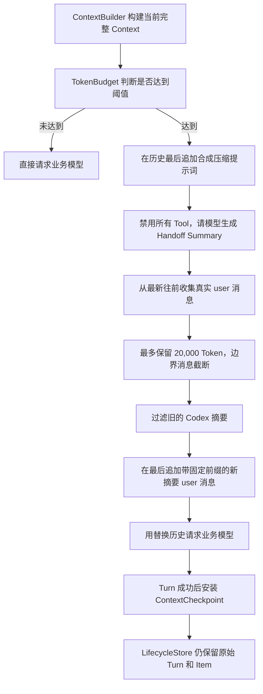

# Codex 式 Context Compaction：压缩算法、实现与源码导读

一句话结论：Codex 的压缩不是 ZIP，也不是简单删除旧消息，而是让模型为整个当前历史生成有损语义摘要，再用“最近真实用户消息 + 最后一条带固定前缀的摘要”替换模型可见历史；Lifecycle 中的原始事实仍然保留。

## 一、这次对齐依据什么

核对日期：2026-08-03。

对齐基准是 OpenAI 官方开源仓库 [`openai/codex`](https://github.com/openai/codex)，固定到提交 [`bb5054fe47abe73ecbbd454751066a28c89f4bb9`](https://github.com/openai/codex/commit/bb5054fe47abe73ecbbd454751066a28c89f4bb9)，避免 `main` 后续变化导致本文含义漂移。

官方证据：

- [本地压缩主流程 `compact.rs`](https://github.com/openai/codex/blob/bb5054fe47abe73ecbbd454751066a28c89f4bb9/codex-rs/core/src/compact.rs)
- [压缩提示词 `prompt.md`](https://github.com/openai/codex/blob/bb5054fe47abe73ecbbd454751066a28c89f4bb9/codex-rs/prompts/templates/compact/prompt.md)
- [摘要固定前缀 `summary_prefix.md`](https://github.com/openai/codex/blob/bb5054fe47abe73ecbbd454751066a28c89f4bb9/codex-rs/prompts/templates/compact/summary_prefix.md)
- [Token 阈值判断 `context_window.rs`](https://github.com/openai/codex/blob/bb5054fe47abe73ecbbd454751066a28c89f4bb9/codex-rs/core/src/session/context_window.rs)
- [远端压缩路径 `compact_remote.rs`](https://github.com/openai/codex/blob/bb5054fe47abe73ecbbd454751066a28c89f4bb9/codex-rs/core/src/compact_remote.rs)

## 二、旧实现与 Codex 式实现有什么区别

| 对比项 | 旧实现 | 现在的 Codex 式实现 |
|---|---|---|
| 摘要范围 | 只摘要较老消息 | 摘要覆盖当前完整历史 |
| 原文保留 | 保留最近的 user 与 assistant 消息 | 只从最新往前保留真实 user 消息 |
| 保留预算 | `recentMessageTokens` | `retainedUserMessageTokens`，默认 20,000 Token |
| 摘要角色 | `assistant` | `user` |
| 摘要位置 | 摘要在前、最近消息在后 | 摘要必须是替换历史最后一条消息 |
| 重复压缩 | 旧摘要可能被当普通消息 | 根据固定前缀识别并排除旧摘要 |
| 压缩提示词 | 放在 `instructions` | 作为最后一条合成 user 消息追加到历史 |
| Tool | 禁止本地 Tool | 禁止本地 Tool，也关闭 Provider 托管 Tool |

最容易写错的是摘要的角色和位置。Codex 把压缩摘要编码成 `user` 消息，并要求它保持在替换历史最后，因为续接模型是按这种历史形状训练和工作的。

## 三、完整数据流



注意两份数据：

```text
LifecycleStore：完整事实，不因压缩删除
ContextCheckpoint：下一次模型请求使用的替换历史
```

## 四、算法逐步拆解

### 1. 触发压缩

本项目先由 [`TokenBudget`](../../../agent-learn/src/runtime/token-budget.ts) 计算当前消息 Token。当达到配置阈值时，[`AgentLoop`](../../../agent-learn/src/agent/agent-loop.ts) 才调用 `ContextCompactor.compact()`。

Codex 的生产实现还会结合模型专属的 auto-compact limit、完整 Context Window 硬上限、模型切换、手动压缩以及 pre-turn/mid-turn 阶段。本项目暂时保留可配置阈值，没有硬编码某一个模型的私有窗口参数。

### 2. 构造摘要请求

核心文件：[`src/runtime/context-compactor.ts`](../../../agent-learn/src/runtime/context-compactor.ts)

压缩器不是只把“旧消息”交给模型，而是把当前历史放入摘要请求，并在最后追加 Codex 的合成提示词：

```ts
const promptMessage: LlmMessage = {
  role: "user",
  text: CODEX_COMPACTION_PROMPT,
};

return [...selected, promptMessage];
```

本项目额外在请求前执行确定性保护：

- 单条消息默认最多 20,000 Token；
- 摘要请求默认最多 96,000 Token；
- 超预算时从最老消息开始移除，优先保留临近当前任务的历史；
- 合成压缩提示词始终放在最后且不能被裁掉。

Codex 本地路径是在服务端返回 Context Window Exceeded 时删除最老历史项并重试；本项目的 Provider 还没有结构化的该错误类型，所以采用同方向的调用前预裁剪。

### 3. 摘要期间禁用 Tool

```ts
const response = await this.llm.createResponse({
  instructions:
    "Generate only the requested context checkpoint summary.",
  input: this.prepareSummaryInput(messages),
  tools: [],
  allowHostedTools: false,
  signal,
});
```

原因是 Compaction 只负责整理已经发生的事实，不应该重新执行业务 Tool、联网搜索或金额计算。若模型返回 Function Call 或空文本，Runtime 会拒绝安装这个摘要。

### 4. 从最新往前保留真实用户消息

Codex 的本地实现默认保留最近 20,000 Token 的真实 user 消息。伪代码如下：

```text
remaining = 20_000

for message in messages 从后向前:
  如果不是 user: 跳过
  如果是旧压缩摘要: 跳过
  如果整条消息放得下:
    保留整条
    remaining -= messageTokens
  否则:
    按 remaining 截断这条边界消息
    保留截断结果
    停止

把结果反转，恢复原始时间顺序
```

为什么仍保留用户原话：摘要是有损的，而用户的目标、限制和纠正通常最不能被二次改写。保留最近用户原话可以让模型同时看到“语义总览”和“高保真意图”。

### 5. 摘要必须在替换历史最后

```ts
return [
  ...retainedUserMessages,
  {
    role: "user",
    text:
      `${CODEX_SUMMARY_PREFIX}\n` +
      response.text.trim(),
  },
];
```

最终形状是：

```text
user：较新的真实用户消息 A
user：较新的真实用户消息 B
user：Codex 固定前缀 + Handoff Summary   ← 必须最后
```

assistant 原话不直接回放，因为关键回答、决定和进度应由 Handoff Summary 承担；LifecycleStore 仍保存原始 assistant Item，需要审计时依然可以读取。

### 6. 重复压缩为什么不会无限套娃

第一次压缩产生：

```text
CODEX_SUMMARY_PREFIX + 第一窗口摘要
```

第二次压缩时，这条旧摘要会参与“生成新摘要”的输入，让新摘要继承已有事实；但在构造新的替换历史时，`isCompactionSummary()` 会根据固定前缀排除旧摘要，避免把它伪装成真实用户原话再次保留。

因此是“摘要内容向前滚动”，不是“摘要消息不断叠加”。

这里要区分“第二次摘要请求读什么”和“第二次替换历史留下什么”：

```text
第一次压缩前：
原始消息 A → B → C → D

第一次压缩后：
最近真实用户消息 C、D
+ Summary 1

继续产生新对话后：
C、D + Summary 1 + 新回答 E + 新问题 F

第二次摘要请求读取：
C、D + Summary 1 + E、F + 合成压缩提示词

第二次压缩后：
最近真实用户消息 D、F
+ Summary 2（已经融合 Summary 1 与 E、F）
```

所以后续压缩不会重新从 LifecycleStore 回放 A、B、C、D 的全部原始消息。`ContextBuilder` 会从最新 Checkpoint 起步，第二次压缩读取的是“上一次替换历史 + Checkpoint 之后的新对话”。旧历史的语义由 `Summary 1` 传递给 `Summary 2`。

构造第二次替换历史时，旧的 `Summary 1` 会被固定前缀识别并移除，最后只保留新的 `Summary 2`：

```text
Summary 1
   ↓ 融合后续对话
Summary 2
   ↓ 再融合后续对话
Summary 3
```

这叫滚动摘要。它避免每次压缩都重新发送全部原始历史，从而真正降低 Context Token；代价是摘要经过多次滚动后可能逐渐损失细节。因此 LifecycleStore 始终保留原始 Item，用于审计和调试，但默认不把它们重新喂给模型。

## 五、跨 Turn 生命周期

```text
Turn N 开始
  -> ContextBuilder 构建完整模型输入
  -> TokenBudget 触发压缩
  -> ContextCompactor 生成替换历史
  -> 业务模型继续完成 Turn N
  -> Turn N 成功
  -> ContextCheckpointStore 安装 replacementMessages

Turn N+1 开始
  -> 从最新 Checkpoint 起步
  -> 追加 Turn N 的 assistant 结果
  -> 追加 Turn N+1 当前 user 输入
```

只有业务 Turn 成功后才安装 Checkpoint。若摘要成功但后续业务模型失败或 Turn 被取消，新的压缩窗口不会污染后续 Context。

## 六、本项目涉及的核心文件

| 文件 | 职责 |
|---|---|
| [`src/runtime/context-compactor.ts`](../../../agent-learn/src/runtime/context-compactor.ts) | Codex 式摘要请求、用户消息保留、固定前缀和替换历史构造 |
| [`src/runtime/token-counter.ts`](../../../agent-learn/src/runtime/token-counter.ts) | 使用 `o200k_base` BPE 计数并按 Token 截断文本 |
| [`src/runtime/token-budget.ts`](../../../agent-learn/src/runtime/token-budget.ts) | 判断是否达到本项目配置的压缩阈值 |
| [`src/agent/agent-loop.ts`](../../../agent-learn/src/agent/agent-loop.ts) | 压缩前后 Token 事件、业务模型续跑、成功后安装 Checkpoint |
| [`src/runtime/context-checkpoint-store.ts`](../../../agent-learn/src/runtime/context-checkpoint-store.ts) | 保存窗口编号、前一窗口 ID 和替换历史 |
| [`src/runtime/context-builder.ts`](../../../agent-learn/src/runtime/context-builder.ts) | 下一 Turn 从最新 Checkpoint 继续组装 Context |

## 七、测试怎么证明已经对齐

测试文件：

- [`tests/context-compactor-test.ts`](../../../agent-learn/tests/context-compactor-test.ts)
- [`tests/agent-loop-test.ts`](../../../agent-learn/tests/agent-loop-test.ts)

覆盖的关键用例：

1. 摘要请求包含当前完整历史，合成提示词位于最后。
2. 单条消息执行显式压缩，不以“没有旧消息”为由静默跳过。
3. 摘要阶段禁止 Function Call。
4. 单条消息和整次摘要请求都不超过配置 Token 预算。
5. 替换历史从最新往前保留 user 消息，并截断边界消息。
6. 重复压缩时不会把旧摘要当成真实 user 消息保留。
7. 摘要是替换历史最后一条 `user` 消息。
8. Agent Loop 只在 Turn 成功后安装新的 Checkpoint。

本切片的直接相关测试结果：

```text
npx tsx --test tests/context-compactor-test.ts tests/agent-loop-test.ts
16/16 通过
```

## 八、哪些 Codex 能力没有假装已经复制

本次对齐的是适合单 Agent 教学 Runtime 的本地压缩核心，不宣称与 Codex 生产 Runtime 完全等价。以下能力仍未实现：

- OpenAI 专用远端 `/responses/compact` 路径；
- Remote Compaction V2；
- 多模态图片、音频以及专用 ResponseItem 处理；
- Codex 的 World State、Base Instructions 快照和中途压缩插入位置；
- 模型切换时的 compaction compatibility hash；
- pre-compact / post-compact hooks；
- 服务端精确 usage、模型专属 auto-compact limit 和结构化 Context Window Exceeded 重试；
- Codex 专属 telemetry 与 rollout trace。

这些差异不妨碍学习核心算法，但不能用“已经完全复刻 Codex”来描述。

## 九、记忆口诀

```text
完整历史去做摘要，
用户原话倒序装，
二万 Token 是上限，
旧摘要按前缀过滤，
新摘要用 user 身份放最后，
Turn 成功才安装窗口，
Lifecycle 原始事实永不删。
```
