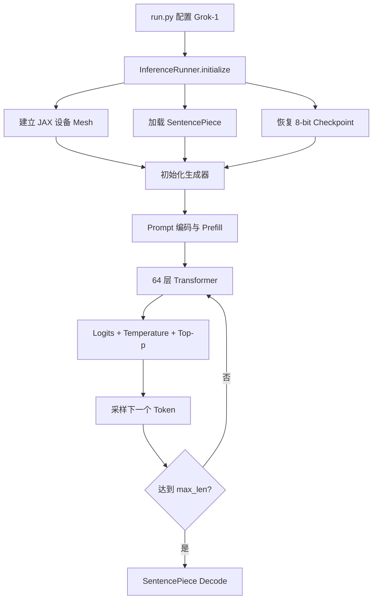
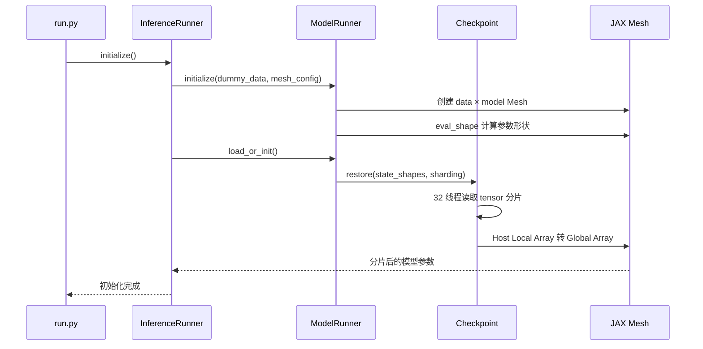
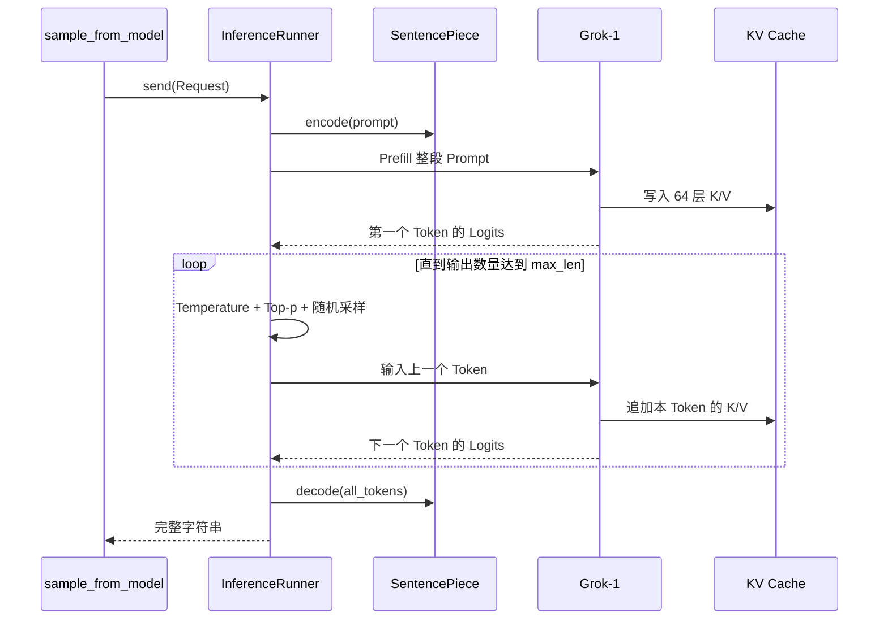

# Grok-1 开源项目源码架构深度解析

> 解析对象：xAI 官方 `xai-org/grok-1`<br>
> 解析日期：2026-07-31<br>
> 源码快照：`main`，最新提交 `7050ed204b82`<br>
> 许可证：Apache License 2.0<br>
> 分析方式：下载官方 `main` 源码快照，逐文件静态分析；未下载数百 GB 权重，未实际执行模型推理
>
> **阅读分流：**本文只分析 Grok-1 模型推理。如果要研究 Coding Agent CLI、Runtime、Tool、Skill、ACP 和 Sandbox，请看同目录的 [Grok Build CLI Agent 架构深度解析](./Grok-Build-CLI-Agent架构深度解析.md)。

---

## 0. 先纠正名称和范围

这里分析的是 **Grok-1**，不是 `gork`。

一句话结论：

> Grok-1 确实开放了推理代码和模型权重，但这个仓库不是完整的 Grok 产品，也不是 Agent 项目，而是一个用于验证 314B MoE 基础模型的 JAX 推理参考实现。

必须区分下面四件事：

| 对象 | 是否在这个仓库中 |
|---|---:|
| Grok-1 模型结构代码 | 是 |
| Grok-1 模型权重 | 官方另行提供下载，仓库内不包含 |
| Grok-1 示例推理流程 | 是 |
| 训练代码、训练数据、线上 Grok 服务、UI、Agent Runtime、Tool、Skill | 否 |

因此，“Grok-1 开源”不等于“xAI 当前整个 Grok 产品和所有 Grok 模型全部开源”。Apache 2.0 的范围是该次发布的源码文件和 Grok-1 权重。

---

## 1. 最重要的结论

### 1.1 它在 Agent 系统里属于哪一层

如果沿用我们之前的 Agent 分层，Grok-1 只属于 `Model`：

```text
桌面客户端                 不在 Grok-1 仓库
Agent Runtime              不在 Grok-1 仓库
Skills / Tools / Approval  不在 Grok-1 仓库
Model Adapter              需要我们自己封装
Grok-1 Model Inference     这个仓库实现的内容
GPU / JAX Mesh             这个仓库涉及的执行基础设施
```

所以这个项目适合学习：

- Transformer 推理。
- Mixture of Experts（MoE）。
- Grouped Query Attention（GQA）。
- KV Cache。
- JAX 的参数分片和多设备 Mesh。
- 8-bit 权重加载。
- 自回归采样。

它不适合直接学习：

- Agent Loop。
- Tool Calling。
- Skill 选择。
- Workflow 编排。
- 审批与 Sandbox。
- JSON-RPC 或客户端/服务端协议。
- 多 Agent 调度。

### 1.2 仓库性质

这个仓库更像：

```text
模型结构说明书
+ 权重读取器
+ JAX 多卡推理样例
+ 最小文本生成入口
```

它不像：

```text
可直接部署的推理服务器
或聊天客户端
或 Agent Runtime
或完整训练框架
```

---

## 2. 开源状态与活跃度

截至 2026-07-31，GitHub 元数据显示：

| 项目 | 结果 |
|---|---|
| 官方仓库 | `xai-org/grok-1` |
| 创建时间 | 2024-03-17 |
| `main` 最新提交 | 2024-03-19，`7050ed204b82` |
| 是否 Archived | 否 |
| 主要语言 | Python |
| 许可证 | Apache-2.0 |
| 仓库定位 | `Grok open release` |

仓库没有被标记为 Archived，但 `main` 的核心代码多年没有继续演进。更准确的定位是：

> 它是一份固定的模型发布快照，不是一个持续快速迭代的通用推理框架。

Apache 2.0 一般允许使用、修改和分发代码及该次发布的权重，但需要保留许可证和版权声明；许可证不自动授予 xAI/Grok 商标使用权。

---

## 3. 仓库目录只有什么

```text
grok-1/
├── README.md              模型规格、运行方式、权重下载说明
├── run.py                 Grok-1 参数配置和最小推理入口
├── model.py               Transformer、Attention、MoE、RoPE、KV Cache
├── runners.py             初始化、多设备执行、Prompt Prefill、逐 Token 采样
├── checkpoint.py          分片权重读取与 JAX 全局数组恢复
├── tokenizer.model        SentencePiece 分词器
├── requirements.txt       JAX、Haiku、NumPy、SentencePiece 版本
├── pyproject.toml         Ruff 的少量配置
├── checkpoints/README.md  权重放置位置说明
├── LICENSE.txt            Apache 2.0
└── CODE_OF_CONDUCT.md
```

真正需要精读的只有四个 Python 文件：

| 文件 | 行数 | 职责 |
|---|---:|---|
| `model.py` | 1398 | 模型本体 |
| `runners.py` | 605 | 推理和采样 Runtime |
| `checkpoint.py` | 221 | 权重恢复 |
| `run.py` | 72 | 配置与 Demo 入口 |

仓库不存在以下常见生产项目目录：

```text
tests/
server/
api/
web/
training/
datasets/
deploy/
docker/
```

这再次说明它是参考实现，而不是生产系统。

---

## 4. 总体运行流程图



这张图里没有 Tool、Skill 或 Agent Loop。循环只是语言模型自己的“逐 Token 生成循环”。

---

## 5. 启动阶段是怎么做的

入口在 `run.py:24-67`。

### 5.1 固定 Grok-1 参数

`run.py` 创建 `LanguageModelConfig` 与 `TransformerConfig`：

| 参数 | 值 |
|---|---:|
| 总参数量 | 官方标称 314B |
| 词表 | 131072 |
| 隐藏维度 | 6144 |
| Transformer 层数 | 64 |
| Query Heads | 48 |
| Key/Value Heads | 8 |
| Head Dimension | 128 |
| Expert 数量 | 8 |
| 每 Token 选择 Expert | 2 |
| 最大上下文 | 8192 |
| 推理激活类型 | bfloat16 |
| 权重 | 支持 8-bit 量化结构 |

### 5.2 初始化时序图



### 5.3 为什么先用 `jax.eval_shape`

权重文件不是简单的一个 `.bin`：代码必须先知道模型参数树中每个 Tensor 的名称、形状和分片规则。

流程是：

```text
模型配置
→ 构造 Haiku 参数树
→ jax.eval_shape 只计算形状，不真正分配完整参数
→ apply_rules 为参数匹配 PartitionSpec
→ 按同样结构读取 Checkpoint
→ 重组成 JAX PyTree
→ 分布到设备 Mesh
```

这是大型模型常见的“先建立参数骨架，再恢复权重”思路。

---

## 6. 单次文本生成时序



注意：代码内部是逐 Token 推理，但示例生成器最终才 `yield output_str`，并没有把每个 Token 实时流式返回给 UI。

---

## 7. 模型内部一层是怎么做的

每个 `DecoderLayer` 的主要结构可以简化为：

```text
输入 h
  ↓ RMSNorm
Grouped Query Self-Attention + RoPE + KV Cache
  ↓ RMSNorm
残差相加
  ↓ RMSNorm
Router → Top-2 Experts → Expert MLP → 加权合并
  ↓ RMSNorm
残差相加
  ↓
下一层
```

源码位置：`model.py:1011-1102`。

### 7.1 Attention：48 个 Q Head，8 个 KV Head

它不是标准的每个 Query Head 都有独立 K/V，而是 Grouped Query Attention：

```text
48 个 Query Head
÷ 8 个 KV Head
= 每组 6 个 Query Head 共享一组 K/V
```

维度为：

```text
Q 投影：6144 → 48 × 128 = 6144
K 投影：6144 →  8 × 128 = 1024
V 投影：6144 →  8 × 128 = 1024
```

共享 K/V 可以显著降低 KV Cache 和 K/V 投影的体积。

### 7.2 RoPE

`RotaryEmbedding` 位于 `model.py:635-692`。

它不建立传统的可学习位置向量，而是用不同频率的 sin/cos 对 Q 和 K 做旋转，让 Attention 能感知相对位置。

```text
Token Embedding 本身不直接加绝对 Position Embedding
Q、K 在进入 Attention 前应用 RoPE
KV Cache 的 step 作为下一 Token 的位置偏移
```

### 7.3 KV Cache

每一层都保存：

```text
KVMemory = {
  k,
  v,
  step
}
```

生成第一个 Token 时，Prompt 的 K/V 被一次性 Prefill；之后每生成一个 Token，只计算新 Token 的 K/V，并写入 Cache 对应位置，不重新计算全部历史 Token。

按 batch=1、8192 上下文、64 层、8 个 KV Head、Head Dimension 128、bfloat16 粗算，K/V Cache 约为 2 GiB，不包括权重和其他激活。

---

## 8. MoE 是这个项目最核心的部分

### 8.1 Router 怎么选专家

`Router` 位于 `model.py:208-269`。

对每个 Token 的隐藏向量执行：

```text
[batch, sequence, 6144]
× Router Weight [6144, 8]
→ 8 个 Expert Logit
→ Softmax
→ Top-K(k=2)
→ expert_index + expert_gate
```

- `expert_index`：选中了哪两个专家。
- `expert_gate`：两个专家输出各自应该占多少权重。

### 8.2 每个 Expert 是什么

每个 Expert 实际上是一个门控 MLP：

```text
x1 = Linear_v(input)
x2 = GELU(Linear(input))
hidden = x1 × x2
output = Linear_1(hidden)
```

FFN 中间维度由源码计算：

```text
ffn_size = 6144 × 8 × 2 / 3 = 32768
```

所以单个 Expert 大约包含三块大矩阵：

```text
6144 × 32768
6144 × 32768
32768 × 6144
```

粗算单 Expert 约 6.04 亿参数。8 个 Expert、64 层，仅 Expert MLP 就达到约 309B 参数量级，这解释了为什么模型总参数达到 314B 左右。

### 8.3 “每 Token 只选 2 个 Expert”不等于只加载 2 个

语义上，每个 Token 只使用 2/8 的 Expert 输出；但所有 Expert 权重仍需要在设备上可用。

更重要的是，这个参考实现为了代码正确性而不是速度，执行了：

```text
先计算多个 Expert 的大矩阵结果
→ 再用 one-hot expert_index 选择结果
→ 最后乘 expert_gate 并求和
```

源码函数名也直接叫：

```text
moe_slow_matmul1
moe_slow_matmul2
```

README 明确说明 MoE 实现不高效，因为官方故意避免依赖自定义 Kernel。这意味着：

> 模型在架构上是稀疏 MoE，但这个公开 Demo 并没有把稀疏计算的性能优势完整实现出来。

生产级 MoE 通常需要 Token Dispatch、Expert Parallel、All-to-All 通信和高度优化的自定义 Kernel。

---

## 9. 8-bit 权重是怎么表示的

源码定义：

```text
QuantizedWeight8bit = {
  weight,
  scales
}
```

计算线性层时再执行：

```text
dequantized_weight = weight × scales
output = input × dequantized_weight
```

`QuantizedWeight8bit` 被注册为 JAX PyTree，因此 JAX 可以像处理普通参数一样对 `weight` 和 `scales` 做形状推导、分片与设备传输。

314B 参数即便按 1 byte/参数粗算，纯权重理论下限也约 314 GB；再加 scale、部分非量化参数、KV Cache、临时激活和 JAX 编译开销，实际需要的总显存/内存更多。

因此，“代码只有几万行字符”与“模型能在普通电脑运行”完全不是一回事。

---

## 10. JAX 多设备分片怎么做

### 10.1 两个逻辑轴

代码把设备组织成：

```text
Mesh(data, model)
```

- `data`：数据并行轴。
- `model`：模型参数并行轴。

示例配置：

```text
local_mesh_config   = (1, 8)
between_hosts_config = (1, 1)
```

即本机 8 个设备组成：

```text
data = 1
model = 8
```

这基本是在做 8 路模型并行，而不是把同一模型复制 8 份。

### 10.2 PartitionSpec

代码按参数类型声明分片方式，例如：

```text
Attention Q/K/V 权重：P("data", "model")
Attention 输出权重：P("model", "data")
MoE 输入权重：P(None, "data", "model")
MoE 输出权重：P(None, "model", "data")
KV Cache：P("data", "model")
```

这里的 `None` 通常表示该维不切分，字符串表示该 Tensor 维度映射到哪个设备轴。

### 10.3 `shard_map` 与 `pjit`

- `shard_map`：明确描述某一段局部计算的输入/输出如何分片。
- `pjit`：把 Prefill、单步采样和新建 KV Cache 编译为跨设备执行函数。
- `with_sharding_constraint`：告诉 XLA 希望中间激活采用什么布局。

这套代码真正值得学的地方，是它展示了“模型结构”和“分布式执行布局”如何同时出现在一套 JAX 程序中。

---

## 11. Checkpoint 是怎么恢复的

源码位置：`checkpoint.py`。

流程：

```text
state_shapes
→ 展平 JAX PyTree
→ 根据 tensor 序号寻找 tensorXXXXX_YYY
→ 32 个线程并发读取
→ pickle.load
→ 重建原参数树
→ 校验 Checkpoint Key 与代码 Key
→ host_local_array_to_global_array
→ 按 Mesh 分片到全局设备数组
```

### 11.1 为什么复制到 `/dev/shm`

文件先复制到 Linux 的共享内存文件系统 `/dev/shm`，再进行反序列化，以减少慢磁盘重复读取带来的影响。

但这也带来两个现实限制：

1. `/dev/shm` 是 Linux 常见路径，macOS 默认没有。
2. `pickle.load` 可以执行恶意序列化内容，Checkpoint 必须来自可信来源。

因此不能把陌生人提供的 Grok 权重分片直接交给这段加载器。

---

## 12. `InferenceRunner` 实际扮演什么角色

`InferenceRunner` 可以叫“模型推理运行器”，但不要把它误认为完整 Agent Runtime。

它负责：

```text
设备 Mesh
模型参数加载
SentencePiece
Prompt Bucket
KV Cache
Temperature
Nucleus Top-p
随机种子
逐 Token 采样
```

它不负责：

```text
理解用户任务
规划步骤
选择 Skill
生成或解析 Tool Call
执行 Tool
审批
Sandbox
记忆数据库
Workflow
多 Agent
```

### 12.1 Generator 的控制方式

`InferenceRunner.run()` 返回 Python Generator：

```text
next(generator)        让生成器停在等待 Request 的位置
generator.send(req)   送入 Prompt 和采样参数
yield output_str      完成后返回最终文本
```

这只是同一 Python 进程内的协程控制，不是 JSON-RPC、HTTP、WebSocket 或 Unix Socket。

---

## 13. 采样逻辑

每一步执行：

```text
logits / temperature
→ 屏蔽不允许的 Token
→ Top-p Filter
→ categorical 随机采样
→ 返回 token_id、概率和 Top-8 候选
```

示例调用使用：

```text
temperature = 0.01
nucleus_p = 1.0
max_len = 100
```

这意味着它非常接近贪心生成，而且 `top_p=1.0` 基本不裁剪候选 Token。

`TOP_K=8` 在这里主要用于同时返回观测信息，并不是最终只允许从 8 个 Token 中采样。

---

## 14. 静态代码审查发现的限制

### 14.1 没有 EOS 停止

虽然 `LanguageModelConfig` 声明了：

```text
eos_token = 2
```

但生成循环没有检查 EOS，实际只按 `max_len` 停止。

### 14.2 默认 Prompt 最多实际保留 1024 Token

模型声明最大上下文为 8192，但 `run.py` 只配置：

```text
pad_sizes = (1024,)
```

`get_pad_bucket` 找不到更大 Bucket 时仍返回 1024，`pad_to_size` 会对超长 Prompt 左截断。因此不修改 Bucket 配置时，示例入口不能完整保留 8192 Token Prompt。

### 14.3 `max_len` 没检查 Prompt + Output 是否超过 KV Cache

停止条件只统计输出 Token 数，没有显式保证：

```text
prompt_len + generated_len <= 8192
```

实际封装服务时必须补上总上下文边界。

### 14.4 Padding Mask 在 MoE 调用中被忽略

`MoELayer.__call__` 接收 `padding_mask`，但调用 `_inference_call` 时没有继续传入，导致 Router 内部准备好的 Padding Mask 分支实际没有使用。

这至少会让 Padding Token 也参与不必要的专家路由和计算。

### 14.5 默认批量大小实际上是 1

配置为：

```text
bs_per_device = 0.125
local GPU = 8
global batch = 0.125 × 8 = 1
```

代码虽然写了空闲 Slot 和多个 Request 的结构，但默认只跑一个请求。

### 14.6 扩展 batch>1 时输出 Token 容器存在问题

`all_tokens` 是整个生成器共用的单个列表，而不是每个 batch slot 一个列表。默认 batch=1 不会暴露问题；如果直接把 batch 扩大，多请求 Token 可能相互混入。

### 14.7 不是流式输出

虽然内部每次产生一个 Token，但只在达到 `max_len` 后返回完整字符串。桌面 Chat 若要逐字显示，需要重新设计输出接口。

### 14.8 依赖版本老且平台固定

依赖锁定：

```text
JAX 0.4.25 + CUDA 12
Haiku 0.0.12
NumPy 1.26.4
SentencePiece 0.2.0
```

代码使用多个 `jax.experimental` API。直接升级到 2026 年的新 JAX 版本，很可能需要迁移 API；直接在 Apple Silicon/macOS 上也无法照搬 CUDA 配置。

### 14.9 没有测试

仓库没有单元测试、集成测试或数值对齐测试。README 也把它定位为用于验证模型正确性的示例代码，而不是生产 SLA 实现。

---

## 15. 当前电脑能不能直接运行

结论：**不能按原样运行完整 Grok-1。**

主要原因：

1. 当前源码目录没有下载 Grok-1 Checkpoint。
2. 权重为数百 GB 量级。
3. 示例预期 CUDA 12 与多 GPU。
4. 默认 JAX Mesh 需要 8 个本地设备。
5. `checkpoint.py` 依赖 Linux `/dev/shm`。
6. MoE 是慢速正确性实现，运行效率不是生产水平。

本次没有盲目安装依赖或下载权重，因为那会产生数百 GB 数据、耗费大量网络资源，而且当前机器不满足原始执行条件。

如果只是学习代码，不需要真的跑 314B 权重。更合理的实验是：

```text
保留同样的 Router、Top-2 Expert、GQA、KV Cache 思路
→ 把层数、隐藏维度、词表和 Expert 大幅缩小
→ 用随机参数跑通一个 Tiny Grok
```

---

## 16. 它和 Codex 架构的根本区别

| 维度 | Grok-1 开源仓库 | Codex 开源项目 |
|---|---|---|
| 核心对象 | 大语言模型推理 | Agent Runtime 与客户端能力 |
| 输入输出 | 文本 Token → 文本 Token | 用户任务 → 模型/工具/审批/结果 |
| Tool | 无 | 有 |
| Skill | 无 | 有 |
| Approval | 无 | 有 |
| Sandbox | 无 | 有 |
| IPC/RPC | 无 | App Server 等协议 |
| 模型实现 | 仓库核心 | 通常通过模型服务调用，不在客户端内训练/实现大模型 |
| 多设备 GPU 分片 | 有 | 不是客户端核心 |

两者不应该二选一，它们处在不同层：

```text
Codex 类项目研究“怎样让模型成为能做事的 Agent”
Grok-1 项目研究“一个大模型怎样在多 GPU 上完成 Token 推理”
```

---

## 17. 对我们手写 Agent 项目的启发

### 17.1 不要把模型推理绑死在 Agent Runtime

我们的 Agent 应该依赖稳定的 `Model Adapter`：

```text
Agent Runtime
    ↓
Model Adapter Interface
    ├── OpenAI-compatible API
    ├── 本地小模型
    └── 未来其他 Provider
```

不应该把 Grok-1 的 JAX 推理代码直接塞进 Electron/Rust Agent Runtime。模型层与 Agent 编排层需要解耦。

### 17.2 `InferenceRunner` 值得借鉴的点

- 配置与模型实现分离。
- Tokenizer 独立加载。
- Prompt Prefill 与单 Token Decode 分开编译。
- KV Cache 显式建模。
- 采样参数封装成 `Request`。
- 模型参数和激活有清晰分片规则。

### 17.3 不应该照搬的点

- Generator 只适合同进程 Demo，不适合作为桌面客户端协议。
- 没有取消、超时、EOS、总上下文边界。
- 没有真正的流式事件模型。
- Checkpoint 使用不安全的 Pickle 信任边界。
- 没有生产级 MoE Kernel。
- 推理 Runtime 与硬件配置高度耦合。

### 17.4 正确的学习定位

```text
第一主线：Codex → Agent Runtime、Tool、Skill、Approval、协议

第二支线：Grok-1 → Transformer、MoE、KV Cache、JAX 多卡推理

不要用第二支线替代第一主线。
```

如果你的目标是深耕 Agent，Grok-1 可以帮助你理解“Agent 背后的模型为什么能生成下一个 Token”，但它不会教你“Agent 怎样可靠地执行任务”。

---

## 18. 推荐源码阅读顺序

不要从 1398 行的 `model.py` 第一行硬啃，建议按调用链：

```text
1. README.md
   先确认发布范围和模型参数

2. run.py:24-67
   看 Grok-1 的完整配置和入口

3. runners.py:262-439
   看初始化、Prefill、Sample Step

4. runners.py:440-603
   看 Request Generator 和逐 Token 循环

5. model.py:1202-1398
   看 Token → Transformer → Logits

6. model.py:1011-1102
   看单层 Decoder

7. model.py:694-912
   看 GQA、RoPE 和 KV Cache

8. model.py:208-399
   看 Router 和 Top-2 MoE

9. checkpoint.py:83-221
   看分片权重怎样恢复到 JAX Mesh
```

---

## 19. 可以自己动手做的三个实验

### 实验 A：Tiny MoE

目标：只理解专家路由。

```text
隐藏维度：64
Expert：4
Top-K：2
层数：2
词表：1000
```

打印每个 Token 被分配到哪些 Expert，以及两个 Gate 权重。

### 实验 B：KV Cache 对照

同一段文本分别运行：

```text
每一步重新计算全部历史 Token
vs
Prefill + KV Cache 增量 Decode
```

比较计算量和输出是否一致。

### 实验 C：把 Tiny Model 接入手写 Agent

不要改 Agent Runtime，只实现新的 Model Adapter：

```text
Tiny Local Model Adapter
→ 与远程 OpenAI-compatible Adapter 使用相同接口
→ 验证 Runtime 不依赖具体模型实现
```

这个实验能真正把 Grok-1 的模型知识和 Agent 学习主线连接起来。

---

## 20. 从神经网络到 Grok-1 的学习路线

### 20.1 能否从 Grok-1 学会 LLM 的底层原理

可以学到重要的一部分，但不是全部。

Grok-1 主要回答：

```text
一段文本怎样变成 Token
→ Token 怎样经过 Transformer
→ Attention 怎样读取上下文
→ MoE 怎样选择专家
→ Logits 怎样变成下一个 Token
→ 怎样利用 KV Cache 连续生成
```

它不能单独回答：

```text
训练数据怎样收集和清洗
→ 314B 参数怎样从随机数训练出来
→ 怎样进行 SFT / RLHF / DPO / RLAIF
→ 怎样做安全对齐和拒答
→ 怎样训练 Tool Calling
→ 怎样建设线上分布式推理服务
→ 怎样做成 ChatGPT / Claude 那样的完整产品
```

因此更准确的说法是：

> Grok-1 是学习“大模型推理结构”的高级教材，不是从数据到 ChatGPT 产品的完整制作教程。

### 20.2 是否必须学习神经网络

必须学，但不需要先把所有高等数学学完才开始写代码。

最低数学基础：

| 知识 | 学到什么程度 |
|---|---|
| 向量与矩阵 | 会理解矩阵乘法、形状、转置和广播 |
| 导数与链式法则 | 能解释反向传播为什么能更新参数 |
| 概率 | 理解 Softmax、交叉熵、采样和条件概率 |
| 优化 | 理解梯度下降、学习率和过拟合 |

暂时不需要：

- 先证明所有定理。
- 一上来研究分布式 3D 并行。
- 为了运行 Grok-1 购买多张高端 GPU。
- 从头训练几十亿参数模型。

### 20.3 推荐的八步路线

#### 第 1 步：Python 与 NumPy

自己实现：

```text
向量点积
矩阵乘法
Softmax
交叉熵
```

验收：不用框架算出一个三分类模型的 Loss。

#### 第 2 步：两层神经网络

用 NumPy 写：

```text
Linear
→ ReLU
→ Linear
→ Softmax
→ Backpropagation
```

验收：在一个很小的数据集上看到 Loss 下降。

#### 第 3 步：切换到 PyTorch

学习：

- Tensor 与 shape。
- `autograd`。
- `nn.Module`。
- Optimizer。
- Dataset / DataLoader。

验收：用 PyTorch 重写第二步，结果一致。

#### 第 4 步：字符级语言模型

用一段文本训练模型预测下一个字符。先使用 Bigram，再做 MLP。

验收：模型能生成像训练文本、但不完全相同的短句。

#### 第 5 步：手写 Self-Attention

重点理解：

```text
Q = XWq
K = XWk
V = XWv
Attention = softmax(QK^T / sqrt(d))V
```

验收：画出 Attention Matrix，解释一个 Token 在关注哪些历史 Token。

#### 第 6 步：手写 MiniGPT

组合：

```text
Tokenizer
Embedding
Positional Encoding / RoPE
Multi-Head Self-Attention
MLP
Residual Connection
LayerNorm
Language Model Head
```

模型只需几十万到几百万参数，在普通电脑或小 GPU 上训练。

验收：能保存和加载 Checkpoint，并输入 Prompt 连续生成文本。

#### 第 7 步：推理优化

依次加入：

- Temperature。
- Top-k / Top-p。
- Prefill 与 Decode。
- KV Cache。
- Batch。
- 量化的基本概念。

验收：比较“每次重算全部历史”和“KV Cache 增量生成”的速度及输出。

#### 第 8 步：回到 Grok-1

此时再读：

```text
model.py 的 Attention
→ GQA
→ RoPE
→ KV Cache
→ Router
→ Top-2 Experts
→ JAX Mesh / PartitionSpec
→ 8-bit Checkpoint Restore
```

你会发现 Grok-1 不再是一堆陌生名词，而是 MiniGPT 的超大规模 MoE 版本。

### 20.4 两条学习线不要互相替代

推荐并行但分层学习：

```text
LLM 线：MiniGPT → Transformer → Grok-1 → 训练与推理系统

Agent 线：Model API → Agent Loop → Tool → Permission
       → Skill / MCP → Session → Subagent / Workflow
```

两条线的连接点是 `Model Adapter`：

```text
Agent Runtime
→ Model Adapter
→ 远程 ChatGPT / Claude / Grok API
或
→ 自己训练的 TinyGPT / 本地开源模型
```

先用现成 API 学 Agent，不会妨碍以后学习模型；先做 MiniGPT，也不等于必须自己训练一个 Claude 才能做 Agent 产品。

### 20.5 一个现实的三个月验收目标

不以“做出 ChatGPT”为目标，而以三个可观察结果为目标：

1. 能从零训练一个小型字符级语言模型并生成文本。
2. 能解释 Transformer、Attention、KV Cache 和 MoE 的数据流。
3. 能把本地 Tiny Model 与远程模型分别接入同一个 Agent Runtime 接口。

做到这三件事，你就同时摸到了 LLM Model Engineering 和 Agent System Engineering 的入口。

---

## 21. 最终判断

### Grok-1 是否开源

```text
是：Grok-1 的本次推理代码和权重按 Apache 2.0 发布。

不是：完整 Grok 产品、训练数据、训练基础设施、线上服务、
      当前全部 Grok 模型和 Agent 能力并没有因此全部开源。
```

### 这个仓库到底怎么做的

```text
SentencePiece 将文本变成 Token
→ JAX/Haiku 构建 64 层 Transformer
→ GQA + RoPE + KV Cache 完成 Attention
→ Router 为每个 Token 从 8 个 Expert 中选择 2 个
→ 8-bit 分片权重在 8 设备 Mesh 上计算
→ Temperature/Top-p 逐 Token 采样
→ SentencePiece 解码为文本
```

### 对 Agent 深耕的价值

> 它适合当作“LLM 推理基础课”，不适合当作“Agent 架构样板”。Agent 主线仍应继续研究 Codex Runtime；Grok-1 用来补足模型、MoE 和推理基础设施知识。

---

## 22. 参考资料

- [xAI Grok-1 官方 GitHub 仓库](https://github.com/xai-org/grok-1)
- [Grok-1 官方 Hugging Face 模型页](https://huggingface.co/xai-org/grok-1)
- [Apache License 2.0](https://www.apache.org/licenses/LICENSE-2.0)
- [JAX 官方文档](https://docs.jax.dev/)
- [Haiku 官方仓库](https://github.com/google-deepmind/dm-haiku)
- [RoFormer / RoPE 论文](https://arxiv.org/abs/2104.09864)
