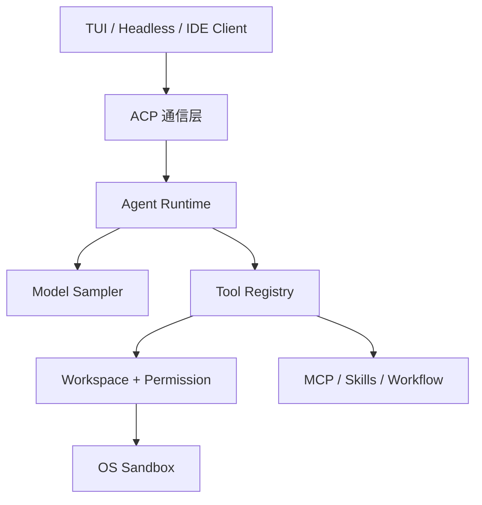
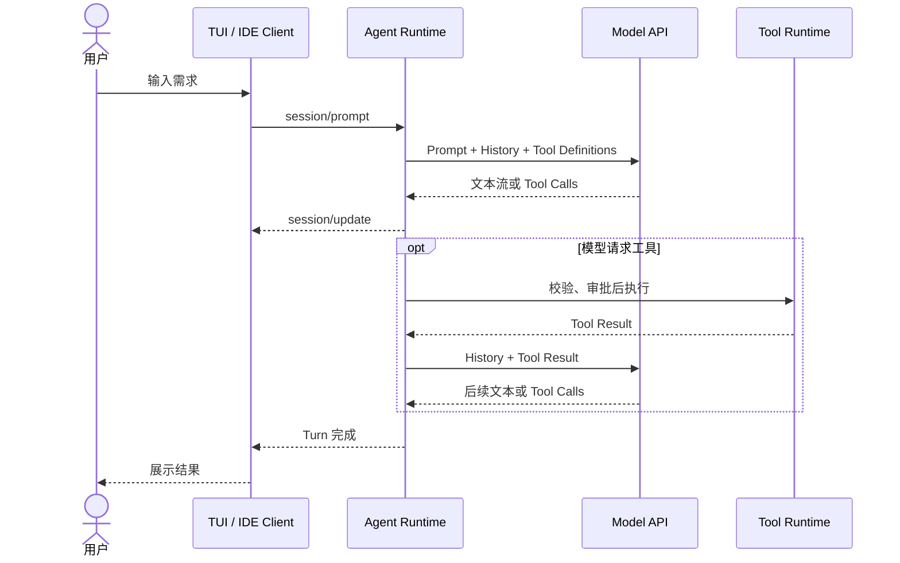
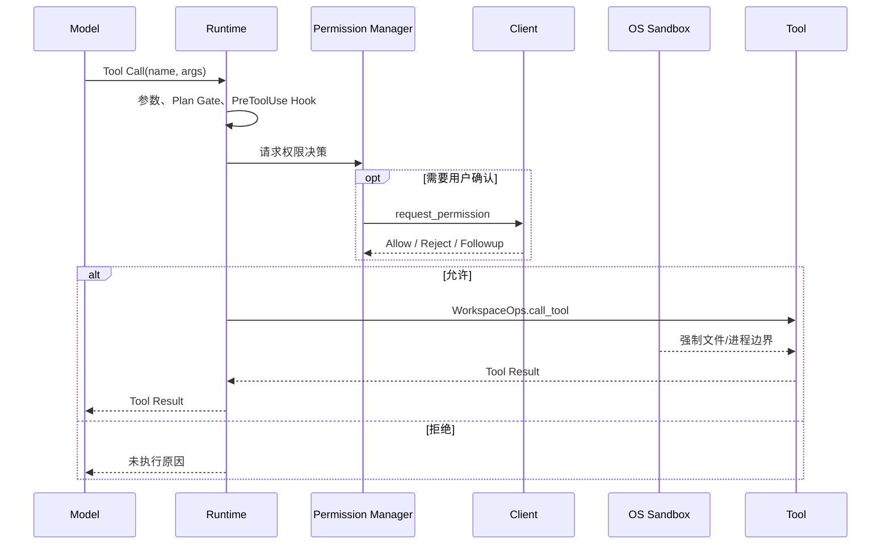
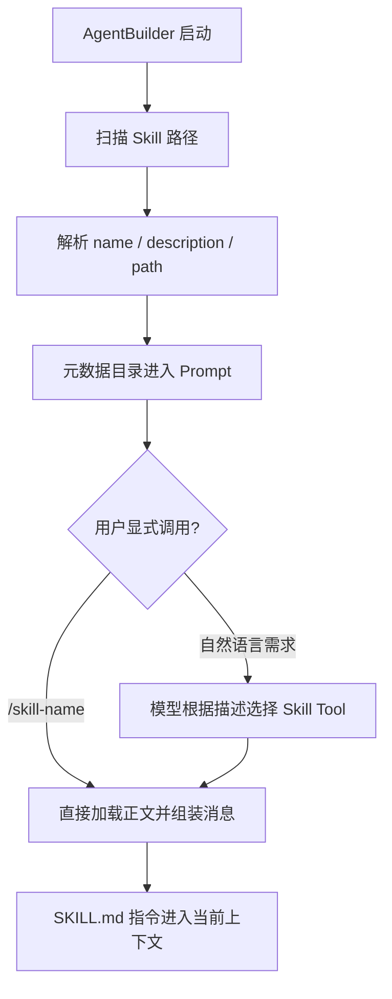

# Grok Build CLI Agent 架构深度解析

> 解析对象：SpaceXAI 官方 `xai-org/grok-build`<br>
> 解析日期：2026-07-31<br>
> 源码基线：官方 `main` 核心源码快照，`SOURCE_REV` 为 `2a28b4a86cfc4a4c133c35b7fc2a6a9964387c39`<br>
> 许可证：第一方代码 Apache-2.0；移植和第三方代码保留原许可证<br>
> 分析方法：官方 README、用户指南与 Rust 核心源码交叉核对；未安装、登录或实际运行 Agent

---

## 0. 先把三个容易混淆的项目分开

你记得的 “Grok CLI 开源项目” 确实存在，但目前至少有三个名称很接近的对象：

| 对象 | 官方性 | 技术栈 | 本质 | 是否适合学 Agent |
|---|---|---|---|---:|
| [`xai-org/grok-1`](https://github.com/xai-org/grok-1) | xAI 官方 | Python/JAX | Grok-1 314B MoE 模型推理参考实现 | 否，主要学 LLM 推理 |
| [`xai-org/grok-build`](https://github.com/xai-org/grok-build) | SpaceXAI 官方 | Rust | Coding Agent CLI/TUI、Runtime 与工具执行系统 | 是，本篇主角 |
| [`superagent-ai/grok-cli`](https://github.com/superagent-ai/grok-cli) | 社区项目，与 xAI 无关 | TypeScript/Bun | 调用 Grok API 的终端 Coding Agent | 是，更适合快速读懂 |

最容易误解的地方是：

- 官方 CLI 的仓库名是 `grok-build`，但安装后的命令叫 `grok`。
- 社区项目的仓库名真的叫 `grok-cli`，安装后也叫 `grok`。
- `grok-1` 不是 CLI，也没有 Agent Runtime、Tool、Skill 或审批系统。

因此，之前对 Grok-1 的分析并没有作废，只是分析的是 **Model 层**；本篇分析的是 **Agent Runtime 与客户端层**。

---

## 1. 一句话定位与客观结论

一句话说清 Grok Build：

> Grok Build 是一个 Rust 编写的终端 Coding Agent 客户端和 Runtime：它负责组织模型请求、驱动 Agent Loop、执行工具、处理权限与沙箱，并通过 ACP 接入 IDE 或其他客户端。

它不是下面这些东西：

- 不是把 Grok-1 314B 权重塞进本机运行。
- 不是只有一层聊天页面的模型 API 套壳。
- 不是 Electron 或 Tauri 桌面客户端。
- 不是纯粹的一段 CLI 参数解析代码。
- 也不是完整开源了 xAI 的模型训练与线上推理服务。

更准确的产品形态是：

```text
终端客户端（TUI）
+ Coding Agent Runtime
+ Tool / Skill / MCP / Workflow
+ Permission / Sandbox / Session
+ IDE/SDK 接入协议（ACP）
+ 远程模型 API
```

截至 2026-07-31，GitHub API 显示该仓库约 2.36 万 Stars、4494 Forks，语言为 Rust，许可证为 Apache-2.0。Stars 只能表示关注度，不能代替架构质量判断。

README 还明确说明：

- 代码是从 SpaceXAI monorepo 周期性同步出来的。
- 根目录 `SOURCE_REV` 记录对应的上游 monorepo commit。
- 当前不接受外部贡献。
- 部分 Tool 实现移植自 `openai/codex` 与 `sst/opencode`。

所以最准确的评价是：

> 它有自己的 Rust Runtime、TUI、ACP、Leader、Memory、Workflow、Goal、Plugin 和 Hook 体系，同时复用了 Codex、OpenCode 的部分工具实现；既不能说是从零完全独创，也不能说只是“Codex 换了个模型”。

---

## 2. 本地源码范围说明

本地目录 `agent/grok-build/` 是根据官方 `main` 重建的 **核心源码快照**：

- 161 个文件。
- 约 18.3 万行（包含 Markdown、Rust、Cargo 文件）。
- 包含 24 篇用户指南和本篇分析所需的核心 crate。
- 不包含完整 Git 历史。
- 不包含所有第三方 vendored 文件、测试快照和每个 workspace crate 的完整源码。

因此它不是完整 `git clone`，也暂时不能据此承诺全仓编译通过。本文明确区分：

- **源码已确认**：本地核心文件中可以直接定位。
- **官方文档已确认**：用户指南或 README 明确说明。
- **架构判断**：根据前两类证据作出的解释。

---

## 3. 总体架构

下面只画分层，不把每个 crate 都塞进一张图：



对应的核心 crate：

| Crate | 职责 |
|---|---|
| `xai-grok-pager-bin` | 组合根和命令入口；产物名为 `xai-grok-pager`，官方安装名为 `grok` |
| `xai-grok-pager` | 全屏 TUI、Headless 输出、ACP 客户端、交互状态 |
| `xai-grok-shell` | Agent Runtime、Session Actor、Turn Loop、stdio、Leader |
| `xai-grok-agent` | Agent Definition、Prompt 构建、Skill/Plugin/Agent 发现 |
| `xai-grok-tools` | Tool Registry、Tool Bridge、内置 Tool 实现 |
| `xai-grok-workspace` | 文件系统、终端执行、权限、Checkpoint、WorkspaceOps |
| `xai-grok-sandbox` | macOS/Linux OS 级沙箱配置与应用 |
| `xai-grok-mcp` | MCP Server 连接、Tool 暴露与传输 |
| `xai-acp-lib` | ACP 双向通道、请求/响应 Gateway |
| `xai-chat-state` | Conversation、Token、Compaction 和持久化状态 |
| `xai-workflow` | 确定性 Workflow Engine、Journal、暂停和恢复 |

这里可以看出，Runtime 并不是 UI，也不是 Model：

> Runtime 是那个持续维护会话状态、调用模型、解释 Tool Call、执行工具并把结果再次交给模型，直到任务结束的控制程序。

---

## 4. 它到底是客户端、服务端，还是 CLI

答案是：它可以扮演多种角色，取决于启动模式。

| 启动方式 | UI | Runtime 位置 | 主要通信 |
|---|---|---|---|
| `grok` | 全屏终端 TUI | 默认同一进程内 | Rust Channel + ACP 语义 |
| `grok -p "..."` | 无交互，输出到 stdout | 同一进程内 | Rust Channel + ACP 语义 |
| `grok agent stdio` | 由外部 IDE/程序提供 | `grok` 子进程 | JSON-RPC 2.0 over stdin/stdout |
| `grok agent serve` | 由远程/本地客户端提供 | 长驻 Agent Server | ACP over WebSocket |
| Leader 模式 | TUI、stdio 等多个客户端 | 共享 Leader 进程 | Unix Socket / Windows Named Pipe |

所以它不是 Electron/Tauri 那种独立桌面窗口，也不是网页套壳。它是：

1. 一个真实的终端客户端。
2. 一个可独立运行的 Agent Runtime。
3. 一个可被 IDE、SDK 或自定义客户端接入的 Agent Server。

### 4.1 默认 TUI 为什么不需要 TCP

`xai-grok-pager/src/acp/spawn.rs` 明确显示：

```text
TUI
→ spawn_grok_shell
→ 新建 Agent Worker 线程
→ acp_channels()
→ Tokio mpsc + oneshot
→ AcpGatewayReceiver 直接分发给 MvpAgent
```

UI 和 Runtime 已经在同一进程中，使用内存 Channel 更简单：

- 不需要端口。
- 不需要序列化再反序列化。
- 不暴露网络攻击面。
- 仍然保留 ACP 的请求、响应和反向请求语义。

此时说“JSON-RPC over TCP”是不正确的；它甚至没有走内核网络栈。

### 4.2 stdio 模式

`grok agent stdio` 用于 IDE 或 SDK 启动一个本地 Agent 子进程：

```text
IDE 写子进程 stdin
→ JSON-RPC 2.0 Request
→ Grok Runtime
→ stdout 返回 Response / Notification
```

这依然不是 TCP。stdin/stdout 是父子进程的管道。

### 4.3 WebSocket Server 模式

`grok agent serve --bind 127.0.0.1:2419 --secret ...` 才会真正监听网络地址。

分层是：

```text
ACP / JSON-RPC Message
→ WebSocket Message
→ TCP
→ IP
```

WebSocket 是消息传输层；JSON-RPC/ACP 是应用协议；TCP/IP 是更底层的网络协议。它们不是互斥选项。

### 4.4 Leader 模式为什么使用 Unix Socket

`xai-grok-shell/src/leader/transport.rs` 直接把 Unix 平台的 `LeaderStream` 定义为 `tokio::net::UnixStream`；Windows 则使用 Named Pipe。

Leader 的用途是让多个本机客户端共享一个长驻 Runtime。Unix Socket 比回环 TCP 更合适：

- 只服务本机，不需要占用端口。
- 可使用文件权限限制谁能连接。
- 不经过 IP 路由。
- 生命周期可以由 socket 文件表示。
- 延迟和系统开销较低。

Leader 外层协议不是裸 JSON-RPC：

```text
4 字节大端长度
→ JSON 编码的 Leader Message
→ ClientMessage::Acp { payload }
→ payload 内才是 ACP JSON-RPC 字符串
```

单帧上限在源码中是 64 MiB。Windows 使用确定性 Named Pipe 名称实现同样的本机 IPC 语义。

### 4.5 Runtime 到模型用什么协议

Runtime 调用模型时不走 ACP。ACP 是“客户端 ↔ Agent”的协议，模型 API 是“Agent ↔ 模型服务”的协议。

官方自定义模型文档支持：

- OpenAI Chat Completions：`/v1/chat/completions`。
- OpenAI Responses：`/v1/responses`。
- Anthropic Messages 风格接口。
- Ollama 等 OpenAI-compatible endpoint。

底层是 HTTP/HTTPS，请求和流式响应由 Provider/Backend 决定。官方内置模型同样通过远程采样服务获取结果，不会加载 Grok-1 本地权重。

---

## 5. ACP 与 JSON-RPC 的关系

ACP 全称 Agent Client Protocol。它定义“Coding Agent 客户端和 Agent Runtime 应该怎样交谈”；JSON-RPC 2.0 提供消息信封。

典型 ACP 生命周期：

```text
initialize
session/new 或 session/load
session/prompt
session/update（流式通知）
request_permission（Agent 反向请求客户端）
session/cancel
```

JSON-RPC 2.0 的三种核心消息：

```json
{"jsonrpc":"2.0","id":1,"method":"session/prompt","params":{}}
```

有 `id` 的是 Request，接收方必须回 Response：

```json
{"jsonrpc":"2.0","id":1,"result":{}}
```

没有 `id` 的是 Notification，不等待回复：

```json
{"jsonrpc":"2.0","method":"session/update","params":{}}
```

双向不是指同时建立两条 TCP 连接，而是同一条双向通道的两端都能发 Request：

- Client → Agent：`session/prompt`。
- Agent → Client：`request_permission`。
- Client → Agent：返回本次审批结果。

Grok 还扩展了 `x.ai/*` 方法，用于文件、Git、Worktree、终端、搜索、Session、认证和遥测。它们不是 ACP 标准核心方法，第三方客户端应先从 `initialize` 返回的 capabilities 判断是否支持。

---

## 6. 一次用户请求的完整时序



关键理解：

> 一次用户消息不等于一次模型请求。只要模型继续产生 Tool Call，Runtime 就会执行工具、写回结果并再次请求模型。

---

## 7. Agent Loop 源码拆解

核心代码位于：

- `xai-grok-shell/src/session/acp_session_impl/turn.rs`
- `run_loop.rs`
- `sampler_turn.rs`
- `tool_calls.rs`
- `tool_dispatch.rs`

可压缩成下面的伪代码：

```text
prepare turn
build tool definitions
inject AGENTS.md / Skill / MCP / Memory reminders
check auto-compaction

loop:
    request = ChatState.build_request()
    response = sampler.submit_and_collect(request)
    stream text/thought/tool updates to client

    if response has no tool_calls:
        run stop gates
        finish turn

    validate repetition and max-turn limits
    tool_results = execute_tool_calls(response.tool_calls)
    append tool_results to conversation
    continue
```

它还实现了这些工程保护：

- 最大 Tool Turn 限制。
- 重复相同 Tool Call 检测。
- 先提醒模型修正，达到阈值后停止。
- TodoGate：任务未完成时阻止模型过早结束。
- 用户中途 Interjection。
- 自动 Compaction。
- 401 认证刷新和有限重试。
- Structured Output。
- Memory、MCP 和 Skill Reminder。

这就是为什么真正的 Agent Runtime 远不止 `while (tool_call)` 十几行代码：难点集中在状态、一致性、恢复、安全和用户交互。

---

## 8. Tool 注册、审批与执行

### 8.1 Tool 是什么

Tool 是 Runtime 可以实际执行的能力，例如：

- 读取、搜索和修改文件。
- 执行终端命令。
- Web Search / Web Fetch。
- MCP Tool。
- Memory Search。
- 启动 Subagent。
- 进入或退出 Plan Mode。
- 启动 Workflow。

模型只产生结构化调用意图；真正解析参数、鉴权和执行的是 Runtime。

### 8.2 审批时序



源码中的实际检查顺序是：

1. 向客户端发送 `ToolCall(Pending)`，让 UI 先显示。
2. 检查 MCP 是否已初始化。
3. 解析和容错 Tool JSON 参数。
4. ToolBridge 解析 Tool 类型。
5. Plan Mode Edit Gate。
6. `PreToolUse` Hook。
7. Permission Rule、已记忆授权、内置只读规则和当前 Permission Mode。
8. 必要时通过 ACP 反向请求 Client。
9. `WorkspaceOps::call_tool`。
10. `PostToolUse` Hook、状态更新和 Tool Result 入 Conversation。

几个容易忽略的语义：

- Hook 的 Allow 不会越过后续 Permission；Hook Deny 可以提前阻止。
- 配置中的 Deny 优先级高于 Ask 和 Allow。
- `PolicyDeny` 通常把拒绝原因喂回模型，让模型换方案继续。
- 用户在交互审批中主动 Reject，可能停止当前批次。
- Always-approve 也不会越过所有 Deny/Hook。

### 8.3 多个 Tool Call 是否并发

答案是：**准备阶段有顺序，批准后的执行阶段可以并发**。

`execute_tool_calls_batch` 先按模型给出的顺序逐个执行：

```text
参数解析
→ Hook
→ Permission
→ 放入 approved 列表
```

随后用 `FuturesUnordered` 并发执行已批准 Tool：

- 不同文件的 Tool 可并发。
- 同一路径通过 `file_path`、`path` 或 `target_file` 建立 Mutex，按顺序串行。
- 只要同一批次中有写操作，针对同一路径的读写都会进入同一个锁。
- `exit_plan_mode` 等 ExitPlan Tool 会被拆到批次尾部，等待普通 Tool 完成。

这不是“所有 Tool 无脑并发”，而是带冲突控制的批量执行。

---

## 9. Skills：发现、选择、加载和多个 Skill

### 9.1 Skill 的本质

Skill 是可复用 Prompt Package，通常是一份 `SKILL.md` 加可选脚本、参考资料和资产。它本身不是：

- 一个独立进程。
- 一个固定模型。
- 一个正在运行的 Agent。
- 一个向量数据库条目。
- 一个天然并发任务。

### 9.2 当前源码中的真实流程



这里必须修正一个旧结论：当前代码确实在 Registry 中注册了 `OpenCodeSkillTool`，并在 Agent Definition 的工具集中把它作为 Skill 类型能力使用。

所以有两条加载路径：

1. **显式 `/skill-name`**：Prompt 组装阶段直接读取正文并放进 `<skill_information>`，不需要先让模型调用工具。
2. **自动选择**：模型先看到 Skill 的名称、描述和路径，判断适用后调用 Skill Tool；Tool 返回正文，下一轮模型按指令工作。

Skill 的“智能匹配”主要由模型理解 `description` 和 `when-to-use` 完成，不是 Runtime 去向量库做最近邻搜索。

### 9.3 启动时扫描哪些位置

官方文档和源码共同显示，发现范围包括：

```text
当前目录及到 repo root 之间的：
  .grok/skills
  .agents/skills
  .claude/skills
  .cursor/skills
  相应 commands 目录

用户目录：
  ~/.grok/skills
  ~/.agents/skills
  ~/.claude/skills
  ~/.cursor/skills

其他：
  config.paths
  Plugin Skills
  Server 同步 Skills
  Bundled Skills
```

规则包括：

- 高优先级的同名 Skill 覆盖低优先级版本。
- Plugin 与 Native 冲突时可使用限定名。
- `ignore` 完全隐藏。
- `disabled` 保留展示但不可调用。
- `disable-model-invocation: true` 只允许用户显式调用。
- 文件变化会触发 watcher，几秒内重新加载。

如果某个 Skill 没有安装在任何发现来源中，Grok 不会仅凭聊天内容自动从互联网下载并加入。它只能使用当前本机、插件、服务端同步或 Bundled 列表里已经可用的 Skill。

### 9.4 Agent Profile 是否等于 Skills Assemble

不等于。源码里的 `AgentDefinition` 可以配置：

```text
name / description
prompt 与 prompt_mode
model / effort / max_turns
toolset / allowlist / denylist
permission_mode
skills / discover_skills / inherit_skills
MCP servers / MCP inheritance
memory scope
hooks
isolation / background
subagent capability mode
```

所以更准确的公式是：

```text
Agent Profile / Agent Definition
= Prompt
+ Model 策略
+ Tool 能力
+ Permission
+ 可预加载 Skills
+ MCP / Memory / Hook / Isolation 等运行策略
```

Skills 只是 Profile 的一个组成部分。Profile 也不是一个正在运行的 Agent；Definition 与 Session Context 经过 `AgentBuilder` 构建后，才得到绑定当前 Session 的 Agent 实例。

### 9.5 命中多个 Skill 怎么办

没有一个独立的“多 Skill 调度器”替模型建立 DAG。通常是：

1. 模型从元数据中判断需要哪些 Skill。
2. 产生一个或多个 Skill Tool Call。
3. Skill Tool 只负责返回对应 Prompt 正文。
4. 多份 Skill 指令进入同一个 Agent 的 Conversation。
5. 模型再决定后续 Tool 或 Subagent 如何执行。

如果模型在同一响应里发出多个无路径冲突的 Skill Tool Call，它们会进入通用批量 Tool 执行机制，执行层可以并发；但这只是并行加载文本，不代表 Skill 变成多个独立 Agent。

“Meta-skill”也不是 Grok Build 的独立 Runtime 类型。它通常只是一个指导“如何发现、组合或创建其他 Skills”的 Skill。

---

## 10. MCP

MCP 解决的是“外部工具怎样以统一方式接入 Agent”，不是客户端与 Runtime 的通信协议。

Grok 支持：

- stdio MCP：Grok 启动本地 Server 进程，通过 stdin/stdout 通信。
- HTTP/SSE MCP：连接远程 MCP Server。
- OAuth。
- `.mcp.json`、Claude 和 Cursor 兼容配置。
- Plugin 附带的 MCP Server。

MCP Tool 的模型侧名称是：

```text
server__tool
```

Progressive 模式不会一次把所有 MCP Tool Schema 塞进上下文，而是主要给模型：

```text
search_tool
use_tool
```

模型先搜索，再调用。这能控制大量 MCP Tool 对 Context Window 的占用。

默认 MCP 输出超过约 20,000 bytes 会落盘，避免巨型 Tool Result 直接挤爆上下文。

Skill 与 MCP 的关系是：

- Skill 可以告诉模型何时、怎样使用某个 MCP Tool。
- Skill 本身不负责连接 MCP。
- MCP Server 的生命周期由 Runtime 管理。

---

## 11. Permission 与 Sandbox 不是一回事

一句话区分：

> Permission 决定“这次 Tool Call 是否允许尝试”，Sandbox 决定“即使已经允许，进程在操作系统层面实际能触碰什么”。

| 层 | 主要问题 | 例子 |
|---|---|---|
| Permission | 用户/策略是否同意 | 是否允许执行 `rm`、是否允许写某路径 |
| Hook | 自定义组织规则是否放行 | PreToolUse 脚本阻止部署命令 |
| Sandbox | OS 是否真正准许 | 内核阻止读取 `.env` 或写工作区外文件 |

### 11.1 Permission Mode

官方模式包括：

- `default`：默认询问，内置只读操作可自动通过。
- `acceptEdits`：文件编辑自动通过。
- `auto`：安全分类器减少交互，其余阻止或升级。
- `dontAsk`：只运行预批准和内置只读操作。
- `bypassPermissions` / Always-approve：普通调用不询问，但 Deny、Hook 等仍可限制。

### 11.2 Sandbox 实现

Sandbox 是应用到整个 Grok 进程的 OS 级限制：

- Linux：Landlock；特定路径 deny 还可能用 Bubblewrap；子进程网络限制用 seccomp。
- macOS：Seatbelt。
- Windows：当前文档没有给出等价完整支持。

内置 Profile：

| Profile | 大致行为 |
|---|---|
| `off` | 默认关闭，无 OS 沙箱 |
| `workspace` | 到处可读，只能写 CWD、Grok 状态目录和临时目录 |
| `read-only` | 项目不可写 |
| `strict` | 主要只读 CWD 和必要系统路径，写入范围受限 |
| `devbox` | 面向可丢弃开发 VM 的较宽配置 |

启用非 `off` Sandbox 时，Grok 拒绝把 Tool 委托给共享 Leader，而是让 Runtime 和 Tool 留在当前受限进程中。

### 11.3 必须知道的真实限制

- Sandbox 默认关闭。
- Linux 子进程网络限制不等于阻止 Runtime 自己的 Web Search 或模型 API。
- macOS 上内置 Profile 的 child-network blocking 是 no-op。
- 内置 Profile 应用失败时可能警告后继续；显式自定义 deny Profile 的关键失败会拒绝启动。
- Plan Mode 只拦截文件编辑 Tool，不解析 Bash 重定向。
- 父 Session 的 Plan Mode Edit Gate 不自动约束写能力 Subagent。
- Permission 的“只读命令列表”是交互便利，不应当成安全边界。

所以安全不能只靠一个 Allow 按钮，推荐组合：

```text
narrow Permission Rules
+ Hook
+ OS Sandbox
+ Folder Trust
+ Git / Checkpoint Recovery
```

---

## 12. Subagent 与并发

Subagent 是独立 Child Session，不是 Skill：

- 有自己的 Context Window。
- 有自己的 Toolset 和 Agent Type。
- 可叠加 Persona。
- 完成后把摘要或结果返回 Parent。
- 可前台阻塞，也可 `background: true` 后台运行。
- 可使用共享工作区，也可创建隔离 Git Worktree。

内置类型：

| 类型 | 能力 |
|---|---|
| `general-purpose` | 完整通用能力 |
| `explore` | 研究、搜索、读取和执行，不编辑文件 |
| `plan` | 探索并输出计划，不编辑文件 |

Capability Mode 还能粗粒度限制为：

```text
read-only
read-write
execute
all
```

并发的来源是：Parent 可以启动多个后台 Child Session，每个 Child 独立驱动模型和 Tool。源码和文档明确规定最大嵌套深度为 1：

```text
Parent
├─ Subagent A
├─ Subagent B
└─ Subagent C

Subagent 不能再创建孙 Agent
```

这能防止递归失控，但平行数量仍应由预算、文件冲突和 API 成本限制。

Worktree Isolation 很重要：共享工作区的并发写可能互相覆盖；隔离 Worktree 让 Child 的修改先留在自己的工作树，再由 Parent 审查和 apply。

---

## 13. Workflow

Workflow 不是“多写几步的 Skill”。两者差异：

| 维度 | Skill | Workflow |
|---|---|---|
| 本质 | Prompt 指令包 | 可执行编排程序 |
| 谁决定下一步 | LLM | 脚本/状态机 + Host Call |
| 状态 | 主要在对话上下文 | 有 Run State 和 Journal |
| 恢复 | 依赖 Session | 可按 Journal 重放和恢复 |
| 并行 | 不自带 | Engine 可显式安排并行 Agent |
| 适合 | 有判断弹性的专业流程 | 稳定、可恢复的长流程 |

`xai-workflow` 使用 Rhai 脚本引擎，并主动限制非确定性行为：

- 禁用 `eval`。
- 禁用 `sleep`。
- 禁用读取当前时间的 `timestamp()`。
- 用 `args` 显式传入外部数据。
- Host Call 的请求和结果写入 Journal。
- 恢复时校验调用序列和请求 Hash，发现脚本漂移则拒绝重放。

Workflow 可产生：

```text
Completed
Paused
BudgetExceeded
Cancelled
Failed
```

这就是 Agent Execution Infrastructure 的典型组成：它不负责“想什么”，而是为长任务提供调度、状态、预算、暂停、恢复和可观测性。

---

## 14. Memory：是否使用向量数据库

答案不是简单的“是”或“否”：

> Agent Loop 不依赖向量数据库；Grok Build 的实验性跨 Session Memory 可选地使用向量检索，并与全文检索组合。

Memory 默认关闭。启用后，事实正文仍保存在 Markdown：

```text
~/.grok/memory/MEMORY.md
~/.grok/memory/<workspace>/MEMORY.md
~/.grok/memory/<workspace>/sessions/
```

SQLite 索引用于搜索：

- FTS5：关键词/BM25。
- vec0：向量相似度。
- 默认混合权重：向量 0.7，文本 0.3。
- Embedding 默认维度为 1024。
- 支持时间衰减和可选 MMR 去重排序。

模型可使用：

```text
memory_search
memory_get
```

新 Session 第一轮会自动搜索相关 Memory；Compaction 后也会重新检索，以补回可能被压缩掉的上下文。

一个 Agent 系统出现多个存储并不奇怪：

| 存储 | 用途 |
|---|---|
| Session JSONL / Summary | 保存对话和会话索引 |
| Memory Markdown + SQLite Index | 跨会话知识检索 |
| Workflow Journal | 确定性恢复 |
| Rewind Checkpoint | 恢复文件状态 |
| Config / Permission Grant | 保存配置和授权 |

它们不是“一个 Agent 为了思考必须维护五个向量数据库”，而是不同可靠性需求对应不同存储。

---

## 15. Session、Snapshot、Checkpoint 与 Compaction

这些词经常混在一起：

### 15.1 Session Persistence

Grok 自动将对话存盘。`updates.jsonl` 是恢复 Conversation 的权威日志，`summary.json` 用于索引和展示。

### 15.2 Snapshot / Rewind Point

每个用户 Prompt 可建立文件状态快照。`/rewind` 不是让模型“猜着改回去”，而是恢复真实文件快照。

源码中的 `RewindCheckpoint` 可包含：

- 文件系统 before/after snapshots。
- 可选 Hunk Delta。
- 可选 Git 状态。
- Prompt Index。

这属于 Workspace 恢复能力，不是 LLM Memory。

### 15.3 Compaction

当 Conversation 接近模型 Context Window 上限时，Runtime 将旧历史压缩为摘要或分段表示，保留近期 Turn 和关键状态。

Compaction 改的是“送给模型的上下文形态”，不会等同于删除全部 Session 日志，也不等同于回滚文件。

### 15.4 Workflow Journal

Journal 记录 Workflow Host Call 的序号、请求 Hash 和结果。恢复时重放已完成结果，避免重复执行外部副作用。

四者可以这样记：

```text
Session      = 对话档案
Memory       = 可跨会话召回的知识
Compaction   = 缩短模型当前上下文
Snapshot     = 恢复工作区文件
Journal      = 恢复确定性工作流
```

---

## 16. Grok Build 与 Codex 的架构对比

| 维度 | Grok Build | OpenAI Codex 开源 CLI/Runtime |
|---|---|---|
| 主要语言 | Rust | Rust |
| 官方主 UI | 全屏终端 TUI | CLI/TUI，另有独立 Codex Desktop 产品 |
| 客户端协议 | ACP/JSON-RPC，另有 `x.ai/*` 扩展 | App Server JSON-RPC 等接口 |
| 本机同进程 | Channel + ACP 语义 | 具体入口可同进程或 App Server |
| 多客户端共享 | Leader + Unix Socket/Named Pipe | App Server/产品宿主方式不同 |
| Skills | SKILL.md、显式展开、Skill Tool 自动调用 | SKILL.md，发现与按需加载 |
| MCP | stdio、HTTP/SSE、Progressive Meta-tools | 支持 MCP，具体组织不同 |
| Memory | 实验性 Markdown + FTS/Vector | 不应假设与 Grok 完全相同 |
| Workflow | 独立 Rhai Engine + Journal | 不宜用同名概念强行一一映射 |
| Tool 来源 | 自研并移植 Codex/OpenCode 部分 Tool | Codex 自身工具体系 |

两者都值得学习的共同原则：

1. UI 与 Runtime 解耦。
2. Model Adapter 与 Tool Runtime 解耦。
3. Tool Call 必须经过 Permission 与执行边界。
4. Session 状态、事件流和恢复是一级能力。
5. Skills 是 Prompt 能力，不替代 Tool 和 Runtime。

Grok Build 特别值得看的点：

- ACP 让 IDE/客户端接入更标准化。
- 同一套 Runtime 覆盖 TUI、Headless、stdio 和 WebSocket。
- Tool 批量并发同时对同文件加锁。
- Permission 与 Sandbox 分层。
- Workflow Journal 处理长流程恢复。

不应直接照搬的点：

- 超大 Cargo Workspace 对学习型 MVP 太重。
- Leader、远程 Relay 和复杂遥测不是 0→1 第一阶段需求。
- Sandbox 默认关闭，不能把“有沙箱 crate”误认为默认安全。
- Agent Profile、Persona、Workflow、Plugin、Skill 同时出现，初学者很容易过度设计。

---

## 17. 对“所有 Agent 本质只有 Runtime、Skill、Tool”的修正

这个抽象抓住了三个重要组件，但还不完整。

最低可工作的 Coding Agent 至少是：

```text
Model Adapter
+ Agent Runtime / Loop
+ Tool Registry / Executor
+ Conversation State
```

能交付给真实用户的产品通常还需要：

```text
Client / Protocol
+ Permission / Sandbox
+ Session Persistence / Recovery
+ Context Management / Compaction
+ Observability / Cancellation
```

Skills、MCP、Subagent、Workflow、Memory 属于增强能力，不是最小 Agent 都必须有。

所以更成熟的分层是：

```text
1. Client Experience
2. Agent Runtime
3. Model & Context Layer
4. Capability Layer（Tool / Skill / MCP）
5. Execution Infrastructure（Permission / Sandbox / Workflow / Subagent）
6. State & Reliability（Session / Memory / Checkpoint / Telemetry）
```

这也解释了“专家团”产品：

- 有些专家只是不同 Prompt/Skill。
- 有些是 Agent Profile：Prompt + Model + Toolset + Skill。
- 真正并行运行、拥有独立上下文的才是多个 Agent Session。

不能只看营销名称判断实现。

---

## 18. 对从 0 到 1 手写 Agent 的建议

不要一开始复制 Grok Build 全部架构。推荐按可验证链路递增：

### 阶段 1：最小 Agent Loop

```text
Electron 页面
→ IPC
→ Node Runtime
→ 模型 API
→ 一个 read_file Tool
→ Tool Result 回模型
→ 最终回答
```

验收目标：亲眼看到一次用户 Prompt 触发两次模型请求和一次 Tool 执行。

### 阶段 2：Tool Registry 与事件流

- 统一 Tool Schema。
- 增加文件搜索和受限终端。
- UI 渲染 `message_chunk`、`tool_call`、`tool_result`。
- 增加 Cancel。

### 阶段 3：Permission

- 读操作自动允许。
- 写文件和终端命令弹审批。
- 明确 Allow Once / Reject。

### 阶段 4：Skills

- 扫描 `SKILL.md` 元数据。
- 把目录提供给模型。
- 做一个 Skill Tool 按需读取正文。
- 先不要上向量数据库。

### 阶段 5：Session 与 Compaction

- JSONL 保存事件。
- 支持 Resume。
- 接近 Context Window 时摘要旧历史。

### 阶段 6：协议和 Rust Runtime

等 Electron 学习版链路稳定后，再抽出协议：

```text
Electron Client
→ JSON-RPC / ACP-like
→ Rust Runtime
→ Model / Tool / Permission
```

以后可新增 Tauri Client，而不用重写业务 Runtime。关键不是第一天选对永久 UI，而是从第一天让 UI 不直接包含 Agent Loop。

Subagent、Workflow、MCP、Memory、Sandbox 放在第二阶段项目演进，不要同时开工。

---

## 19. 推荐源码阅读顺序

### 第一遍：只看主链路

1. `README.md`
2. `xai-grok-pager-bin/src/main.rs`
3. `xai-grok-pager/src/headless.rs`
4. `xai-grok-pager/src/acp/spawn.rs`
5. `xai-grok-shell/src/session/acp_session_impl/turn.rs`
6. `tool_calls.rs`
7. `tool_dispatch.rs`

目标：看懂 Prompt → Model → Tool → Model → Answer。

### 第二遍：看 Agent 能力如何组装

1. `xai-grok-agent/src/config.rs`
2. `xai-grok-agent/src/builder.rs`
3. `xai-grok-agent/src/prompt/skills.rs`
4. `xai-grok-tools/src/registry/types.rs`
5. `xai-grok-tools/src/bridge.rs`

目标：看懂 Profile、Prompt、Skills 和 Tool Registry。

### 第三遍：看安全和基础设施

1. `xai-grok-workspace/src/permission/`
2. `xai-grok-sandbox/src/`
3. `xai-grok-shell/src/leader/`
4. `xai-acp-lib/src/gateway.rs`
5. `xai-workflow/src/`

目标：理解真实 Agent 产品最难的状态、安全和恢复。

---

## 20. 最终判断

Grok Build 值得深挖，但学习重点不应该是“照着把 18 万行搬一遍”，而是提炼它解决的核心问题：

```text
模型是不可靠的决策者
Runtime 必须把决策变成可观察、可审批、可恢复的执行
```

最值得你掌握的五条主线：

1. Agent Loop 如何维持多轮模型—工具闭环。
2. Client 与 Runtime 如何用双向协议解耦。
3. Tool 如何经过 Hook、Permission 和 Sandbox。
4. Skill、Agent Profile、Subagent、Workflow 为什么不是一回事。
5. Session、Memory、Compaction、Snapshot 如何保证长任务可持续。

如果目标是进入 Agent 领域，推荐同时保留两条学习线：

- 用 Grok-1/MiniGPT 学 **LLM Model 原理**。
- 用 Grok Build/Codex 学 **Agent System Engineering**。

这两条线最终会汇合，但不要在概念上混为同一层。

---

## 21. 参考资料

- [官方 Grok Build 仓库](https://github.com/xai-org/grok-build)
- [官方 Grok Build 产品页](https://x.ai/cli)
- [官方文档](https://docs.x.ai/build/overview)
- [Agent Client Protocol](https://agentclientprotocol.com)
- [官方 Grok-1 仓库](https://github.com/xai-org/grok-1)
- [社区 superagent-ai/grok-cli](https://github.com/superagent-ai/grok-cli)
- 同目录：[Grok-1 开源项目源码架构深度解析](./Grok-1开源项目源码架构深度解析.md)
- Codex 专题：[Codex Skill 选择、加载与多 Skill 执行机制](../02-Codex源码学习/Codex-Skill选择加载与多Skill执行机制.md)
