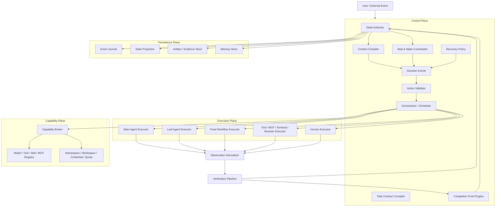

# God-Agent 中央大脑统一 Agent Runtime

## 副标题：从耐久执行底座走向任务契约、上下文编译、验证恢复与完成证明的闭环体系

> 文档类型：持续架构讨论 / Living Architecture Document  
> 当前版本：v0.1  
> 当前状态：Discussion Draft / 尚未批准实施  
> 首次整理：2026-08-19  
> 知识库版本：2026-08-20  
> 工程项目：[hanlaining/agent-learn](https://github.com/hanlaining/agent-learn)  
> 当前工程证据对象：[PR #31](https://github.com/hanlaining/agent-learn/pull/31)  
> 维护原则：机制先于功能；事实先于包装；模型建议不能代替运行时事实；未经验证不得升级为结论。

## 1. 文档目的

本文持续记录 God-Agent 的产品定位、广义 Runtime 架构、执行语义、科研问题和演进边界。

它不是一次性的产品介绍，也不表示文中的所有方案都已经实现或批准。长期成立的结论会直接修订正文；仍待验证的判断会明确标记为 `Proposed`、`Hypothesis` 或 `Open Question`；重要变化会追加到文末的讨论日志。

## 2. 一句话方向

> God-Agent 是一个以 Task Contract 为目标函数、以权威持久状态为世界模型、以 Completion Proof 为停止条件，并能在主 Agent、叶子 Agent、固定 Workflow、工具和人工之间动态选择执行方式的耐久 Agent Runtime。

通俗解释：它不是只会“调用模型和工具”，而是需要持续、理智地判断现在该做什么、什么时候执行或等待、应该由谁完成、结果是否可信、失败后如何修正，以及依据什么证据确认总目标真正完成。

广义 Runtime 定义为：

```text
Runtime
  = Agent Harness
  + Orchestration
  + State Management
  + Execution Environment
```

核心闭环为：

```text
感知现状
  -> 理解目标
  -> 判断优先级
  -> 调度能力
  -> 执行验证
  -> 更新认知
  -> 再次决策或形成完成证明
```

模型、Tool、Skill、MCP、浏览器、Sandbox、主 Agent、子 Agent 和固定 Workflow 都只是 Runtime 可以调用的能力或执行器。中央 Runtime 才承担判断、约束、调度、等待、恢复和验证责任。

## 3. 产品愿景、工程系统与科研问题必须分开

### 3.1 产品愿景

God-Agent 希望成为一个可以处理长程复杂目标的“中央大脑”：它能够理解目标、持续感知状态、分配工作、监督执行、验证结果并在失败后恢复。

### 3.2 工程系统

当前工程应先实现一个低风险、可审计、可重启、可证伪的软件闭环，而不是直接追求全能自治。

### 3.3 科研问题

论文不能研究整个“中央大脑”。研究问题必须收窄到可建立基线、可做消融、可复现实验的机制，例如：

> Task Contract、Context Compiler 与 Completion Proof 驱动的耐久 Harness，能否在相同模型、工具和任务条件下，降低假完成率并提高故障恢复正确率？

### 3.4 上位体系

更远期的上位目标可描述为 `Unified Intelligent Organism System`（统一智能有机体体系）：

```text
统一智能有机体体系
  ├─ 主体、价值、治理与责任
  ├─ 躯干、资源网络和执行环境
  ├─ God-Agent Runtime：状态、神经、编排、执行、验证和恢复底座
  ├─ Controller / Harness：决策与约束中枢
  ├─ 器官：模型、Agent、Tool、Memory、Browser、Robot
  ├─ 免疫与自稳：权限、验证、隔离、恢复、降级
  └─ 生长演化：接入、评测、版本、灰度、淘汰和继承
```

当前 God-Agent 的合理定位是其中的 `Software Organism Kernel`（软件有机体内核）实验种子，不是完整文明系统，也不能把有机体类比包装成生命或意识证据。

## 4. “中央”不等于巨型单体

“中央”表示逻辑上存在唯一的运行时事实权威和完成裁决权，不表示所有逻辑都塞进一个类、一个 Prompt 或一个不可恢复的单进程对象。

推荐原则：

- 逻辑上集中：状态、权限、预算、决策版本和终态有唯一权威。
- 实现上模块化：Contract、Context、Scheduler、Executor、Validator、Recovery 和 Memory 职责分离。
- 执行上事件驱动：没有新事实时不空转调用模型。
- 故障上可恢复：重启后依赖持久事实，而不是旧 Promise、Timer 或内存上下文。
- 完成上证据驱动：模型或 Agent 说“完成”不构成完成事实。

父 Agent 也不是中央 Runtime 本身。父 Agent 可以理解语义、拆解任务、诊断失败和提出动作，但不能绕过权威状态、扩大权限或直接宣布总任务完成。

## 5. 两条执行链路

God-Agent 同时需要两条相互独立的执行链路。

### 5.1 链路 A：Codex 式单 Agent / 多 Chat Runtime

这里的“单 Agent”不是系统只能执行一个任务，而是每个 Chat 都拥有独立 Agent 执行上下文：

- 多个 Chat 可以并行执行；
- 上下文、取消域、工具调用、状态和资源互相隔离；
- 每个 Chat 都能规划、编码、调用终端与工具、使用 Skill/MCP、运行测试和执行受控 Git 工作；
- 一个 Chat 出错、阻塞、崩溃或取消，不应拖垮其他 Chat。

### 5.2 链路 B：父子 Agent / 专家团 Runtime

父 Agent 面向总目标建立 Task Graph，将边界清楚、可并行的工作交给多个叶子 Agent，并承担：

- Supervisor：持续监督任务状态和证据缺口；
- Scheduler：根据依赖、优先级、资源和冲突安排执行；
- Reviewer：审查、证伪、要求返工或更换执行器；
- Recovery Coordinator：处理阻塞、超时、崩溃和未知外部副作用；
- Final Arbiter：汇总证据并向 Completion Proof Engine 提交完成候选。

父 Agent 不能“创建子任务后被动等待”，也不能把子 Agent 自报结果直接拼接成最终答案。

### 5.3 为什么必须独立

两条链路的故障域、所有权和取消语义不同：

| 维度 | 多 Chat Runtime | 父子 Agent Runtime |
|---|---|---|
| 顶层所有者 | 用户与 Chat | 父级 Goal/Job |
| 并行单位 | Chat/Job | Child Task/Run |
| 上下文关系 | 相互隔离 | 受控继承、最小披露 |
| 取消语义 | 取消当前 Chat/Job | 取消子树、单 Task 或 Graph revision |
| 完成语义 | 当前 Job 的 Proof | 子任务 Proof 聚合为总 Goal Proof |
| 主要风险 | Chat 串线、资源抢占 | 权限放大、结果错配、级联失败 |

如果强行共用同一执行状态机，容易造成上下文污染、取消串线、Return 错投和父子权限继承失控。

### 5.4 哪些基础设施可以共享

可以共享“定义和服务”，不能共享“活动实例和所有权”：

- 可共享：Model Provider、Tool/Skill Registry、MCP Client Factory、事件 Schema、凭据服务、Workspace 管理器、观测规范。
- 必须隔离：Context、CapabilityGrant、取消域、Lease、Invocation、配额账本、临时目录、进程组、MCP Session 和浏览器 Session。

## 6. 当前工程底座

截至 PR #31 的当前工程证据，God-Agent 已具备一部分耐久执行与故障一致性底座：

- Requirement 澄清、修订、哈希和确认门；
- Thread、Turn、Job、Task、Run、Invocation、Return 等状态对象；
- Job Lease、Fencing 与执行所有权协调；
- Model/Tool Invocation WAL；
- Return Outbox、Receipt 和 Stage Checkpoint；
- Snapshot v7 generation/state capability CAS；
- `outcome_unknown` 处置基础；
- Dynamic Agent Execution Engine 与 Team Workflow V2；
- Process Chaos Harness、Runtime-E2E 和容量测试基础。

这些能力的价值在于：它们开始回答重启、迟到结果、重复执行、所有权竞争和未知副作用等 Runtime 问题。

但它们仍然只是底座，不代表中央 Runtime 已经完成。

## 7. 五个关键机制缺口

### 7.1 缺少单一权威状态协议

当前多套 Engine、Store、Snapshot、Queue 和 Coordinator 仍可能分别维护局部事实。目标应是统一：

```text
Command -> Validate -> Event -> Projection -> Wake/Decision
```

模型、UI、Executor 和网络回调都不能直接改写权威状态。

### 7.2 Requirement 尚未编译成可执行 Task Contract

自然语言 Requirement 可以表达目标，但还不足以机器化约束：

- 输入和输出 Schema；
- 验收条件与 Validator 映射；
- 允许和禁止的范围；
- Capability、预算、Deadline 和副作用等级；
- 重试、重规划、等待和人工升级条件；
- Completion Proof 要求。

### 7.3 ContextBuilder 尚未成为 Context Compiler

历史消息拼接和摘要压缩不能回答“本次决策真正需要哪些事实”。Context Compiler 应从权威状态编译面向特定决策的最小上下文，并明确：

- 哪些是 Fact、Observation、Claim 或 Hypothesis；
- 哪些 Artifact 已过期；
- 自上次决策后出现了什么新事件；
- 当前合法动作、权限和剩余预算；
- 哪些内容被排除以及原因。

### 7.4 Evidence 记录尚未形成 Completion Proof

Evidence 数组或 Reviewer 文本不等于完成证明。必须回答：

- 每条验收条件由谁验证；
- Evidence 是否来自可独立查询的 Oracle；
- Evidence 是否绑定当前 Contract revision 和 Artifact digest；
- 是否仍有未处置失败、冲突或 `outcome_unknown`；
- 所有子任务结果能否闭包到总目标。

### 7.5 缺少统一 Decision / Wait / Recovery Loop

系统需要一个跨 Main Agent、Leaf Agent、Workflow、Tool 和 Human 的统一闭环，而不是每种执行器各自维护一套等待和恢复语义。

## 8. 推荐目标架构



### 8.1 Control Plane

负责目标契约、权威状态、决策、调度、等待、恢复和完成裁决。

### 8.2 Execution Plane

负责实际执行。执行器只能返回 Observation、Artifact、Evidence 或 Action Result，不能自行修改权威终态。

### 8.3 Capability Plane

负责“谁在什么范围内、以多大预算、可以调用什么能力”，并提供 Namespace、Credential 和 Quota 隔离。

### 8.4 Persistence Plane

保存不可变事件、状态投影、产物、证据和经过治理的记忆，使重启恢复不依赖旧内存对象。

## 9. 确定性机制与模型决策

核心原则是：

> 模型提出动作，Runtime 校验并提交动作；模型输出本身不是事实。

### 9.1 应由确定性机制负责

- 状态机迁移和版本检查；
- 权限、Capability、预算和 Deadline；
- Lease、Fencing、取消和幂等；
- 等待条件、Timer 和 Wake；
- 重试上限、无进展检测和终止门；
- Artifact digest、Validator 执行和 Completion Gate。

### 9.2 可以由模型负责

- 理解目标和发现信息缺口；
- 拆分任务、判断优先级和选择候选 Executor；
- 诊断语义失败；
- 提出 `EXECUTE`、`WAIT`、`VERIFY`、`REPLAN` 等结构化动作；
- 综合证据并形成可审查解释。

模型提议必须携带读取的 `stateVersion`。Runtime 在提交前重新检查版本、权限、预算、副作用等级和前置条件，过期提议必须拒绝或重新决策。

## 10. Task Contract v1

Goal Contract 与 Child Task Contract 应共享基础 Schema，但分开建模：

```text
TaskContract
  identity: contractId / revision / parentContractId
  objective: desired state change
  inputs: references + version + freshness
  outputs: artifact/result schema
  acceptance: criterion -> validator mapping
  scope: allowed / denied / nonGoals
  capabilityRequirements
  sideEffectClass
  executorEligibility
  dependencies
  priority / deadline
  token / tool / cost / process budget
  retry / replan / rollback policy
  wait / escalate / ask-user conditions
  completionProofRequirements
```

子 Task 必须继承或收紧父 Contract：

- 不能扩大 Scope；
- 不能增加权限；
- 不能突破总预算；
- 不能删除父级 Mandatory Criterion；
- 新增副作用必须重新授权；
- Graph revision 不能静默抹除已经发生的外部动作。

## 11. Context Compiler v1

第一版只建议支持四种明确用途：

1. `planning`：理解 Goal、缺失信息和可执行分解；
2. `execution`：执行单个 Task 所需的最小上下文；
3. `verification`：验收条件、产物、Evidence 和 Validator；
4. `recovery`：失败事实、已发生副作用、可选恢复动作和预算。

编译结果 `DecisionFrame` 至少包含：

- `decisionId`、`stateVersion`；
- 当前 Goal/Task；
- 与完成标准之间的差距；
- 唤醒原因和新增 Event；
- 已确认 Fact；
- 未验证 Claim/Hypothesis；
- 冲突信息；
- ArtifactRef、digest 和 freshness；
- 合法 Action 集合；
- Capability 和剩余预算；
- 被淘汰的上下文及原因。

Context Compiler 应尽量是纯函数：相同权威状态和配置应产生可重复的结构化输出。

## 12. 认知状态模型

“更新认知”不能等同于追加聊天消息。

| 类型 | 含义 |
|---|---|
| Fact | Runtime 或外部 Oracle 已确认的事实 |
| Observation | 一次执行观察，尚未完成解释 |
| Claim | 模型或 Agent 提出的判断 |
| Hypothesis | 明确等待验证的假设 |
| Decision | 基于哪些事实做出的选择 |
| Evidence | 支持或反驳验收条件的证据 |
| Artifact | 可定位、可校验的产物 |
| Memory | 经过治理后允许再次使用的记录 |

模型输出默认是 Claim，不是 Fact。只有 Validator、Runtime 确定性事实或受信任外部状态才能提升可信等级。

## 13. 核心对象定义

| 对象 | 严格含义 |
|---|---|
| Thread | 用户交互和展示历史的容器 |
| Turn | 一次交互事务，不等于长期任务 |
| Goal/Requirement | 用户确认的目标契约 |
| Job | Goal 的一次耐久执行实例 |
| Task | Job 内一个可验收的目标节点 |
| Agent | 能执行决策策略的逻辑身份/Profile |
| Run | 某 Executor 对一个 Task 的一次 Attempt |
| Invocation | 一次 Model、Tool、MCP、命令或浏览器调用 |
| Event | 已持久化、不可变的运行时事实 |
| Observation | Executor 返回、等待解释的标准化结果 |
| Return | 子 Run 向所有者交付结果的可靠信封 |
| Evidence | 支持或反驳验收判断的记录 |
| WaitSpec | 耐久等待和唤醒合同 |
| DecisionRecord | 一次决策的输入版本、动作和依据 |
| CompletionProof | 证明当前 Goal revision 满足完成条件的闭包 |

## 14. WaitSpec 与耐久等待

`WAITING` 不能只表示某个 Promise 尚未返回，必须写出可恢复的等待合同：

```text
WaitSpec
  waitId
  owner: jobId / taskId / runId
  reason
  wakeCondition
  subscriptionOrTimer
  deadline
  timeoutAction
  stateVersion
```

至少需要区分：

- `waiting_dependency`；
- `waiting_return`；
- `waiting_external_state`；
- `waiting_permission`；
- `waiting_user`；
- `waiting_backoff`；
- `waiting_resource`；
- `waiting_review`。

重启后应从 WaitSpec 重建 Timer 或 Subscription，而不是等待已经消失的旧内存对象。

## 15. Completion Proof

建议采用最高完成不变量：

> 只有 Completion Proof Engine 可以把 Job 判定为 `completed`；父 Agent、子 Agent、工具和模型只能提交完成候选与证据。

`CompletionProof` 至少需要绑定：

- 当前 `contractId` 与 `revision`；
- 每一条验收条件及其 Validator；
- Evidence 来源、时间、digest 和 freshness；
- 关键 Artifact 的定位与完整性；
- 子 Task Proof 的聚合闭包；
- 未处置失败、冲突和未知副作用集合；
- 生成 Proof 时使用的 `stateVersion`。

只要存在未处置的 Mandatory Criterion、Failure 或 `outcome_unknown`，就不得进入 `completed`。

## 16. 父 Agent 的 Supervisor Loop

父 Agent 应运行持续监督闭环：

```text
读取权威状态
  -> 编译 Supervisor DecisionFrame
  -> 判断任务差距和阻塞原因
  -> 提出结构化动作
  -> Runtime 校验动作
  -> 派发 / 等待 / 验证 / 返工 / 重规划
  -> 观察新 Event 与 Evidence
  -> 更新认知
  -> 继续循环或提交完成候选
```

建议动作集合：

```text
EXECUTE
WAIT
VERIFY
RETRY
REPLAN
DELEGATE
START_WORKFLOW
REQUEST_HUMAN
FINALIZE
FAIL
PARTIAL
```

为了避免无限循环，Recovery Policy 必须限制最大 Attempt、最大无进展决策数、Deadline、预算和人工升级条件。

## 17. Executor 选择原则

中央 Runtime 不应默认创建子 Agent。

| 情况 | 推荐 Executor |
|---|---|
| 短任务、高上下文耦合、无需隔离 | Main Agent |
| 有确定 API、命令或算法 | Direct Tool |
| 输入输出边界清楚、可安全并行 | Leaf Agent |
| 需要独立上下文、特殊权限或对抗审查 | Leaf/Reviewer |
| 步骤稳定、可预定义、需要 Checkpoint | Fixed Workflow |
| 产品取舍、敏感授权、不可查询副作用 | Human |

只有至少存在一种明确收益时才应委派子 Agent：上下文隔离、安全并行、专门能力、独立验证或权限隔离。

多 Agent 数量本身既不是成功指标，也不是科研创新。

## 18. Capability、Namespace 与 Quota

Tool、Skill、MCP、终端、浏览器和文件系统应统一通过 Capability Broker 发放实例化授权：

```text
CapabilityGrant
  subject: agentId / taskId / runId
  capabilityType
  resourceNamespace
  allowedOperations
  deniedOperations
  credentialRef
  quota
  deadline
  sideEffectClass
  revocationPolicy
  auditContext
```

关键规则：

- Registry 可以共享，Grant 不能共享；
- 子 Task 的 Grant 只能继承并收紧；
- 文件系统以 Workspace/Worktree/Overlay 形成 Task Namespace；
- Terminal 使用独立 Process Group、端口范围和资源预算；
- MCP request/session 必须绑定 Job/Task/Invocation；
- 凭据只通过 Credential Broker 短期投递，不进入 Prompt 和持久日志；
- 取消、超时和配额账本必须按 Job 隔离；
- 高风险或不可查询副作用必须显式授权并提供补偿或人工处置路径。

远期的“器官接入”不应退化成 Tool Registry。可进一步研究 `Organ Contract`，覆盖接口语义、权限、资源、健康信号、故障模式、验证、隔离、撤销、兼容、版本和责任来源。

## 19. 统一失败与恢复语义

| 失败类别 | 默认恢复动作 |
|---|---|
| 瞬时网络或限流 | 有界退避重试 |
| 参数或输出结构错误 | 局部格式修复，不重复业务副作用 |
| 权限不足 | 选择低权限方案或等待用户 |
| 环境或依赖缺失 | 修复环境或更换 Executor |
| 上下文失效或污染 | 重新编译 Context，必要时建立新 Run |
| 原计划假设被推翻 | 局部 Replan 或新 Graph revision |
| Worker 质量不足 | 同 Task 返工或更换 Executor |
| 外部副作用未知 | 查询最终状态或人工处置，禁止盲重放 |
| Lease/Owner 丢失 | 从权威 Event/Projection 恢复，不相信旧回调 |
| Validator 不可用 | 等待、替代 Validator 或降级为人工，不得伪造通过 |

## 20. 核心不变量

1. 模型输出不能直接修改权威状态。
2. Context 只是状态投影，不能反向成为事实源。
3. Executor 不能自行判定 Task completed。
4. Job completed 必须存在绑定当前 Contract revision 的 CompletionProof。
5. `WAITING` 必须有持久 Wake 条件或明确人工阻塞。
6. 未知副作用不得自动重放。
7. 子 Task 的权限、范围和预算只能比父 Contract 更窄。
8. 每个 Action、Observation、Evidence 和 Proof 都能追溯到 Job/Task/Run/Invocation。
9. 重启后不得依赖旧 Promise、内存 Queue、Timer 或旧模型上下文恢复。
10. 多 Agent 不是默认策略；委派必须有可说明收益。
11. Fixed Workflow 与模型自主决策必须经过同一 State Authority 和 Completion Gate。
12. 终态与迟到结果竞争时，已提交的权威终态优先。
13. Registry 可以共享，Capability 实例、取消域和配额账本必须隔离。
14. 模型生成的 Claim 在验证前不得提升为 Fact。
15. 测试通过、代码存在、真实进程验证和生产可用必须分级陈述。

## 21. 分阶段路线

以下阶段在正式确认实施前均属于 `Proposed`。

### Phase 0：冻结语义

定义核心对象、状态机、不变量、Task Contract、WaitSpec、CompletionProof、确定性/模型责任矩阵、故障模型和非目标。

### Phase 1：权威 Event 与耐久等待

建立每 Job 的 Command/Event 边界和 Wake Registry，使重启不依赖旧 Promise、Queue 或 Timer。

### Phase 2：Task Contract v1

把已确认 Requirement 编译成机器可执行 Contract，并绑定 Validator、Capability、预算、副作用和升级条件。

### Phase 3：Context Compiler v1

实现 planning、execution、verification、recovery 四类 DecisionFrame。

### Phase 4：Verification 与 Completion Proof

先覆盖代码任务的文件 digest、类型检查、目标测试、构建、页面/API 状态和未知副作用处置。

### Phase 5：中央 Decision / Recovery Loop

引入结构化动作、模型唤醒条件、无进展检测和恢复策略。

### Phase 6：统一 Executor 接入

把 Main Agent、Leaf Agent、Workflow、Tool/MCP/Terminal/Browser 和 Human 接入同一状态权威与完成门。

### Phase 7：Capability、持久化扩展和 Process Chaos

补齐 Task Namespace、配额账本、MCP 隔离、Event Journal 分区以及更完整的真实进程故障矩阵。

## 22. MVP、科研版和生产版边界

### 22.1 MVP

- 本地单机；
- 单层 Leaf Agent；
- 最多 4 个并发 Executor；
- Task Contract、WaitSpec 和 CompletionProof 的最小实现；
- 代码任务的确定性验证；
- 重启恢复和未知副作用人工处置；
- 不追求跨机器调度和自动长期自治。

### 22.2 科研版

- 可切换普通 Tool Loop、同步父子 Agent、耐久状态机和完整方案；
- 可记录上下文选择、决策、恢复和 Proof；
- 支持基线、消融、故障注入和可复现实验；
- 研究指标优先于 UI 丰富度。

### 22.3 生产版

- 数据库或分布式一致性语义；
- 多租户 Namespace、Credential 与 Quota 隔离；
- 跨进程/跨机器 Scheduler；
- 完整审计、观测、告警、灰度和回滚；
- 生产级安全审查和大规模 Process Chaos；
- 明确的 SLO、成本与人工治理机制。

生产版是远期目标，不能用当前单机测试数量替代。

## 23. 自研还是采用外部编排 Runtime

### 方案 A：继续自研核心 Orchestration Kernel

优点：能够复用现有 WAL、Lease、Return 和 Snapshot；实验变量可控；有利于真正研究状态与恢复机制。

缺点：Durable Timer、Event、Projection、迁移和一致性成本高，容易膨胀成通用工作流平台。

### 方案 B：采用 LangGraph、Temporal 等外部 Runtime

优点：Durable Wait、Checkpoint、Timer、Retry 和可视化更成熟。

缺点：现有数据模型需要迁移；外部语义可能压过研究问题；个人项目的运维和认知成本较高。

当前推荐：先冻结 Contract、Event、WaitSpec 和 CompletionProof 语义，再做一个最小外部框架对照 POC。先决定需要什么语义，再决定哪些自研、哪些通过 Adapter 复用。

## 24. 科研设计

### 24.1 当前主线

> 面向长程 Agent Runtime 的崩溃一致性与副作用安全恢复。

现有 WAL、Lease/Fencing、Return Receipt、Snapshot CAS 和 Process Chaos 可以支撑这条较窄、较成熟的主线。

### 24.2 后续研究问题

> 在相同模型、工具和执行环境下，Task Contract + Context Compiler + Completion Proof 驱动的耐久 Harness，能否相对普通 Tool Loop 和同步多 Agent 降低假完成率，并提高失败后的正确恢复率？

### 24.3 基线

- B0：普通 AgentLoop；
- B1：同步父子 Agent；
- B2：耐久状态机，但无 Context Compiler/Proof Gate；
- Full：Contract + Compiler + Recovery + Proof。

### 24.4 消融

- `no-contract`；
- `no-context-selection`；
- `no-external-validator`；
- `no-failure-taxonomy`；
- `no-durable-wait`。

### 24.5 指标

- 真实任务成功率；
- False Completion Rate；
- Completion Proof 覆盖率；
- 恢复正确率；
- 重复或无效动作比例；
- 人工介入次数；
- Token、时间和费用；
- Context 有效信息密度。

## 25. 当前证据边界

截至本文所依据的工程审计：

- Requirement、Context、Snapshot、Outcome Unknown 和 Team Runtime 专项：41/41；
- 父子/Dynamic/稳定性专项：64/64；
- Runtime-E2E：9/9；
- 没有调用真实 Provider。

必须同时保留以下限制：

- 64/64 和 41/41 主要属于组件或集成级证据；
- Runtime-E2E 9/9 不能解释为 GATE-40 完成；
- Process Chaos 仍只能称 Team Workflow Return 窄范围 1/40；
- Dynamic 双 App Server 全矩阵未完成；
- Snapshot CAS 是本地单文件 CAS，不是数据库事务；
- 不得宣称端到端 exactly-once；
- 不得宣称中央大脑 Runtime 已经实现；
- 测试数量不等于科研创新，也不等于生产可靠性。

## 26. 当前已收敛原则

- 广义 Runtime 是 God-Agent 的上位工程架构。
- Harness 是带明确策略的 Agent Runtime，不等于狭义执行环境。
- 机制体系优先于功能数量。
- 模型建议不能成为权威事实。
- 完成必须证据驱动。
- 当前最强工程资产是耐久执行与故障一致性底座。
- 子 Agent、Workflow、Tool 和 Human 应统一为 Executor。
- 多 Agent 和固定角色不是默认目标。
- 市面 Agent Framework 是参考和实验基线，不是最终本体边界。
- 当前模块分层是可验证的 Reference Architecture，不是不可改变的本体结构。
- God-Agent Runtime 是统一智能有机体体系的软件内核种子，不等于完整体系。
- 器官必须具备契约、健康、隔离、替换、验证和责任机制，不能退化为插件列表。

## 27. 尚待确认的问题

1. 是否正式接受“只有 Completion Proof Engine 可以判定 Job completed”为最高完成不变量？
2. 权威状态使用 append-only Event Journal，还是先在现有 Snapshot 上增加 Command/Event 审计层？
3. Task Contract v1 首先只覆盖代码任务，还是同时覆盖分析和浏览器任务？
4. Context Compiler 第一版是否严格限制为四类 DecisionFrame？
5. MVP 是否限定为本地单机、单层 Leaf、最多 4 个并发 Executor？
6. 何时做 LangGraph/Temporal 最小对照 POC？
7. 中央 Runtime 研究问题是否作为后续课题，不干扰当前崩溃一致性主线？
8. 哪些可复现实验足以证明现有 Harness/Workflow 对“统一个体”存在结构性不契合？
9. Organ Contract 应统一 Model、Tool、Agent、Memory 和 Robot，还是保留类型专用契约并共享最小公共协议？
10. 哪些连续性是维持同一 Runtime 主体身份的必要条件？

## 28. 文档迭代规则

1. 已达成共识且预计长期成立的结论，直接修订正文。
2. 尚未验证的判断必须标记为 Proposed、Hypothesis 或 Open Question。
3. 被证据推翻的结论直接修订，并在讨论日志中保留原因。
4. 每次架构讨论追加日期、问题、结论、反例和下一步。
5. 每次实施后更新“当前能力”和“证据边界”，禁止只更新路线图。
6. 所有数字必须绑定事实基线、环境、测试层级和限制条件。
7. 知识库公开版不记录本机绝对路径、凭据或内部生产配置。

## 29. 讨论日志

### 2026-08-19：从父子 Agent 收敛到中央 Runtime

- God-Agent 的核心不再是 Agent 数量，而是目标、状态、决策、执行、验证和恢复闭环。
- 父 Agent 不是权威状态和完成裁决者，只是语义决策策略的一部分。
- 当前关键缺口是 State Authority、Task Contract、Context Compiler、Completion Proof 和统一 Decision/Wait/Recovery Loop。

### 2026-08-19：重新审计最新工程基线

- Requirement 已具备上层合同骨架，但未编译为机器可执行 Contract。
- ContextBuilder/Compactor 已支持历史、Checkpoint 和预算，但仍不是状态驱动的 Context Compiler。
- Evidence 和 StageResult 已存在，但 Completion Proof 尚未形成。
- 当前多套 Engine/Loop/Coordinator 尚未统一为中央 Decision Runtime。
- “异步 Task Graph -> Supervisor”仍然偏向多 Agent，应让位于“权威状态 -> Contract -> Context -> Proof -> Decision Loop”。

### 2026-08-19：明确市场框架只是参考架构

- 研究问题从“怎样继续扩展现有 Agent 框架”上升为“怎样让异构能力形成统一认知—行动个体”。
- 允许未来根据反证重新定义 Agent、Task、Memory 或 Runtime 边界。
- 新框架必须通过基线对照和消融实验证明必要性，不能只替换术语。

### 2026-08-19：从中央 Runtime 上升为可容纳躯干与器官的体系

- 上位目标暂定为 Unified Intelligent Organism System。
- Runtime 是其中的状态、神经和运行底座。
- Controller/Harness 是决策与约束中枢。
- Model、Agent、Tool、Memory 和 Robot 是不同类型的器官。
- God-Agent 当前合理定位是 Software Organism Kernel 的软件实验种子。

### 2026-08-20：整理为公开知识库版本

- 删除本机绝对路径和不适合公开的工作区信息。
- 将产品愿景、工程架构、当前证据和科研问题分层表达。
- 保留科研诚信边界、开放问题和持续迭代规则。

## 30. 来源与说明

本文由项目维护者结合 God-Agent 的持续架构讨论、`agent-learn` 当前工程审计和 Codex 辅助整理形成。本文是个人工程与研究记录，不代表 OpenAI、Codex、LangGraph、Temporal 或其他项目的官方观点。

文中对公开工具或框架名称的提及用于架构比较，不表示隶属、背书或已经采用。后续如加入第三方源码、论文结论或直接引用，应按本知识库的《原创、借鉴、引用与 AI 辅助说明》补充具体来源和许可证信息。
