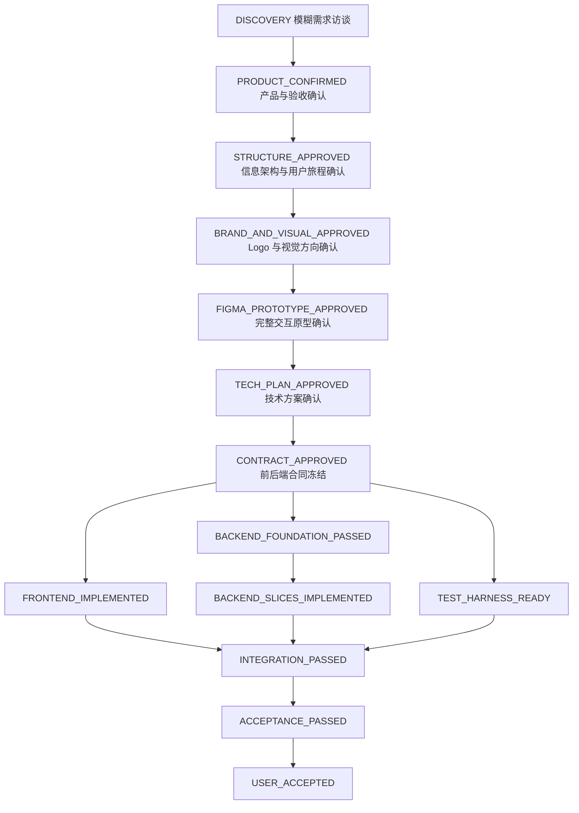

# 从“烂 Prompt”到可验收全栈产品：Meta-Skill 方案 V0.3

> 状态：V1 本机 Skill 产物已落地并完成首轮校验；Figma MCP 尚未连接，尚未修改业务代码
> 日期：2026-08-03
> 替代方向：此前 V0.2 的“HTML → 墨刀 → Figma”方案不再作为主路线；墨刀已放弃，Figma 成为唯一正式设计事实源
> 默认审美偏好：Logo、全部页面、组件、图标、状态和动效统一采用小清新、干净简洁、留白充分、元素克制、紧贴产品主题的视觉语言

## 0. 一句话结论

创建一个主题级总控 Skill：`deliver-product-end-to-end`。

它先从目标用户、使用场景、核心任务和真实摩擦判断“什么产品值得做、怎样才好用”，再把用户模糊甚至很差的 Prompt 转换成可确认的产品需求，调度品牌、Logo、Figma、前端、后端、联调和测试等专业能力，并用 `Rxx + ACxx + Graph + Evidence` 保证最终交付物不是“看起来做过了”，而是真正通过用户验收。

第一版推荐打通：

```text
模糊想法
→ 产品访谈与需求确认
→ 产品结构、品牌与 Logo
→ Figma 高保真视觉和交互原型
→ 用户体验并冻结原型
→ 技术方案与前后端合同
→ 前后端实现与联调
→ 自动化测试、视觉回归与真实验收
→ 用户最终确认
```

生产发布暂不纳入 V1。发布、数据库迁移和线上回滚应作为独立高风险 Skill。

### 0.1 2026-08-03 实现快照

本机默认安装到 `~/.codex/skills`：

```text
deliver-product-end-to-end
research-product-references
design-product-experience
design-product-identity
define-service-contracts
bootstrap-backend-foundation
implement-product-frontend
implement-backend-slices
integrate-and-verify-product
```

已补齐官方 Figma 配套 Skill：

```text
figma-use
figma-create-new-file
figma-design-to-code
```

已通过符号链接接入 Akasha 上游能力，保持上游仓库为唯一事实源：

```text
agent-task-supervisor
claude-code-cli-development
```

已完成 7 个自建脚本的语法编译、7 个单元测试、真实资源快照与并发规划 smoke、Akasha 终态监控 smoke、9 个自建 Skill 结构校验和三类独立前向测试（模糊需求、原型后技术推进、产品价值与体验）。当前 Claude Code `2.1.185` 的启动参数仍与所需 Akasha 合同兼容；适配事实保存在总控 Skill 的 `references/claude-cli-adapter.md`。

尚未完成的是 Figma MCP/OAuth 连接与真实写入 PoC，因此当前不能声称已经验证了 Figma 文件创建、结构化画布写入和交互连线。业务项目、Claude 模型、分支、worktree、Git 和生产环境均未被操作。

---

## 1. 用户最终得到什么

以后用户只需要描述一个大致想法，例如：

> 给我做一个帮助创作者管理素材的产品，要清爽、好看、操作顺滑。

系统不要求用户写专业 PRD 或 UI Prompt，而是主动完成：

1. 分轮询问应用场景、目标人群、核心问题、最短用户旅程和成功结果。
2. 把口语化表达转换成产品定义、`Rxx` 需求和 `ACxx` 验收用例。
3. 调研可借鉴的竞品和优质 GitHub 项目，但不提前绑定技术栈。
4. 从零设计信息架构、页面、状态、文案和完整交互。
5. 设计紧贴产品主题的 Logo 与基础品牌视觉，并直接放入 Figma 页面展示实际效果。
6. 交付可点击、可跳转、可体验完整主路径和异常路径的 Figma 原型。
7. 用户确认原型后，再讨论前端、后端、数据库、组件库和代码复用。
8. 实现真实前后端，并通过截图差异、自动化测试和验收脚本证明结果。

用户最短路径：

```text
说一句想法
→ 每轮回答 1–3 个关键问题
→ 查看产品结构和推荐设计方向
→ 查看带 Logo 的 Figma 高保真设计
→ 点击体验完整交互
→ 提出修改或确认冻结
→ 确认技术方案
→ 验收真实运行的产品
```

---

## 2. 为什么使用 Meta-Skill

不建议把产品经理、Logo 设计、UI、Figma、前端、后端和测试全部塞入一个巨大的 Skill。

正确结构是：

```text
Meta-Skill：维护状态、路由、依赖、用户审批和证据
    ↓
专业 Skill：只完成自己负责的可验收产物
    ↓
Tool / MCP / Script：执行结构化、可重复、可验证的动作
```

### 2.1 Meta-Skill 负责什么

`deliver-product-end-to-end` 只负责：

- 保存用户确认的 `Rxx` 需求和 `ACxx` 验收用例。
- 维护 Graph Engineering 的节点、依赖和解锁条件。
- 判断当前处于哪个阶段，以及应该使用哪个专业 Skill。
- 根据 ready Issue、文件冲突和电脑实时负载动态决定可以继续启动多少个 Worker，不设置固定数字上限。
- 每轮只向用户询问真正影响产品形态或验收结果的问题。
- 管理用户确认闸门，禁止擅自跨阶段。
- 收集截图、录像、Figma 链接、测试结果和真实接口响应等 Evidence。
- 用户纠偏时，同步更新受影响的需求、验收、任务和下游产物。

### 2.2 Meta-Skill 不负责什么

- 不亲自完成全部设计和编码。
- 不把“某个 Agent 说完成了”当成验收证据。
- 不在原型冻结前决定 Vue、Element Plus、数据库等技术方案。
- 不让前端、后端或测试绕过冻结后的接口合同。
- 不自动发布生产环境。
- 不在用户未确认时写入外部账号、Figma 文件或业务仓库。

### 2.3 必须承认的技术边界

Codex Skill 更像可复用的工作方法和路由规则，不是天然具备强事务保证的工作流引擎。

因此可靠方案应由四部分组成：

1. **Meta-Skill**：阶段规则与决策逻辑。
2. **项目状态文件**：跨轮次保存产品真相和进度。
3. **专业 Skill 与工具**：完成各阶段任务。
4. **确定性校验脚本**：检查追踪关系、必需产物和阶段闸门。

若以后需要无人值守、失败重试、长时间任务恢复或跨多 Agent 调度，再升级为 Plugin、MCP 服务或专门的工作流执行器；不应只依赖一段很长的 Prompt。

---

## 3. 推荐的专业能力树

```text
deliver-product-end-to-end                  主题 Meta-Skill 总控
│
├─ requirement-acceptance-planner           烂 Prompt → Rxx / ACxx
├─ research-product-references              竞品和 GitHub 产品调研
├─ design-product-experience                信息架构、页面视觉、用户旅程、交互状态
├─ design-product-identity                  产品命名输入、Logo、品牌基础规范
├─ figma-create-new-file                     创建新的 Figma 文件
├─ figma-use                                 Figma Plugin API 结构化读写合同
├─ figma-generate-design                     创建 Figma 页面与结构化设计
├─ figma-generate-library                    Token、变量、组件和主题
├─ figma-create-design-system-rules          设计系统与代码项目规则对齐
├─ figma-design-to-code                      官方 Figma 设计上下文读取流程
├─ figma-implement-design                    Figma → 1:1 真实前端
├─ define-service-contracts                 API、数据模型、错误和权限合同
├─ implement-product-frontend               前端业务与 1:1 视觉实现
├─ bootstrap-backend-foundation             后端工程底座唯一 Owner
├─ implement-backend-slices                 基于底座实现后端业务切片
├─ integrate-and-verify-product             前后端集成、视觉回归与真实验收
├─ agent-task-supervisor                     Graph Engineering 任务监工
├─ claude-code-cli-development              可见 Claude CLI 实现 Worker
└─ hln-code-risk-gate                       代码交付前风险门禁
```

说明：

- 官方和自建 Figma Skills 已具备，但 Figma MCP/OAuth 尚未真正连接，因此不能声称已经具备完整写入能力。
- 上述 9 个本方案专业 Skill 已创建；实际项目仍需叠加项目自身规则和组件库约束。
- 前端实现 Skill 不预置大型模板；技术方案确认后优先复用项目现有组件、Token 和约定。
- Akasha 已存在 `agent-task-supervisor`、`claude-code-cli-development` 和可见 Terminal + tmux 脚本，可以作为多窗口方案的验证基础；但其默认 commit、push 和 worktree 回收权限与 hln 的逐项 Git 审批规则冲突，正式复用时必须由 hln 规则覆盖，不能原样照搬自动 Git 收尾。

---

## 4. 产品品牌与 Logo Skill

建议新增：

```text
design-product-identity
```

它不只是生成一张 Logo 图片，而是根据已经确认的产品定位，建立可以进入 Figma 和真实前端的最小品牌识别系统。

### 4.1 输入

- 产品名称；如果名称未定，明确使用临时名称，不擅自定名。
- 产品的一句话定位。
- 应用场景、目标人群和核心问题。
- 品牌关键词及不希望出现的感觉。
- 使用位置：网页、桌面端、移动端、App 图标、favicon 等。
- 已有商标、品牌色、字体或必须保留的资产。
- 用户默认审美偏好：小清新、干净简洁、紧贴主题、不要过多元素。

### 4.2 默认设计原则

默认风格配置建议命名为：

```yaml
style_profile: clean-fresh-minimal
```

具体原则：

- 一个 Logo 只表达一个最核心的产品意象。
- 优先简洁轮廓、清晰负形和易识别的几何关系。
- 使用有限色彩，默认一组主色加必要的中性色。
- 保持充足留白，不堆砌叶子、星光、渐变、圆环等无意义装饰。
- 视觉元素必须能解释它与产品主题的关系。
- 小尺寸下仍然清晰，不能只在大图展示时成立。
- 不照抄竞品，不使用来源和许可证不明的 Logo 素材。
- 若“小清新”与严肃、安全、工业等产品语义冲突，仍保持干净简洁，但调整色彩和气质，并向用户说明理由。

本节描述 Logo 自身的规则；同一个 `clean-fresh-minimal` 风格必须继续约束页面视觉，不能出现“Logo 很清新，但页面像另一套通用后台模板”的割裂情况。

### 4.3 第一版交付

默认先给一个经过判断的推荐主方案，只有产品语义存在明显分叉时才补充最多两个方向，避免让用户在大量随机图案中盲选。

交付物至少包括：

1. Logo 核心创意与一句话解释。
2. 图形标、文字标和横向组合。
3. 浅色、深色、单色与反白版本。
4. favicon / App Icon 小尺寸版本。
5. 主色、辅助色和中性色 Token。
6. 字体方向及中英文名称排版建议。
7. 安全距离、最小尺寸和禁止用法。
8. 可编辑的 Figma 结构与矢量资产。
9. 可供前端使用的 SVG；需要时补 PNG 尺寸集。
10. 原创性与近似风险说明；正式商用商标检索另行确认。

### 4.4 Logo 与 UI 的正确顺序

Logo 不应脱离产品页面单独生成，也不应等前端完成后再补。

推荐顺序：

```text
产品定位确认
→ 页面结构与视觉方向草案
→ Logo 和基础品牌方向
→ 将推荐 Logo 放入第一版 Figma 高保真页面
→ 用户同时观察 Logo 单体和真实使用效果
→ BRAND_AND_VISUAL_APPROVED
→ 完善组件、状态和交互原型
```

这样可以避免“Logo 单看不错，放进产品却不协调”。

### 4.5 可使用的工具边界

- 图像生成工具可以帮助探索创意方向，但生成的位图不能直接冒充最终 Logo。
- 最终正式产物应在 Figma 中整理为可编辑的结构和矢量资产。
- 任何自动描摹结果都要检查曲线、节点、对齐、小尺寸识别度和导出质量。
- 正式商用前需要进行名称、图形近似和商标风险检查；Skill 只能给出初筛，不能承诺法律无风险。

---

## 5. Figma 作为唯一设计事实源

放弃墨刀后，不再维护 HTML、墨刀和 Figma 三套互相漂移的最终标准。

推荐规则：

- 产品结构和交互合同：由 `Rxx / ACxx / 用户旅程` 保存。
- 正式视觉、组件、Token、Logo 和原型连接：由 Figma 保存。
- 真实前端：以冻结后的 Figma 和验收用例为准。
- HTML：只在需要快速比较视觉方向时作为可选探索稿，不是最终 1:1 基准。

### 5.1 页面必须遵守同一套小清新风格

`clean-fresh-minimal` 是整个产品的页面视觉合同，不是 Logo 专属标签。它必须覆盖首页、列表、详情、表单、弹窗、抽屉、设置页以及 loading、empty、error、disabled 等全部状态。

页面规则：

- **布局**：保持清楚的主次关系和充足留白，控制同屏信息密度，不用大量无意义卡片切碎内容。
- **色彩**：以明亮或柔和背景、中性色文字和一个主题强调色为主；状态色只表达真实语义。
- **字体**：优先清晰、轻盈、易读的无衬线字体，字号层级克制，不用超大标题制造虚假高级感。
- **组件**：圆角、边框、阴影和内边距保持统一；阴影轻而少，避免厚重悬浮和满屏玻璃拟态。
- **图标**：使用统一线宽与视觉尺寸，只放有实际含义的图标，不为填空而添加装饰图形。
- **图片与插画**：必须服务产品主题和当前任务；没有必要时宁可留白，不强行加入人物、植物或抽象渐变。
- **文案**：简短、自然、直接，减少空泛副标题和重复说明，让用户快速理解下一步操作。
- **动效**：使用轻量、短促、可解释的过渡来表达层级和状态变化，不加入无意义漂浮、循环和长动画。
- **异常状态**：即使在报错、空数据、无权限和断网状态下，也要保持同一视觉体系，不能退化成未设计的默认组件。
- **主题关联**：页面中的主色、图形、插画、图标和文案都应能解释与产品核心主题的联系。

明确禁止：

- 为了“显得高级”堆叠大面积渐变、玻璃拟态、光晕和装饰球。
- 把所有内容都塞进同样大小的卡片。
- 直接套用与产品无关的通用 Dashboard 模板。
- 同一产品混用多套圆角、阴影、图标线宽和动效节奏。
- Logo 使用清新简洁风格，但页面使用厚重、拥挤或炫技的另一套视觉语言。

第一版 Figma 设计评审必须同时展示：

```text
Logo 与品牌区
→ 核心首页/工作台
→ 一个核心任务页
→ 一个表单或操作流程
→ loading / empty / error 等关键状态
→ 主要弹窗或抽屉
```

用户由此判断这套风格是否能覆盖真实产品，而不是只看一张漂亮首页。

### 5.2 Figma 阶段必须交付

1. 页面信息架构和画板目录。
2. Logo、颜色、字体、间距、圆角、阴影和动效 Token。
3. 可复用组件及 default、hover、active、focus、disabled、loading 等变体。
4. 主流程页面以及弹窗、抽屉、Overlay、Tab、表单反馈和页面跳转。
5. empty、error、无权限、断网、失败重试、取消和返回等异常路径。
6. 目标窗口尺寸、最小宽度和必要的响应式状态。
7. 可点击原型和逐步验收脚本。
8. 用户确认记录、冻结版本和仍未解决的问题。

### 5.3 官方 Figma 能力

推荐使用 Figma 官方 MCP：

```text
https://mcp.figma.com/mcp
```

相关能力包括读取设计上下文、元数据、截图、设计系统、动效信息以及结构化写入 Figma。交互原型可以覆盖点击、Hover、页面跳转、Overlay、Scroll To、Change To、Smart Animate、Variables、Conditions 和 Multiple Actions。

官方参考：

- https://learn.chatgpt.com/use-cases/figma-designs-to-code
- https://github.com/openai/plugins/tree/main/plugins/figma

正式实施前必须完成一次最小 PoC，验证当前账号权限、结构化写入、组件与变量创建、交互连接、分享链接和后续读取是否真实可用。

---

## 6. Element Plus 与 Iconfont 的位置

Element Plus 和 Iconfont 不应写死在 Meta-Skill 的产品设计阶段。

正确处理方式：

- 原型阶段可以参考成熟组件行为，但不承诺真实项目必须使用 Element Plus。
- Figma 原型冻结后进入技术方案，结合目标项目现状决定是否采用 Vue、Element Plus 和 Iconfont。
- 如果最终确认使用 Element Plus，创建或调用对应的前端实现配置，把 Figma Token、组件和状态映射到 Element Plus。
- 如果已有正式 Iconfont，作为品牌资产进入 Figma；如果没有，设计阶段先使用统一的临时图标体系并明确标记。
- Logo 不进入 Iconfont；Logo 应保留独立 SVG 和品牌使用规范。

---

## 7. 主动访谈规则

每轮只问 1–3 个最影响产品形态的问题。

第一轮优先确认：

1. 产品在什么场景使用？
2. 主要用户是谁？
3. 最核心要解决的问题是什么？

后续根据答案确认：

- 用户从哪里进入，最短要完成什么任务？
- 完成后得到什么结果，怎样算成功？
- 使用设备、频率、目标窗口和环境是什么？
- 哪些操作有风险，是否存在角色和权限？
- 产品名称、品牌关键词和已有资产是什么？
- 用户喜欢或排斥哪些视觉与交互风格？

提问规则：

- 用户不知道怎么回答时，提供一个推荐答案和 1–2 个有明显差异的备选。
- 可逆的视觉细节先使用默认方案，在 Figma 中让用户直观看到。
- 会改变目标人群、核心流程、数据权限、安全边界和最终验收的问题必须问清。
- 用户纠偏后更新全部受影响的 `Rxx / ACxx / Graph / Evidence`，不能只修改当前页面。

---

## 8. 状态机与用户确认闸门



闸门规则：

- `PRODUCT_CONFIRMED` 前不做高保真页面。
- `BRAND_AND_VISUAL_APPROVED` 前不把 Logo 和视觉方向当成定稿。
- `FIGMA_PROTOTYPE_APPROVED` 前不进入真实项目技术选型。
- `CONTRACT_APPROVED` 前，前后端不能分别猜测接口。
- 前端、后端底座和测试脚手架可以在合同冻结后按 Graph 并行，但不能同时修改共享合同。
- 后端业务切片必须等待 `BACKEND_FOUNDATION_PASSED`，不能由多个 Worker 分别搭建第二套底座。
- `INTEGRATION_PASSED` 前不能声称全栈功能完成。
- `ACCEPTANCE_PASSED` 必须有真实产品证据，不能用设计稿或 Agent 口头结果代替。
- `USER_ACCEPTED` 必须由用户对最终产品形态明确确认。

---

## 9. Graph Engineering 与项目状态文件

借鉴 Akasha Grimoire：

```text
Spec → Epic → Issue → Agent Task → Evidence
```

在本方案中收敛为：

```text
Rxx 用户需求
→ ACxx 可观察验收
→ Txx 可独立验证任务
→ dependency 真实依赖
→ Evidence 真实证据
```

建议每个项目维护一个轻量状态目录：

```text
.product-delivery/
├─ manifest.json          当前阶段、冻结版本、下一步和审批状态
├─ requirements.md        Rxx 需求与用户纠偏记录
├─ acceptance.md          ACxx 验收合同和状态
├─ graph.json             Txx、依赖、负责人和文件边界
├─ decisions.md           已确认、推断、未知和冲突
├─ evidence/
│  └─ index.md            Figma、截图、录像、测试和接口证据索引
└─ runtime/               每个活跃 Issue 的状态与 handoff；不作为长期事实源
```

总控 Skill 已提供上述状态模板与初始化/校验脚本；只有用户批准写入具体项目后才复制到项目中，初始化不得覆盖已存在状态。

专业 Skill 必须按统一交接格式返回：

```yaml
stage: FIGMA_PROTOTYPE
status: passed
requirements: [R01, R02]
acceptance_cases: [AC01, AC02]
outputs:
  - figma_file
  - prototype_link
evidence:
  - page_screenshot
  - interaction_recording
open_issues: []
next_stage: TECH_PLAN
requires_user_approval: true
```

### 9.1 后端底座由谁实现

后端底座必须是独立 Graph Issue，建议对应专业 Skill：

```text
bootstrap-backend-foundation
```

执行责任分为三层：

```text
主 Codex / Epic 监工
→ Backend Foundation Issue 负责与验收任务
→ Claude Code CLI：后端底座唯一写入 Worker
```

职责边界：

- 主 Codex：维护 Spec、依赖、用户确认和总体验收，不亲自抢写底座。
- Issue 负责与验收任务：冻结底座合同、文件范围和测试，独立审阅完整 diff，发现 P0–P2 后要求原 Claude CLI 返工。
- Claude CLI：只在指定 worktree 中实现后端底座，不修改产品需求、Figma、前端和 Graph 真相文件。

底座具体内容只能在技术方案确认后确定，通常至少包括：

- 服务启动入口和模块边界。
- 环境配置分层及敏感信息边界。
- 健康检查和优雅启动/退出。
- 统一错误、日志、请求追踪和必要的可观测性。
- 数据库连接、schema 与 migration 基线；仅在产品确实需要数据库时创建。
- 鉴权、权限和安全基线；仅实现已确认范围，不擅自扩张账号系统。
- API 文档或合同生成/校验入口。
- 单元、集成、合同测试脚手架。
- 本地开发启动与最小 smoke 验证。

底座只有在独立 Review 和真实 smoke 通过后才能产生：

```text
BACKEND_FOUNDATION_PASSED
```

这个 Evidence 解锁后端业务切片，避免每个业务 Worker 都自创目录、错误格式、数据库连接和鉴权方式。

### 9.2 多窗口 Graph Engineering 形态

推荐采用 Akasha 的三层结构，而不是只有“一个主 Codex 直接问三个 Claude 做完没有”：

```text
用户
  ↓
主 Codex App：Spec / Epic 总监工与唯一用户入口
  │
  ├─ Codex Issue A：负责合同与独立验收
  │    └─ 可见 Claude CLI A：后端底座唯一写入者
  │
  ├─ Codex Issue B：负责合同与独立验收
  │    └─ 可见 Claude CLI B：前端唯一写入者
  │
  └─ Codex Issue C：负责合同与独立验收
       └─ 可见 Claude CLI C：测试或独立模块唯一写入者
```

用户主要与一个主 Codex 客户端沟通；多个 Claude CLI 可以显示在独立 macOS Terminal + tmux 窗口中，方便用户观察。Issue 负责与验收任务可以是 Codex App 内部的独立任务，不要求用户逐个盯住。

并发不设置“最多三个”或其他固定数字上限。可见 Claude CLI 窗口数量由当前 ready Issue、写入冲突、电脑资源和用户优先级实时决定。

例如电脑保持流畅且存在足够多互不冲突的 ready Issue 时，可以从 3 个继续增加到 4、5 或更多；如果内存压力、Swap、构建负载或交互响应变差，就停止启动新 Worker。不是为了凑并发而开满窗口，任何时候都只有 `ready`、权限成立且文件范围互不冲突的 Issue 才有资格进入资源调度。

### 9.3 推荐执行波次

```text
Wave 0：主 Codex
  产品/Figma 冻结 → 技术方案 → API/数据/错误合同冻结 → 建 Graph

Wave 1：可并行
  Claude A：后端底座
  Claude B：前端工程壳、设计 Token 与路由骨架
  Claude C：合同测试、测试夹具或独立验证工具

Wave 2：依赖 Wave 1 Evidence
  Claude A：后端业务切片
  Claude B：真实页面与接口接入
  Claude C：端到端与视觉回归用例

Wave 3：单一集成 Owner
  合并候选树 → 真实前后端启动 → 集成测试 → ACxx 验收

Wave 4：主 Codex + 用户
  汇总 Evidence → 风险门禁 → 用户最终体验确认
```

上面的 A/B/C 只是第一批常见角色示例，不代表三个窗口的固定上限。资源调度器可以继续从 Graph 中选择更多 ready Issue 分批扩容。

禁止并行的典型情况：

- 两个 Worker 同时修改应用入口、全局样式、路由根、共享 schema 或 migration 顺序。
- API 合同尚未冻结就同时写前端请求和后端响应。
- 底座尚未通过就启动多个后端业务 Worker。
- 测试 Worker 为了让用例通过，直接修改生产实现。
- 主 Codex 在 Worker 执行时进入同一 worktree 代写代码。

### 9.4 主 Codex 如何监控 Claude CLI

不能只靠聊天消息或抓取 Claude 的过程思考。每个 Issue 必须有独立状态文件和终态交付文件：

```text
.product-delivery/runtime/<issue-id>/
├─ status.txt
└─ handoff.md
```

建议状态：

```text
CLAUDE_PLANNING
CLAUDE_RED_READY
CLAUDE_IMPLEMENTING
CLAUDE_BLOCKED_USER_DECISION
CLAUDE_SCOPE_DRIFT
CLAUDE_DELIVERY_COMPLETE
CLAUDE_ERROR
CLAUDE_ABORTED
```

监控规则借鉴 Akasha：

- Claude CLI 通过可见 Terminal + tmux 在精确 worktree 中运行。
- 每条父子边只有一个监控者：Issue 任务监控自己的 Claude；主 Codex 只监控 Issue，不越级重复轮询 Claude。
- Worker 阶段变化时原子覆盖单行状态；完成时写带固定末行标记的 handoff。
- 父层使用有界、低噪声等待脚本读取状态与交付文件，不持续抓 pane、完整日志或模型思考。
- `CLAUDE_DELIVERY_COMPLETE` 只表示“等待 Review”，不表示 Issue 完成。
- Issue 任务检查 Red、完整累计 diff、真实调用链、测试和风险；P0–P2 必须退回同一个 Claude 窗口返工。
- 一个 Worker 阻塞时，Graph 可以继续启动与它无依赖、无文件冲突的 ready Issue。
- Worker 异常退出时，先核对精确 session 和 Git 现场；必要时在同一 worktree 启动唯一替代 TUI，不创建第二个并发写入者。

### 9.5 每个 Graph Issue 的最小合同

```yaml
issue: BACKEND-FOUNDATION-01
requirements: [R08, R17]
acceptance_cases: [AC07, AC09]
depends_on: [CONTRACT_APPROVED]
owner: backend-foundation
worker: claude-code-cli
worktree: /absolute/approved/worktree
allowed_files: []
forbidden_files: []
produces: [BACKEND_FOUNDATION_PASSED]
validates:
  - startup_smoke
  - health_check
  - contract_tests
status_file: /absolute/runtime/status.txt
handoff_file: /absolute/runtime/handoff.md
requires_independent_review: true
```

每个节点必须同时写明 `depends_on`、`blocks`、`produces` 和 `validates`，这样主 Codex 才是在跑 Graph，而不是维护一张普通待办清单。

### 9.6 复用 Akasha 时必须修改的地方

可选择性复用：

- `agent-task-supervisor` 的 Spec → Epic → Issue → Agent Task → Evidence 模型。
- `claude-code-cli-development` 的可见 Terminal + tmux、单一 TUI、同会话返工和状态/交付文件合同。
- `launch-visible-cli.zsh`、`wait-for-delivery.zsh` 等确定性脚本；正式使用前要先按本机 CLI 版本做 PoC 和脚本测试。

复用方式优先级：

```text
保留 Akasha 仓库作为唯一事实源并通过符号链接安装
→ 在明确边界内增加本项目适配层
→ 确实需要修改上游代码时再受控 fork/vendor
```

Akasha 仓库使用 GPLv3。若复制、修改或分发其 Skill 与脚本，必须保留许可证和相应源码义务；不能把上游文件静默复制成没有来源的新私有实现。

必须覆盖：

- Akasha 监工 Skill 中“验收后默认 commit、push、回收 worktree”的授权不能带入本方案。
- 对 hln/smy，branch、worktree、commit、push、PR、merge 和回收仍需遵守逐项明确审批。
- `bypassPermissions` 只减少 Claude 工具确认，不扩大需求、文件、Git、外部账号和生产权限。
- 不允许 Worker 擅自发布、迁移线上数据库或写入生产系统。

### 9.7 无固定上限的资源自适应并发

“无限”在本方案中的准确含义是：

```text
hard_limit: null
```

它表示不人为写死 3、5 或 10 个窗口，并不表示忽略操作系统、模型服务、磁盘、网络和机器散热限制。

建议调度配置：

```yaml
concurrency:
  mode: resource-aware
  hard_limit: null
  minimum_workers: 1
  ramp_step: 1
  launch_only_when_ready: true
  pause_new_launch_on_pressure: true
  kill_active_worker_on_pressure: false
```

调度链路：

```text
Graph ready 节点
→ 过滤未授权节点
→ 过滤写入范围冲突
→ 估算每个 Issue 的资源级别
→ 读取当前电脑资源快照
→ 按优先级逐个启动 Worker
→ 观察稳定窗口
→ 仍流畅则继续增加一个
```

不能只看 CPU。资源快照至少考虑：

- CPU 核心数、当前 load 和持续高负载时间。
- 内存压力、可用内存和 Swap 是否持续增长。
- 磁盘剩余空间及构建、数据库、浏览器产生的 I/O 压力。
- 当前活跃构建、测试、浏览器、数据库和 Claude TUI 数量。
- macOS thermal / power 状态可获取时作为降载信号。
- 主 Codex、Terminal 和用户前台应用的交互响应是否明显变慢。
- 模型服务并发限制、网络失败率和账号侧限流。

Issue 资源权重示例：

| 级别 | 示例 | 调度倾向 |
| --- | --- | --- |
| light | 文档、只读调研、小型合同测试 | 资源稳定时优先填充 |
| medium | 普通前端页面、单模块接口、单元测试 | 一次增加一个并观察 |
| heavy | 全量构建、浏览器 E2E、数据库迁移 smoke、大型集成测试 | 避免多个 heavy 同时启动 |

资源状态建议分为：

```text
GREEN  → 可以从 ready 集合继续扩容
YELLOW → 保持现有 Worker，不再启动新的 heavy Worker
RED    → 暂停所有新启动，只让已运行 Worker 安全到达交付点
```

降载规则：

- 资源吃紧时首先暂停启动新的 Worker，而不是直接杀死已有 Claude TUI。
- active Worker 继续写状态和 handoff；若构建可暂停，应由其直接父 Issue 任务协调。
- 资源恢复并保持稳定后，再从 Graph 重新计算 ready 集合并一次增加一个 Worker。
- 不因窗口多就降低独立 Review 标准；Review 积压本身也是停止扩容的信号。
- 即使资源允许，也不并行修改共享入口、合同、schema、migration、全局样式或同一页面。

资源调度必须由确定性脚本采样并输出紧凑 JSON，主 Codex 只读取摘要和调度结论，避免频繁执行大量系统命令。正式阈值必须根据实际电脑做 PoC 校准，不能在方案阶段伪造一个所有 Mac 都适用的固定百分比。

---

## 10. 当前需求清单 Rxx

| ID | 状态 | 需求 |
| --- | --- | --- |
| R01 | confirmed | 创建一套可复用流程，即使用户 Prompt 很差，也能主动补全并交付真实产品。 |
| R02 | confirmed | Skill 可以主动询问应用场景、目标人群、核心问题、用户旅程和预期结果。 |
| R03 | confirmed | UI 从零设计，不依赖用户先提供外部设计稿。 |
| R04 | confirmed | 页面必须设计完整交互、异常状态、反馈和适度动效，供用户真实体验验收。 |
| R05 | confirmed | 放弃墨刀，使用 Figma 作为正式设计与交互原型方案。 |
| R06 | confirmed | 原型确定之后再讨论具体前端、后端和数据库技术。 |
| R07 | confirmed | 可以调研优质 GitHub 项目，原型确认前只借鉴产品结构和交互。 |
| R08 | confirmed | 流程最终覆盖需求、设计、前端、后端、联调和测试。 |
| R09 | confirmed | 使用主题级 Meta-Skill 统一控制阶段、依赖、审批和证据。 |
| R10 | confirmed | 产品设计阶段必须同时提供产品 Logo。 |
| R11 | confirmed | Logo 与所有产品页面、组件、状态、图标和动效统一采用小清新、干净简洁、少元素并紧贴产品主题的视觉语言。 |
| R12 | inferred | Figma 是最终 1:1 视觉事实源；HTML 只作为可选探索稿。 |
| R13 | inferred | 第一版终点为本地集成与真实验收，不包含生产发布。 |
| R14 | inferred | Logo 默认先交付一个推荐方案，只有明显方向分歧时再补充最多两个候选。 |
| R15 | unknown | Logo 是否需要同时覆盖中文名、英文名、App Icon、桌面图标和 favicon。 |
| R16 | unknown | 用户是否希望所有小型 UI 调整也经过 Figma，还是只有新页面和交互改版进入 Figma。 |
| R17 | confirmed | 后端底座必须有明确的专业 Skill、唯一实现 Owner、独立验收和解锁证据，不能只写成一个无人负责的“后端实现”节点。 |
| R18 | confirmed | 实现阶段支持同时打开多个可见 Claude Code CLI 窗口处理互不冲突的 Graph Issue。 |
| R19 | confirmed | 一个主 Codex App 作为用户入口和 Spec/Epic 总监工，持续计算 ready 节点并汇总 Evidence。 |
| R20 | confirmed | 采用 Akasha 三层结构：主 Codex Epic 监工 → 独立 Issue 负责/验收任务 → Claude CLI 唯一写入 Worker。 |
| R21 | confirmed | 并发 Worker 不设置固定数字上限；根据 Graph ready 节点、文件冲突、电脑流畅度和实时资源压力逐步扩容或暂停新启动。 |
| R22 | confirmed | 每个 Worker 使用独立已批准 worktree、明确文件范围、状态文件和终态 handoff。 |
| R23 | confirmed | Akasha 的自动 commit、push 和 worktree 回收默认授权不适用；所有 Git 动作继续按 hln 规则逐项审批。 |
| R24 | confirmed | 选择性复用 Akasha 已验证的开发监工、可见 CLI、tmux 和低噪声等待能力，优先保持上游仓库为唯一事实源。 |
| R25 | confirmed | 所有产品决策必须从目标用户、触发场景、核心任务、当前摩擦和预期结果出发；页面不仅要美观，还要让入口可发现、下一步明确、状态可见、错误可恢复，并用真实用户任务观察验收体验。 |

---

## 11. 核心验收用例 ACxx

### AC01：烂 Prompt 能转成可确认产品

- Related requirements: R01, R02, R03
- Precondition: 用户只给一句模糊想法。
- Action: 用户回答每轮 1–3 个问题。
- Expected observable result: 系统输出产品定位、目标人群、最短旅程、页面范围、Rxx 和 ACxx；关键业务事实不靠猜测。
- Required evidence: 产品摘要、需求清单、验收清单、用户确认记录。
- Status: draft

### AC02：第一版设计同时包含 Logo 和真实应用效果

- Related requirements: R10, R11, R14
- Precondition: 产品定位、名称状态和页面结构已经明确。
- Action: 用户打开第一版 Figma 高保真设计。
- Expected observable result: 页面已应用推荐 Logo 和基础品牌色；Logo 简洁、主题相关、小尺寸可识别，并提供图形标、组合标、单色和图标版本。
- Required evidence: Figma 结构、页面截图、Logo 变体、SVG 导出检查、设计说明。
- Status: draft

### AC03：Logo 与所有页面统一符合“小清新、干净简洁”且不是模板堆砌

- Related requirements: R03, R11
- Precondition: 产品定位已确认。
- Action: 用户依次检查 Logo、首页、核心任务页、表单、弹窗以及 loading、empty、error 等关键状态。
- Expected observable result: 所有页面留白充分、信息层级清晰、装饰克制，组件、图标和动效保持统一；每个核心图形和视觉元素都能解释与产品主题的关系，且不存在 Logo 与页面两套风格。
- Required evidence: 统一视觉 Token、Logo 与主要页面同框截图、关键状态截图、设计取舍说明、用户确认。
- Status: draft

### AC04：Figma 原型可以真实体验主流程与异常流程

- Related requirements: R04, R05
- Precondition: 视觉方向已经确认。
- Action: 用户按验收脚本点击原型。
- Expected observable result: 页面跳转、Overlay、表单校验、成功、失败、空状态、取消和返回连贯可体验。
- Required evidence: Figma 原型链接、交互验收脚本、关键路径录像、问题清单。
- Status: draft

### AC05：原型冻结前不提前绑定技术栈

- Related requirements: R06, R07
- Precondition: Figma 原型尚未确认。
- Action: 用户继续纠偏产品或交互。
- Expected observable result: 系统只更新产品和设计，不因为某个 GitHub 项目或组件库提前限制产品形态。
- Required evidence: 原型冻结前无正式技术方案和业务代码写入。
- Status: draft

### AC06：Figma 到前端存在 1:1 视觉证据

- Related requirements: R05, R08, R12
- Precondition: Figma 已冻结，真实前端已实现。
- Action: 在同一 viewport 对 Figma 基准和真实页面截图进行比较。
- Expected observable result: 布局、尺寸、颜色、字体、图标和主要状态达到约定容差；差异都有记录和处理结论。
- Required evidence: viewport、Figma 截图、真实浏览器截图、差异图、人工复核结果。
- Status: draft

### AC07：前后端按冻结合同联调

- Related requirements: R08
- Precondition: API、数据和错误合同已经确认。
- Action: 使用真实前端调用真实后端，覆盖成功和失败路径。
- Expected observable result: 页面展示真实数据，加载、错误、无权限和重试行为符合原型与合同。
- Required evidence: 真实请求响应、集成测试、页面截图或录像。
- Status: draft

### AC08：完成必须由真实产品验收证明

- Related requirements: R01, R08, R09, R13
- Precondition: 前后端已集成到同一候选版本。
- Action: 执行全部已确认 ACxx。
- Expected observable result: 自动化检查通过，真实应用完成最短用户旅程，用户能按验收脚本完成核心任务。
- Required evidence: 测试命令和结果、真实窗口截图或录像、失败项和延期项清单、用户确认。
- Status: draft

### AC09：后端底座有唯一 Owner 并可真实启动

- Related requirements: R08, R17
- Precondition: Figma、技术方案和前后端合同已经确认，后端底座 Issue 已建立。
- Action: Backend Foundation Issue 启动唯一 Claude CLI Worker 实现底座，Issue 负责与验收任务独立复查。
- Expected observable result: 服务可以按合同启动和退出，健康检查、配置边界、错误与日志、必要的数据库/鉴权基线、API 合同和测试脚手架真实可用；不存在第二套竞争底座。
- Required evidence: 完整累计 diff、启动与健康检查结果、合同测试、必要的 migration smoke、风险清单和 `BACKEND_FOUNDATION_PASSED`。
- Status: draft

### AC10：主 Codex 可以按 Graph 监控多个 Claude CLI

- Related requirements: R09, R18, R19, R20, R21, R22, R23, R24
- Precondition: 至少两个互不依赖且无写入冲突的 Issue 已进入 ready。
- Action: 主 Codex 启动对应 Issue 任务，由各 Issue 在独立 worktree 和可见 Terminal + tmux 中启动 Claude CLI。
- Expected observable result: 多个 Worker 可以并行推进且没有固定窗口上限；每条父子边只有一个监控者；完成标记进入独立 Review 后才关闭节点；任一 Worker 阻塞不会导致主 Codex 接管代码或重复启动写入者。
- Required evidence: Graph ready/blocked 转换、精确 worktree 与 session 记录、状态与 handoff 文件、完整 diff Review、测试结果、返工记录和 Git 审批记录。
- Status: draft

### AC11：并发根据电脑流畅度自动扩容和降载

- Related requirements: R18, R19, R21, R22
- Precondition: Graph 中存在多个无依赖、无文件冲突的 ready Issue，并已取得对应执行授权。
- Action: 资源调度器逐个增加 Claude CLI Worker，同时模拟或等待 CPU、内存、Swap、构建和浏览器负载变化。
- Expected observable result: 资源为 GREEN 时继续扩容；YELLOW 时保持现有 Worker 并暂停新的重任务；RED 时停止所有新启动但不粗暴杀死正在交付的 Worker；恢复稳定后继续从 ready 集合扩容。
- Required evidence: 每次调度前后的资源快照、ready 集合、启动/暂缓理由、活跃 Worker 清单、前台响应观察和恢复记录。
- Status: draft

### AC12：功能和页面从用户价值出发且真实好用

- Related requirements: R01, R02, R03, R04, R11, R25
- Target user and scenario: 已确认的目标用户在真实触发场景下，需要完成产品的核心任务。
- User job: 用户获得期望结果，而不是仅能找到并点击界面控件。
- Precondition: Product Experience Brief、MVP、非目标和核心任务已经由用户确认。
- Action: 验收人员从自然入口完成一次首次成功、一次高频核心任务和一次关键失败恢复。
- Expected observable result: 核心功能都能解释其用户价值；入口可发现、下一步明确、信息按决策顺序出现、状态及时、危险后果可预测、错误可修正且有效输入不丢失。
- Experience target: 记录实际步骤/时间、主要犹豫点、理解偏差、失败原因、恢复结果和用户原话；没有真实观察时明确标记待验证。
- Required evidence: Product Experience Brief、功能价值说明、摩擦地图、Figma 点击记录、真实产品操作记录、异常恢复证据和用户确认。
- Status: draft

---

## 12. 从验收倒推的任务 Txx

| Task | 可独立验收的结果 | 依赖 | 对应验收 |
| --- | --- | --- | --- |
| T01 | 收集 5–10 条真实模糊 Prompt，验证主动访谈问题树 | 无 | AC01 |
| T02 | 定义 Meta-Skill 状态机、路由、统一交接格式和失败回退 | T01 | AC01, AC08, AC10 |
| T03 | 定义 GitHub 调研、借鉴级别、许可证与安全检查合同 | T01 | AC05 |
| T04 | 定义覆盖 Logo、全部页面、组件、状态和动效的 `clean-fresh-minimal` 风格合同与反模板化检查 | T01 | AC03 |
| T05 | 创建并验证 `design-product-identity`，覆盖 Logo 与品牌最小交付 | T04 | AC02, AC03 |
| T06 | 连接 Figma 官方 MCP 并完成结构化设计与交互 PoC | 明确授权 | AC02, AC04 |
| T07 | 创建 Figma 页面、组件、变量、Logo 和交互交付流程 | T05, T06 | AC02–AC04 |
| T08 | 定义前后端服务合同 Skill 和合同冻结机制 | FIGMA_PROTOTYPE_APPROVED | AC05, AC07 |
| T09 | 验证 Figma → 真实前端 → 截图差异闭环 | T07 | AC06 |
| T10 | 创建并验证 `bootstrap-backend-foundation`，由唯一 Claude CLI Worker 实现底座 | T08 | AC09 |
| T11 | 基于已通过的底座验证后端业务切片、真实数据和前后端集成路径 | T10 | AC07, AC09 |
| T12 | 验证 Akasha 三层 Graph、多个可见 Claude CLI、状态交付和独立 Review PoC | 明确授权、T02 | AC10 |
| T13 | 实现并校准无固定上限的资源快照、扩容、暂停新启动与恢复调度 PoC | T12 | AC11 |
| T14 | 创建 Meta-Skill、references 和确定性校验脚本 | T02–T13 | AC01–AC12 |
| T15 | 使用全新任务做前向测试和完整本地全栈验收 | T14 | AC01–AC12 |
| T16 | 定义并验证 Product Experience Brief、功能价值判断、摩擦地图、旅程决策卡和真实用户任务体验门禁 | T01, T04 | AC12 |

---

## 13. 已落地的 Meta-Skill 文件结构

遵循 Skill 的渐进加载原则，`SKILL.md` 只保留核心状态和路由，详细合同放入 references，重复校验放入 scripts。

```text
deliver-product-end-to-end/
├─ SKILL.md
├─ agents/
│  └─ openai.yaml
├─ references/
│  ├─ stage-contracts.md
│  ├─ artifact-schema.md
│  ├─ claude-cli-adapter.md
│  ├─ evidence-contract.md
│  ├─ failure-recovery.md
│  ├─ resource-aware-concurrency.md
│  └─ worker-routing.md
├─ assets/project-state/
│  ├─ manifest.json
│  ├─ graph.json
│  ├─ requirements.md
│  ├─ acceptance.md
│  ├─ decisions.md
│  └─ evidence/index.md
└─ scripts/
   ├─ init_delivery_workspace.py
   ├─ validate_delivery_state.py
   ├─ collect_resource_snapshot.py
   ├─ plan_worker_concurrency.py
   └─ test_delivery_scripts.py
```

品牌 Skill 实际结构：

```text
design-product-identity/
├─ SKILL.md
├─ agents/
│  └─ openai.yaml
├─ references/
│  ├─ clean-fresh-minimal-identity.md
│  └─ identity-contract.md
└─ scripts/
   ├─ validate_svg.py
   └─ test_validate_svg.py
```

页面体验 Skill 实际结构：

```text
design-product-experience/
├─ SKILL.md
├─ agents/
│  └─ openai.yaml
└─ references/
   ├─ clean-fresh-minimal-pages.md
   ├─ interaction-state-contract.md
   └─ product-experience-quality-gate.md
```

后端底座 Skill 实际结构：

```text
bootstrap-backend-foundation/
├─ SKILL.md
├─ agents/
│  └─ openai.yaml
└─ references/
   ├─ foundation-contract.md
   └─ foundation-evidence.md
```

不同后端框架的具体做法应在技术方案确认后按需放入 references，不在 Meta-Skill 中提前写死。

第一版不建议塞入大型前端模板资产。技术方案尚未冻结，提前绑定 Vue、Element Plus 或某套脚手架会污染产品阶段。

---

## 14. 实施进度与下一阶段

```text
[完成] 创建 9 个自建 Skill、状态模板和确定性脚本
[完成] 安装 3 个官方 Figma 配套 Skill
[完成] 符号链接接入 2 个 Akasha Skill
[完成] 7 个脚本语法编译、7 个单元测试、资源并发 smoke、Akasha monitor smoke
[完成] 三类全新任务前向测试，并根据结果补充绿地技术选型和产品体验约束
[待用户授权] 连接 Figma MCP/OAuth，完成新建文件、画布写入、组件、变量和交互 PoC
[待具体项目] 用真实产品完成“烂 Prompt → Logo/Figma → 多 CLI → 本地全栈验收”
[后续单独讨论] 生产发布、线上迁移和回滚 Skill
```

Skill 按默认位置安装到 `~/.codex/skills` 后，下一个新任务即可触发；Figma 写入仍以 MCP 真实可用为前提。

---

## 15. 当前推荐决策

1. 使用 `deliver-product-end-to-end` 作为全流程主题 Meta-Skill。
2. 使用 `design-product-identity` 专门负责 Logo 和最小品牌识别。
3. Logo 与第一版 Figma 高保真页面一起展示，不脱离产品单独验收。
4. Logo 和全部页面统一使用 `clean-fresh-minimal`：小清新、干净、简洁、少元素、强主题关联。
5. Figma 是唯一正式设计事实源；HTML 只在需要比较风格时作为可选探索稿。
6. Element Plus、Iconfont 和具体技术栈全部延后到原型冻结之后。
7. Meta-Skill 只做路由、状态、依赖、审批和 Evidence，不亲自包办设计与编码。
8. V1 截止到本地前后端集成、测试和用户验收，不包含生产发布。
9. 正式 Logo 使用可编辑 Figma 结构和 SVG，不把 AI 位图直接当成最终资产。
10. 用真实任务前向测试 Skill；不能仅靠文档检查就宣称好用。
11. 后端底座由 `bootstrap-backend-foundation` 约束，并由一个专属 Claude CLI Worker 唯一实现。
12. 实现阶段使用“主 Codex Epic 监工 → 独立 Issue 验收 → 可见 Claude CLI Worker”的三层 Graph。
13. 并发写入 Worker 不设固定数字上限；只启动依赖、授权和文件范围均成立且电脑仍保持流畅的 Issue。
14. Claude 完成标记只代表等待 Review；主 Codex 汇总真实 diff、测试和 Evidence 后才能关闭上层节点。
15. 选择性复用 Akasha 的监工与可见 CLI 脚本，但 Git 权限始终由 hln 规则覆盖。
16. 资源调度使用逐个扩容、GREEN/YELLOW/RED 降载和 Review 积压门禁，不把“无限”理解为无视机器极限。
17. 优先通过符号链接保留 Akasha 为唯一事实源；复制或修改其 GPLv3 文件时保留许可证与源码义务。

---

## 16. 具体项目启动时会主动确认的两个问题

1. Logo 的默认交付范围是否同时包含：中文名、英文名、网页 favicon、桌面/App 图标？如果产品暂时没有正式名称，建议先使用明确标记的临时名称。
2. 小型文案、间距、颜色调整是否也必须更新 Figma？推荐规则是：不改变结构和交互的小改可直接预览确认；新页面、组件状态或用户流程变化必须回写 Figma。

这两个问题不阻塞 Skill 安装。总控会在具体产品进入品牌或设计阶段时，每轮按 1–3 个问题主动询问；未定名时使用明确的临时名称。

---

## 17. 本轮明确未做与授权边界

- 未启动 Codex Issue 任务或 Claude CLI 窗口。
- 只运行了本地终态监控 smoke，未启动真实 Graph 任务监控。
- 未调用图像生成工具生成 Logo。
- 未连接 Figma MCP 或 OAuth。
- 未写入任何 Figma 文件或外部账号。
- 未创建 HTML、Vue 或 Element Plus 工程。
- 未修改任何业务代码、配置、依赖或数据库。
- V1 Skill 创建与验证阶段未创建业务项目分支或 worktree。
- V1 Skill 创建与验证阶段未对业务项目执行 commit、push、PR、发布或部署。
