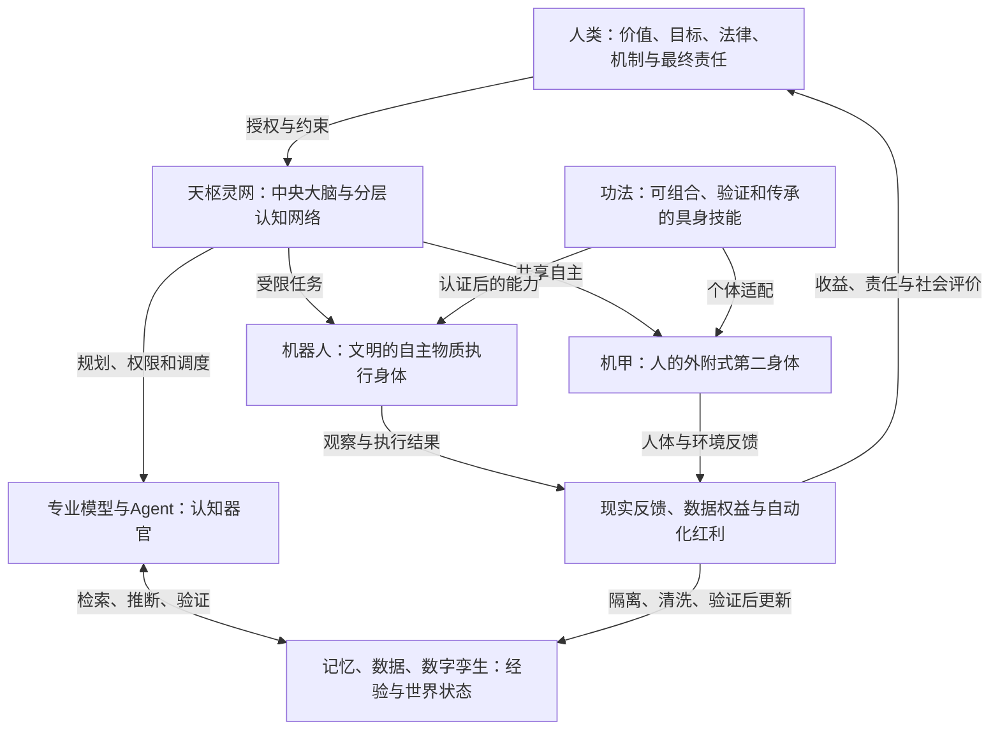

# 中央大脑：文明认知控制雏形 v0.3

## 1. 思想原点

### 用户原话

> 一切的前提都是机制 体系

> 难的不是技术本身，而是怎么把它们统一成一个个体。

> 难的不是零件本身，而是我们怎么把这个零件拼出来。

### 本版专业化表达

单个模型、Agent、数据库、传感器和机器人只是“零件”或“器官”。本项目真正研究的是：

> 如何通过统一的目标、身份、语言、权限、记忆、状态、反馈、利益与责任机制，把异构组件组织成一个可治理、可审计、可纠错、可持续演化的整体。

对应专业领域：

- **Systems Engineering（系统工程）**：零件如何构成完整系统；
- **Architecture Synthesis（架构综合）**：如何设计组件关系而不是简单堆叠；
- **Complex Adaptive System（复杂适应系统）**：系统如何在反馈中持续演化；
- **Cyber-Physical-Social System（信息—物理—社会系统）**：AI、现实设备与人类制度共同闭环；
- **Mechanism Design（机制设计）**：权力、收益、责任、激励与纠错怎样安排。

## 2. 长期目标的准确名称

长期目标暂定为：

> **文明级主权认知—控制基础设施**  
> Civilization-Scale Sovereign Cognitive-Control Infrastructure

其网络形态为：

> **分层主权文明认知网**  
> Hierarchical Sovereign Civilization Cognitive Mesh

中央大脑不是全球唯一超级AI，也不是文明统治者，而是国家、组织或文明域中的：

- **Cognitive Operating System（认知操作系统）**；
- **Control Plane（控制平面）**；
- **Multi-Agent Orchestrator（多智能体编排中枢）**；
- **Memory and World-State Hub（记忆与世界状态中枢）**；
- **Governance Execution Infrastructure（治理规则执行基础设施）**。

## 3. 整个仙武文明的闭环



中央大脑是文明的“神经系统”，机器人是执行身体，机甲扩展个人身体，功法承载技能，机制决定整套力量最终服务于谁。

## 4. “统一成个体”的工程条件

统一不等于所有组件使用同一个模型，也不等于所有主体服从一个意志。统一来自七种连续性：

1. **Identity Continuity（身份连续性）**：知道系统代表谁、职责是什么；
2. **Goal Continuity（目标连续性）**：长期目标不能被单次提示随意覆盖；
3. **Semantic Interoperability（语义互操作）**：不同组件对任务、状态和风险使用共同定义；
4. **Policy Continuity（规则连续性）**：所有组件服从统一但分域的权限机制；
5. **Memory Continuity（记忆连续性）**：事实、经历、技能和治理历史可追溯；
6. **State Continuity（状态连续性）**：中断、失败和迁移后能恢复确定状态；
7. **Accountability Continuity（责任连续性）**：每项关键决定都有依据、执行者和批准者。

准确目标不是“单一意志”，而是：

> **Coherent Pluralism（协调的多元性）**：统一协议、反馈与责任链，同时保留国家、组织、个人和本地设备的边界。

## 5. 当前资源条件下的雏形

当前不直接研究完整文明、现实机甲或国家级系统，而是制作一个可运行的软件种子：

> **机制约束、记忆连续、分层自治的多智能体认知控制系统**  
> Mechanism-Constrained Multi-Agent Cognitive-Control System with Provenance-Aware Memory

### 最小闭环

```text
人类输入目标
→ 身份和权限检查
→ 模型提出任务计划
→ 确定性状态机验证
→ 专业Agent分工并保留不同意见
→ 人类批准关键步骤
→ 虚拟机器人执行
→ 结果进入数据隔离区
→ 来源、权限和可靠性验证
→ 写入正式记忆或驳回
→ 生成可追溯审计记录
```

### 最小模块

| 模块 | 专业名称 | 雏形职责 |
| --- | --- | --- |
| 目标入口 | Goal Interface | 接收目标、身份和约束 |
| 策略引擎 | Policy Engine | 判断主体能做什么 |
| 任务规划器 | Task Planner | 生成候选任务树 |
| 编排器 | Agent Orchestrator | 分配Agent、模型和工具 |
| 状态机 | Deterministic State Machine | 管理审批、执行、失败和恢复 |
| 记忆服务 | Provenance-Aware Memory | 保存带来源、权限和版本的记忆 |
| 虚拟执行器 | Simulated Embodied Executor | 模拟机器人执行与断网自治 |
| 审计系统 | Event Sourcing & Audit Log | 保存全过程和责任链 |

### 核心边界

> **神经网络负责感知、理解、预测和提出候选方案；确定性程序负责权限、状态、安全、执行许可和审计。**

机器人数据只能先成为 **Observation（观察）**，不能未经审核直接成为 **Canonical Fact（权威事实）**。

## 6. 雏形要回答的科研问题

### RQ1：异构Agent如何形成稳定整体？

比较“纯LLM自由协作”和“LLM + 策略引擎 + 状态机”在任务成功率、越权率、冲突保留率和故障恢复率上的差异。

### RQ2：现实反馈如何成为可信长期记忆？

研究 **Provenance-Aware Hierarchical Memory（来源感知的分层记忆）**，测试错误信息、冲突信息和数据投毒能否被隔离、纠正和追溯。

### RQ3：中央协调与本地自治怎样共存？

研究 **Safe Hierarchical Autonomy under Intermittent Connectivity（断续连接下的安全分层自治）**，测试延迟、断网、错误命令和局部故障。

## 7. 最小实验指标

- Task Success Rate：任务完成率；
- Policy Violation Rate：越权行为率；
- Recovery Rate：故障后恢复率；
- Evidence Traceability：结论证据可追溯率；
- Memory Contamination Rate：错误记忆进入正式知识的比例；
- Human Oversight Load：人类审批负担；
- Offline Safety Rate：断网状态下的安全完成或安全停止率。

## 8. 研究生阶段的合理成果

研究生阶段不是“完成仙武文明”，而是完成一块可以被后续机器人、机甲和文明机制继续复用的核心底座：

1. 一套明确的认知—控制架构；
2. 一个可运行、可审计、可恢复的软件原型；
3. 一组能复现实验的数据和评测基准；
4. 一篇围绕受控多智能体、可信记忆或分层自治的论文；
5. 一套从Agent扩展到虚拟机器人和现实设备的接口规范。

优先顺序建议：

```text
受控多Agent软件原型
→ 来源感知记忆
→ 虚拟机器人与断网自治
→ 低风险现实设备
→ 更长期的机甲和文明级网络
```

## 9. 成熟度边界

| 内容 | 成熟度 |
| --- | --- |
| Agent工作流、状态机、权限、审计、数据库 | 1：成熟技术 |
| 多模型集成、可信记忆、虚拟机器人闭环 | 2：可集成但成本较高 |
| 通用世界模型、长期自主具身智能、安全持续学习 | 3：研究前沿 |
| 高级多域机甲、通用防护场、稳定机器主观意识判断 | 4：缺少科学证据的未来假设 |
| 仙武文明、全民松弛、自动化红利和文明个体 | 5：文明机制与哲学构想 |

## 10. 必须防止的偏差

1. **中央控制迷信**：协调不等于中央节点控制每一个动作；本地系统必须具备自治和安全否决权。
2. **自动学习迷信**：现实数据回流不等于模型可以自动获得现实权限；新记忆和新策略必须验证、灰度和回滚。
3. **宏大叙事替代实验**：每个阶段必须有最小问题、对照实验、失败标准和可证伪结论。
4. **只拼技术不拼机制**：若权限、责任、收益和退出机制缺失，技术集成成功仍可能导致文明失败。

## 11. 当前决策状态

### 已决定

- 长期目标是文明级认知—控制基础设施，不是单一超级LLM。
- 中央大脑是协调和治理节点，不是全球唯一统治者。
- 当前先做软件雏形，验证“零件如何成为统一整体”。
- 人类保留价值定义、最高规则和最终责任。

### 暂定假设

- 以“受控多Agent + 来源感知记忆 + 虚拟执行器”作为第一雏形。
- 以协调的多元性取代绝对集中控制。
- 研究生阶段优先完成可验证的纵向小闭环。

### 被否决方案

- 让单一LLM同时负责规划、记忆、权限和现实执行；
- 让机器人原始数据直接修改中央知识或模型；
- 因长期目标宏大而等待所有资源齐备后才开始；
- 把“统一成个体”理解为抹除所有主体差异。

### 开放问题

1. 第一版雏形应选择哪一种具体任务场景作为验证载体？
2. “统一个体”的最低判定标准应以任务表现、记忆连续性，还是责任连续性为核心？
3. 哪些规则即使未来系统可以自我演化，也永远不能由系统单方面修改？
