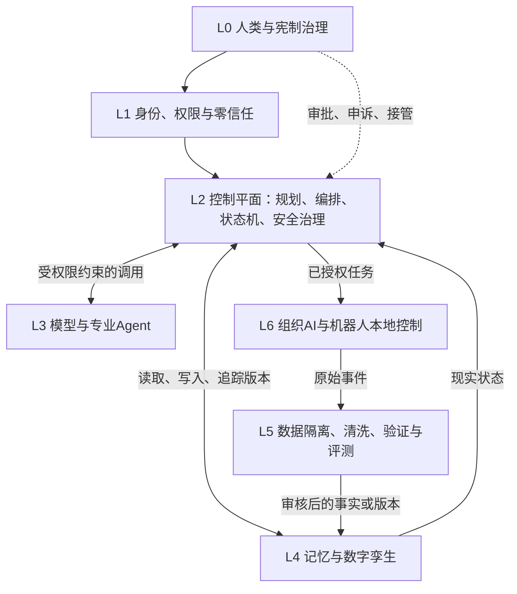

# 中央大脑研究生科研雏形 v0.2

## 1. 用户原话与研究定位

> 一切的前提都是机制 体系

> 难的不是技术本身，而是怎么把它们统一成一个个体。

本项目不是研究“更大的聊天模型”，而是研究如何把模型、Agent、记忆、权限、人类和机器人组成一个**可治理、可审计、可纠错的统一智能系统**。

专业名称暂定为：

> **联邦分层认知—控制系统**  
> Federated Hierarchical Cognitive-Control System（FHCCS）

它属于 **Cyber-Physical-Social System（信息—物理—社会系统）**：既包含AI软件，也包含现实设备、人类制度和责任机制。

## 2. 核心分层

| 层 | 专业术语 | 主要组成 | 简单理解 | 成熟度 |
| --- | --- | --- | --- | --- |
| L0 | Constitutional Governance | 人类、法律、价值、责任、利益分配 | 决定系统为何存在、谁能修改最高规则 | 5 |
| L1 | Identity & Policy Plane | 身份认证、ABAC、能力令牌、零信任 | 门禁、钥匙和授权书 | 1—2 |
| L2 | Control Plane | 任务规划器、Agent编排器、模型路由器、状态机、安全治理器 | 接目标、审查、拆解、派工、暂停和回滚 | 1—2 |
| L3 | Cognitive Plane | LLM、多模态模型、世界模型、VLA、专业Agent | 负责理解、预测并提出候选方案 | 1—3 |
| L4 | Memory & World-State Plane | 事件日志、数据库、知识图谱、向量检索、数字孪生 | 档案馆、技能库和现实状态地图 | 1—3 |
| L5 | Data & Learning Plane | 清洗、溯源、评测、训练、版本发布 | 数据质检厂和实验室 | 1—3 |
| L6 | Execution & Edge Plane | 组织AI、机器人本地AI、实时控制器、硬件联锁 | 执行任务，并在断网时保持安全 | 1—3 |

成熟度：1=成熟技术；2=可工程集成但成本高；3=研究前沿；4=缺少证据的未来假设；5=文明机制或哲学构想。



## 3. 系统统一成“个体”的条件

统一不等于所有功能使用同一个模型。统一来自六种连续性：

1. **Identity Continuity（身份连续性）**：系统始终知道自己是谁、代表谁。
2. **Goal Continuity（目标连续性）**：长期目标不会被单次提示随意覆盖。
3. **Memory Continuity（记忆连续性）**：事实、经历、技能和治理历史可追溯。
4. **Policy Continuity（规则连续性）**：所有模型和Agent服从同一权限体系。
5. **State Continuity（状态连续性）**：任务中断后可以恢复到确定状态。
6. **Accountability Continuity（责任连续性）**：每个重要决定能找到依据、执行者和批准者。

## 4. 神经网络与确定性控制的边界

**神经网络适合：**感知、自然语言理解、预测、候选规划、语义检索重排、异常评分。

**确定性程序必须掌握：**身份认证、权限裁决、状态迁移、资源上限、审批、审计、版本撤销、安全边界、紧急停止。

基本原则：

> **模型提出候选方案，控制器验证并授权，执行器只执行结构化且有效的命令。**

模型不能直接控制高风险设备，也不能自行扩大权限。

## 5. 记忆系统

记忆不是LLM参数，也不是单一向量数据库。最小流程为：

```text
写入申请 → 隔离 → 清洗 → 来源标注 → 权限分类 → 验证
→ 分类型存储 → 检索 → 权限过滤 → 重排 → 注入上下文
→ 使用反馈 → 巩固/纠正/遗忘 → 版本追踪
```

关键机制：机器人只能提交 **Observation（观察）**，不能直接宣布 **Canonical Fact（权威事实）**；观察、模型推断、人类确认和正式规则必须分开存储。

## 6. 通信协议

系统采用 **API/RPC + Event Bus（事件总线）+ Workflow（工作流）**。每个任务使用结构化 **Task Envelope（任务信封）**：

```text
任务ID、目标、发起者、权限范围、风险等级、资源预算、有效期、
允许工具、禁止行为、审批要求、证据来源、当前状态、撤销条件、审计ID
```

任何跨层通信都必须同时携带：**内容、身份、权限、来源、状态、版本和责任记录**。

## 7. 现在可以做的MVP

第一版只做软件仿真，不连接高风险现实设备：

```text
目标输入
→ 权限检查
→ 模型生成任务计划
→ 确定性状态机校验
→ 人类批准
→ 虚拟机器人执行
→ 事件回传隔离区
→ 人类确认是否写入正式记忆
→ 生成完整审计记录
```

最小模块：任务规划器、Agent注册表、策略引擎、状态机、记忆服务、事件日志、人工审批界面、虚拟机器人执行器。

MVP成功标准：越权任务拦截率、任务完成率、错误恢复率、证据可追溯率、记忆污染率、人类审批负担和断网安全性。

## 8. 研究生阶段可形成的科研方向

### 方向A：策略约束的多智能体编排

专业问题：**Policy-Constrained Multi-Agent Orchestration**。

研究模型提出的任务计划，如何经过形式化策略和状态机验证后再执行。可比较“纯LLM编排”和“LLM+确定性控制器”在越权率、成功率、恢复率上的差异。

### 方向B：具备来源追踪的分层记忆

专业问题：**Provenance-Aware Hierarchical Memory**。

研究多源信息冲突、数据投毒和错误记忆纠正。重点不是提高向量检索命中率，而是让每条知识保留来源、权限、时间、置信度和修订历史。

### 方向C：断网条件下的安全分层自治

专业问题：**Safe Hierarchical Autonomy under Intermittent Connectivity**。

研究中央目标、本地自治和硬件安全边界如何协同。可在仿真机器人中测试延迟、断网、错误命令和局部故障。

三个方向中，A最适合作为软件型研究生课题；A+B可以组成完整论文系统；C需要机器人或高质量仿真平台。

## 9. 三个主要机制风险

1. **治理俘获（Governance Capture）**：拥有最高权限的人或组织控制系统；必须采用职责分离、多方授权和独立审计。
2. **认知污染闭环（Epistemic Contamination Loop）**：错误观察进入记忆后反过来指导行动；必须建立隔离、溯源、反证和版本纠错。
3. **责任—能力错配（Accountability-Capability Mismatch）**：AI实际决定、人类形式批准；必须保证审批者有信息、时间、否决权和明确责任边界。

## 10. 当前决策状态

### 已决定

- 中央大脑不是单一LLM，而是分层认知—控制系统。
- 模型、权限、控制器、记忆和机器人必须解耦。
- 人类保留最高规则制定、关键审批和最终责任。

### 暂定假设

- 采用联邦分层架构和统一任务信封。
- 以“神经网络提案、确定性控制器裁决”作为核心技术路线。
- 先用虚拟机器人验证闭环，再考虑现实设备。

### 被否决方案

- 让单一LLM同时负责权限、记忆、规划和现实控制。
- 机器人数据未经验证直接写入中央知识。
- 所有机器人动作都依赖中央大脑实时下令。

### 开放问题

1. 第一项研究应优先验证“多Agent受控编排”，还是“可信分层记忆”？
2. 中央控制器的最高规则由谁修改，需要怎样的多方授权？
3. 未来的“统一人格”是否必须具有一个持续身份，还是只需统一机制和记忆？
