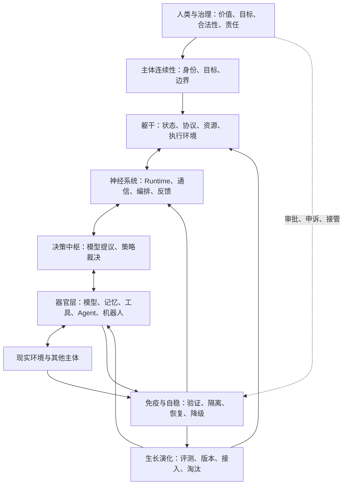

# 中央大脑：统一智能有机体体系 v0.5

## 1. 本次关键修正

v0.4 将目标收敛为 **Unified Cognitive-Action Runtime（统一认知—行动 Runtime）**。

v0.5 进一步确认：Runtime仍不是整个目标，只是完整体系中的运行机制和神经底座。真正要构建的是一个能够容纳躯干、器官、神经、免疫、循环、自稳和生长机制的上位体系。

### 用户原话

> 更广义来讲这个东西应该是个体系 能够容纳躯干 器官的体系 你能明白我的意思么

相关原话继续保留：

> 一切的前提都是机制 体系

> 难的不是技术本身，而是怎么把它们统一成一个个体。

> 难的不是零件本身，而是我们怎么把这个零件拼出来。

> 在不契合的框架中，你只是祥子，祥子到死都以为是自己拉车不够卖力

## 2. 暂定专业名称

上位体系暂定为：

> **Unified Intelligent Organism System（UIOS）**  
> **统一智能有机体体系**

可借鉴但不能完全等同的科研概念：

- **System-of-Systems Architecture（体系之体系架构）**：组织多个能够独立运行的系统；
- **Organismic Architecture（有机体式架构）**：强调器官分工、整体协调、替换和生长；
- **Cybernetic System（控制论系统）**：通过反馈、纠错和调节维持目标；
- **Autonomic Computing（自主计算）**：具备自配置、自修复、自优化和自保护能力；
- **Cyber-Physical-Social System（信息—物理—社会系统）**：把AI、设备、人类和制度纳入同一闭环。

这些术语都是参考。UIOS是当前项目内部的研究性命名，尚未形成被验证的新理论。

## 3. 体系、Runtime、控制器和器官的关系

```text
统一智能有机体体系 UIOS
├─ 主体与治理：身份、目标、价值、责任和主权边界
├─ 躯干与骨架：协议、状态空间、资源网络、生命周期和执行环境
├─ 神经与运行底座：广义Runtime、Harness、通信、编排和反馈闭环
├─ 决策中枢：控制器、Context Compiler、Decision Kernel和Policy Engine
├─ 认知器官：LLM、视觉、语音、世界模型、专业Agent
├─ 记忆器官：情景、语义、程序、治理、版本和世界状态记忆
├─ 行动器官：工具、浏览器、软件服务、机器人和机甲
├─ 循环与代谢：数据、事件、算力、资金、能量、时间和预算流
├─ 免疫与自稳：权限、验证、隔离、监控、恢复、降级和紧急停止
└─ 生长与演化：能力接入、训练、评测、灰度、版本、淘汰和继承
```

严格边界：

| 概念 | 在体系中的位置 | 不是 |
| --- | --- | --- |
| UIOS | 包含主体、躯干、器官和运行机制的完整体系 | 单个软件框架 |
| Runtime | 维持体系持续运行的神经、状态和执行底座 | 整个有机体 |
| Controller | 在Runtime中负责判断、约束和调度的中枢 | 唯一智能来源 |
| Model/Agent/Tool | 可注册、组合、隔离和替换的能力器官 | 系统最高权威 |
| Memory | 受治理的认知、经历和技能器官 | 单一数据库 |
| Human/Governance | 目标、价值、合法性和最终责任来源 | 普通工具节点 |

因此：

> 做好Agent需要做好Runtime；做好中央大脑，则需要在Runtime之上建立能够容纳和维持躯干、器官与主体连续性的完整体系。

## 4. “容纳器官”不等于插件市场

一个插件系统只回答“怎样接入一个能力”。UIOS还必须回答：

1. 什么东西有资格成为器官；
2. 器官与整体使用什么语义和协议通信；
3. 器官可以读取哪些状态、获得哪些权限和资源；
4. 器官产生的是Observation、Claim、Evidence还是Fact；
5. 器官失灵、被污染或发生冲突时如何隔离；
6. 器官怎样替换、升级、回滚和淘汰；
7. 替换器官后，为什么仍然属于同一个体；
8. 局部器官和整体目标冲突时，谁拥有最终裁决权。

每个器官至少需要一个 **Organ Contract（器官契约）**：

```text
organId / type / version
inputs / outputs / semantic schema
capabilities / permissions / resource budget
side effects / risk class
health signals / failure modes
verification method
isolation / revoke / rollback method
compatibility / dependency
provenance / owner / accountability
```

## 5. 形成“个体”的最低条件

UIOS不是把零件放进同一个容器，而是保持以下连续性：

1. **Identity Continuity（身份连续性）**：知道系统是谁、代表谁；
2. **Goal Continuity（目标连续性）**：长期目标有版本和合法修改路径；
3. **State Continuity（状态连续性）**：所有器官基于可追溯的权威状态；
4. **Policy Continuity（规则连续性）**：器官替换后仍受同一治理边界约束；
5. **Memory Continuity（记忆连续性）**：经历和知识能够继承、纠错和追溯；
6. **Embodiment Continuity（具身连续性）**：知道自己能通过哪些躯干和行动器官影响现实；
7. **Accountability Continuity（责任连续性）**：重要行为始终能追溯到依据、执行者和批准者；
8. **Homeostatic Continuity（自稳连续性）**：局部故障不会立刻摧毁整个体系。

暂定判断：模型、工具甚至控制器都可以被逐步替换；只要上述连续性仍成立，体系可以保持同一个体身份。该判断需要实验验证，不能直接当作科学事实。

## 6. 有机体闭环



整个体系的闭环仍然是：

```text
感知现状 → 理解目标 → 判断优先级 → 组合器官
→ 执行验证 → 调节自稳 → 更新认知 → 生长或淘汰
```

## 7. 确定性机制与神经网络的位置

### 神经网络适合

- 感知和语义理解；
- 候选规划与能力组合建议；
- 世界预测和开放式诊断；
- 信息重排、总结和解释；
- 对未知情况提出假设。

### 确定性机制必须掌握

- 主体身份、权限和边界；
- 器官注册、版本、兼容与撤销；
- 权威状态、状态转换和因果记录；
- 资源预算、并发、Lease、幂等和取消；
- 副作用许可、隔离和紧急停止；
- 证据要求、完成裁决和审计；
- 故障恢复、降级和安全模式。

核心原则：

> 神经网络可以成为感觉、预测和思考器官，但不能独占体系的事实权、权限权和完成裁决权。

## 8. 当前资源下的最小雏形

当前不做完整“数字生命”，而做一个 **Software Organism Kernel（软件有机体内核）**：

```text
一个持久主体Identity
+ 一个版本化Goal
+ 一个Authoritative State
+ 一个广义Runtime
+ 一个Decision Kernel
+ 一个Organ Registry与Organ Contract
+ 三类器官：Model / Tool / Memory
+ 一个Verification与Completion Gate
+ 一个Health Monitor与Failure Recovery
+ 一条能力替换实验链
```

第一阶段不必接入机器人。先用软件任务验证：

- 新器官能否被注册并受到权限约束；
- 器官故障能否被发现、隔离和替换；
- 替换模型或工具后任务能否从同一状态继续；
- 错误观察是否会被阻止成为正式记忆；
- 系统重启后主体、目标和责任链是否连续；
- 没有Completion Proof时是否无法宣布完成。

## 9. 分阶段研究路线

| 阶段 | 研究对象 | 可验证结果 |
| --- | --- | --- |
| P0 语义基线 | 定义主体、Runtime、控制器、器官和Organ Contract | 对象边界无循环定义，关键反例可表达 |
| P1 有机体内核 | Identity、Goal、State、Runtime和事件闭环 | 重启后主体与任务连续 |
| P2 器官体系 | Registry、Contract、Capability、权限与健康信号 | 器官可接入、隔离、撤销和替换 |
| P3 免疫与自稳 | 验证、故障分类、恢复、降级、安全模式 | 故障注入后不产生未知重复副作用 |
| P4 记忆与演化 | 来源、冲突、巩固、失效、版本和回滚 | 错误记忆可纠正，能力升级可回退 |
| P5 虚拟躯干 | 浏览器、Sandbox或虚拟机器人作为具身执行器 | 断连或错误指令下安全停止/降级 |
| P6 体系实验 | 与普通Tool Loop、Workflow和多Agent对照 | 证明统一体系在哪些任务上有实际收益 |

## 10. 可证伪的科研问题

### RQ1：器官可替换性

在模型或工具被替换后，统一身份、状态、契约和记忆是否能显著提高任务连续完成率？

### RQ2：自稳能力

Organ Contract、健康监控和隔离机制是否能降低局部故障扩散率与假完成率？

### RQ3：主体连续性

哪些连续性是维持“同一个体”的必要条件，哪些只是有帮助但可以丢失？

### RQ4：新体系的必要性

相对于普通Agent Framework，UIOS是否减少状态分裂、补丁式协调和器官替换成本？如果没有，则不应宣称新体系更优。

## 11. 最大机制风险

1. **类比过度**：人体类比有助于理解，但软件、机器人和社会制度不是真实生物，不能从类比直接推出工程结论。
2. **统一权威膨胀**：统一事实和协议不等于集中所有政治权力；必须保留分域主权、本地自治、申诉和多方治理。
3. **伪主体性**：状态连续和人格表达不等于已经产生主观意识，不能混淆工程身份与科学意识。
4. **体系吞噬实验**：长期体系可以宏大，但每个研究阶段必须窄、可复现、可证伪。

## 12. 成熟度边界

| 内容 | 成熟度 |
| --- | --- |
| Runtime、状态机、权限、Registry、监控、故障恢复 | 1：成熟现实技术 |
| 以Organ Contract统一模型、工具、记忆和执行器 | 2：可工程集成但成本较高 |
| 能力替换下的主体连续性与有机体式自稳 | 3：研究前沿 |
| 长期自主生长、稳定机器主体或主观意识 | 4：缺少科学证据的未来假设 |
| 文明级统一智能有机体体系 | 5：文明机制或哲学构想 |

## 13. 当前决策状态

### 已决定

- 中央大脑的上位目标是能够容纳躯干、器官和运行机制的完整体系。
- Runtime是体系的神经与运行底座，不再等同于整个中央大脑。
- Controller属于Runtime的决策中枢；模型、工具、记忆和机器人属于不同器官。
- “容纳器官”必须包含准入、契约、通信、权限、资源、健康、隔离、替换、验证和责任机制。
- v0.1—v0.4继续保留，记录思想从中央大脑分层架构到统一有机体体系的演进。

### 暂定假设

- 采用“统一智能有机体体系（UIOS）”作为当前上位研究名称。
- 将Software Organism Kernel作为研究生阶段可实现的第一个雏形。
- 主体连续性可能比固定使用某个模型或控制器更接近“同一个体”的判据。

### 开放问题

1. 器官和普通工具的最小区别是什么？
2. 哪些连续性一旦丢失，就不能再认定为同一个体？
3. UIOS的“躯干”在纯软件雏形中应由Workspace、状态网络还是执行环境承担？

### 被否决方案

- 把Runtime直接等同于整个中央大脑体系；
- 把器官理解成没有生命周期、健康状态和责任边界的普通插件；
- 因人体类比而宣称系统已经具有生命或意识；
- 先堆大量器官，再补主体、协议、免疫和自稳机制。

## 14. 与前序版本的关系

```text
v0.1 分层文明认知网
  → v0.2 研究生科研雏形
  → v0.3 文明认知控制雏形
  → v0.4 统一认知—行动Runtime
  → v0.5 统一智能有机体体系
```

这不是否定v0.4，而是确定从属关系：

```text
UIOS 包含 Runtime
Runtime 包含 Controller与Harness机制
Runtime 调用并约束各类器官
躯干、器官、治理和生长共同构成完整体系
```
