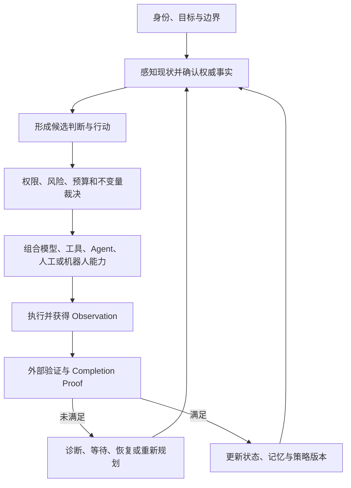

# 中央大脑：统一认知—行动 Runtime v0.4

## 1. 本次演进

v0.3 已经确认：单个模型、Agent、数据库、传感器和机器人只是零件，真正困难的是如何把它们统一成一个个体。

v0.4 进一步确认：这个个体不一定能用当前市场上的 Agent Framework 完整表达。现有 Harness、Workflow、Multi-Agent 和 Runtime 架构可以借鉴，但不能反过来限制中央大脑的形态。

### 用户原话

> 一切的前提都是机制 体系

> 难的不是技术本身，而是怎么把它们统一成一个个体。

> 难的不是零件本身，而是我们怎么把这个零件拼出来。

> 在不契合的框架中，你只是祥子，祥子到死都以为是自己拉车不够卖力

### 本版专业化表达

这对应三个研究概念：

- **Problem–Architecture Fit（问题—架构适配）**：架构必须服务于问题，不能为了适应已有框架而扭曲问题；
- **Architecture Synthesis（架构综合）**：从目标和约束推导新结构，而不是只在现成组件中选型；
- **Unified Cognitive-Action Runtime（统一认知—行动 Runtime）**：让身份、目标、状态、能力、决策、执行、证据、记忆和演进形成同一个持续闭环。

“祥子”原则提醒我们：当结构本身不契合时，继续增加模型能力、Prompt长度、Agent数量或工作流步骤，可能只是在错误框架内加大投入。

## 2. 当前最高层定义

中央大脑不是：

- 一个更大的LLM；
- 一个放在所有模型上方的超级Supervisor；
- 一个固定的Planner—Executor—Reviewer流水线；
- 一个多Agent组织模拟器；
- 一个工具调用总线或API网关。

中央大脑暂定定义为：

> 一套让多个异构、非确定性、可替换能力形成统一主体的认知—行动机制体系。

广义 Runtime 暂定为：

```text
Unified Cognitive-Action Runtime
  = Identity & Goal Continuity
  + Authoritative State
  + Decision & Policy
  + Capability Composition
  + Execution & Observation
  + Evidence & Completion
  + Memory & Evolution
  + Human Governance
```

模型、Tool、Skill、Agent、浏览器、Sandbox和机器人都是可被调用的能力或器官。Runtime负责让这些器官在同一身份、目标、事实和责任链下行动。

## 3. 两种架构必须区分

### 3.1 Reference Architecture（参考架构）

为了做出雏形，当前仍采用以下工程模块：

```text
Task Contract
→ State Authority
→ Context Compiler
→ Decision Kernel
→ Policy Gate
→ Orchestrator
→ Capability / Executor
→ Observation
→ Verification
→ Completion Proof
→ Memory / State Update
```

它的作用是让系统可以实现、测试、审计和恢复。

### 3.2 Ontological Architecture（本体架构）

本体架构回答的不是“代码分成几个模块”，而是：什么东西共同构成了一个持续存在的智能主体。

当前暂定最小本体原语：

| 原语 | 专业含义 | 小白解释 |
| --- | --- | --- |
| Identity | 持续身份与责任归属 | 系统知道自己是谁、代表谁 |
| Goal | 可版本化目标与边界 | 系统长期要实现什么 |
| World State | 权威现实状态 | 现在真实发生了什么 |
| Capability | 可调用且受约束的能力 | 系统有哪些器官可用 |
| Policy | 权限、价值和安全边界 | 什么能做、什么不能做 |
| Decision | 基于事实作出的选择 | 为什么现在做这一步 |
| Observation | 行动后的原始反馈 | 世界对行动作了什么回应 |
| Evidence | 可验证的支持或反证 | 凭什么相信结果 |
| Memory Revision | 经治理的认知更新 | 哪些经验可以影响未来 |

这些原语未来可以重新组合，不必永远对应九个代码模块。

## 4. 中央大脑的最小闭环



核心动作集合暂定为：

```text
EXECUTE / WAIT / VERIFY / RETRY / REPLAN
DELEGATE / REQUEST_HUMAN / FINALIZE / FAIL
```

## 5. 模型与确定性机制的关系

### 模型适合负责

- 理解模糊目标；
- 提出候选计划；
- 发现信息缺口；
- 进行语义判断和失败诊断；
- 在合法候选中提出能力组合；
- 解释结论和不确定性。

### 确定性机制必须负责

- 权威状态和版本；
- 身份、权限和资源上限；
- 状态迁移、Lease、幂等和取消；
- 副作用许可和未知结果处置；
- 等待、重试上限和恢复入口；
- 验收条件与证据覆盖；
- 完成、审计和责任记录。

基本原则：

> 模型提出可能性，Runtime决定什么可以成为行动；执行产生观察，验证决定什么可以成为事实。

## 6. 当前雏形不追求什么

第一版不追求：

- 复制完整的LangGraph、Temporal、AutoGen或其他平台；
- 默认堆叠大量主Agent、子Agent和角色；
- 一开始连接现实高风险设备；
- 用向量数据库代替完整记忆治理；
- 用模型自评代替真实完成证明；
- 为了“创新”重新命名所有成熟机制。

## 7. 当前可实现的最小雏形

```text
一个Job
+ 一个主Agent
+ 零到一个叶子Agent
+ 一个Task Contract
+ 一个权威状态版本
+ 一个Decision Record
+ 一组Capability Adapter
+ 一个外部Verifier
+ 一个Completion Proof
+ 一个可恢复Wait/Retry循环
```

第一阶段只验证五件事：

1. 系统能否准确知道自己处于什么状态；
2. 每次行动是否能追溯到目标、事实和权限；
3. 模型、工具或Agent是否可以替换而不破坏主体连续性；
4. 中断后是否能从持久事实恢复，而不重复未知副作用；
5. 系统是否只能依据验收证据而不是自我声明完成。

## 8. 可证伪的研究假设

### H1：统一状态假设

在相同模型和工具下，引入权威状态、Decision Record和Completion Proof后，假完成率和状态矛盾率应低于普通Tool Loop。

### H2：连续主体假设

当模型、工具或执行器发生替换时，只要身份、目标、状态、策略、记忆和责任链连续，系统仍可以被视为同一Runtime主体。

### H3：新框架必要性假设

如果现有Harness/Workflow无法同时表达长期身份、事实权威、跨执行器恢复和证据闭环，那么新的统一认知—行动原语应在对照实验中降低补丁数量、状态分裂或假完成率。

如果实验没有显示收益，就不能仅凭概念宏大宣称新框架更先进。

## 9. 建议实验与指标

### 对照组

- B0：普通Model → Tool → Model循环；
- B1：固定Workflow或同步多Agent；
- B2：耐久Runtime，但没有统一Context和Completion Proof；
- Full：统一状态、Contract、Decision、Verifier、Recovery和Proof。

### 指标

- Task Success Rate：真实任务成功率；
- False Completion Rate：假完成率；
- State Contradiction Rate：状态矛盾率；
- Recovery Correctness：恢复正确率；
- Evidence Coverage：验收条件证据覆盖率；
- Capability Replaceability：能力替换后的连续完成率；
- Human Oversight Load：人类审批负担；
- Token、时间和执行成本。

## 10. 三个必须警惕的风险

### 10.1 伪创新

只是创造新术语、重新画图，却没有新的状态语义、实验结果或能力提升。

### 10.2 统一变成集中垄断

“统一个体”不能意味着所有权力集中到一个不可监督节点。逻辑事实权威、分域治理、本地自治和人类申诉必须并存。

### 10.3 宏大目标吞噬雏形

中央大脑可以是长期愿景，但当前实验必须保持单Job、低风险、可复现和可证伪，不能一次研究整个文明。

## 11. 成熟度边界

| 内容 | 成熟度 |
| --- | --- |
| 状态机、事件日志、权限、WAL、Verifier | 1：成熟现实技术 |
| Task Contract、Context Compiler、Completion Proof的系统集成 | 2：可以工程集成但成本较高 |
| 统一认知—行动Runtime及能力替换下的主体连续性 | 3：研究前沿与待验证系统假设 |
| 完整机器个体、长期自主认知演进 | 4：缺少充分科学证据的未来假设 |
| 文明级中央大脑及其社会机制 | 5：文明机制或哲学构想 |

## 12. 当前决策状态

### 已决定

- 市面Agent Framework是参考和实验基线，不是中央大脑的最终边界。
- 中央大脑的核心问题是异构能力如何形成统一认知—行动个体。
- 当前仍以耐久Runtime机制作为工程雏形，不因追求新框架而丢弃可靠性底座。
- 用户关于“不契合框架与祥子”的原话作为框架反思原则原样保留。

### 暂定假设

- 使用“统一认知—行动Runtime”作为当前研究名称。
- 以Identity、Goal、World State、Capability、Policy、Decision、Observation、Evidence和Memory Revision作为候选本体原语。
- 通过参考架构先实现雏形，再由实验决定是否需要改变基础结构。

### 开放问题

1. “同一个体”最低需要保持哪些连续性：身份、目标、记忆、策略还是责任？
2. 哪种可复现实验能够证明现有Agent框架存在结构性不契合，而不仅是实现不够好？
3. 哪些成熟机制应成为任何新框架都不能违反的底层不变量？

### 被否决方案

- 因为市场框架流行，就默认中央大脑只能按照相同方式构建；
- 在不改变机制的情况下，只给旧结构换一套新名称；
- 用增加模型、Agent和工作流数量掩盖框架本身不适配；
- 以“突破框架”为理由放弃权限、验证、恢复、审计和人类治理。

## 13. 与工程项目的关系

God-Agent是当前用于验证中央大脑思想的软件种子，但两者不完全等同：

- God-Agent提供WAL、Lease、Snapshot、Return、恢复和测试等工程底座；
- 中央大脑知识库保存长期本体、文明机制和跨机器人演进方向；
- 工程实验可以推翻知识库中的技术假设；
- 文明构想不能被工程Demo冒充为已经实现。

相关工程讨论保存在God-Agent工程知识库中，包括《Agent Harness与Runtime持续讨论》和《中央大脑统一Agent Runtime持续架构讨论》。个人公开知识库只保留研究结论，不记录本机工作区绝对路径。
